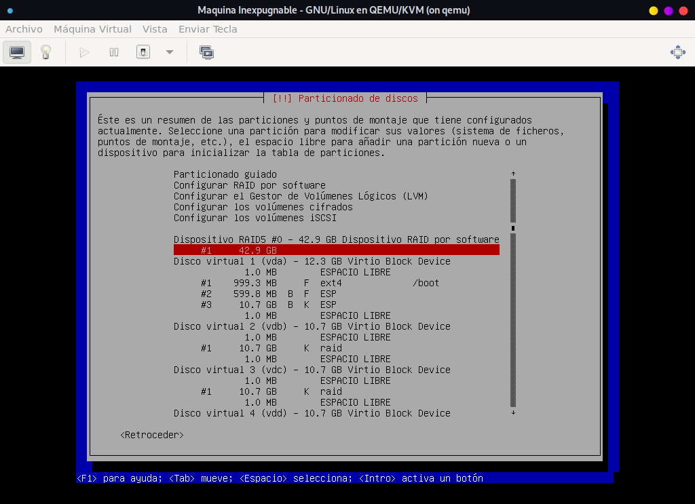

Si la información que almacenas en tu servidor es importante y deseas que en caso de robo, secuestro, extravío, auditoría policial, etc. Les sea imposible de acceder a tu información , sigue esta guía de buenas practicas para crear un servidor que no solo cifra los disco duros, sino que los cifra sobre arreglos.
Cifrar sobre arreglos significa que se puede optar por conservar la información con tolerancia a fallo o destrucción al mas mínimo toque.

- **RAID 0:** Garantiza que al mas mínimo cambio todo el disco quede inútil. Haciendo imposible poder recuperar la información de cualquier otro disco duro. Si alguien esta tratando de abrir el servidor y robar un disco duro, al momento que quite un disco la información se destruirá. Suponiendo que se logre llevar todos los discos, 	debe conseguir la contraseña de todo el RAID para poder 	ensamblar el sistema operativo.

- **RAID 1,3,5,6:** Estos RAID o cualquier otra combinación están pensadas para proteger la información, con copias espejos o con paridad. 

## QEMU/KVM

Como siempre todo lo realizo en mi servidor de Virtualización. Donde creare una maquina virtual con EFI y el sistema operativo sera **Debian**.

Por razones obvias omitiré el proceso de instalación de Debían, ya que si estas leyendo esta guía sabrás como hacer una instalación de un sistema operativo. Solo me centrare en la gestión de los discos duros.

En la siguiente imagen se puede observar que el servidor cuenta con cinco disco duros.

Es necesario que se creen dos particiones, una para el directorio **BOOT**, donde se almacenaran los kernel, y otra para el **EFI**, donde se almacenaran los archivos del **EFI**. 

Luego, los demás discos se deben particionar y en la opción de "Sistema de Archivo" se debe seleccionar **RAID**.
   

En esta parte se debe elegir que tipo de **RAID** se usara. Como asumo que la información que se almacenara sera información legal, el **RAID** que usare sera uno con tolerancia a fallos.

Seleccionar **RAID 5**.

Marcar los discos que conformaran el **RAID**.

Terminar Proceso.

Volumen **RAID** creado.

Preparando el Volumen para el Cifrado.

Finalizar.

Configurar el Cifrado.

Crear volumen cifrado.
 

Seleccionar volumen **RAID**.

Eliminando toda la información del Volumen **RAID**.

Ingresar pasword.

Ahora, al volumen cifrado hay que decirle que sera un **LVM**.

Configurar **LVM**.

Crear Volúmenes. 

Como de costumbre solo creo el volumen de **RAIZ**, luego que finaliza la instalación me dedico a crear los volúmenes para los directorios que creo que deben estar separados y con sus configuraciones correspondientes.

Instalación del Sistema Base.

Un servidor no necesita entorno grafico, por eso solo seleccionare que instale las utilerías del sistema y el servicio **SSH** para poder conectarme remotamente.

Continuar, para reiniciar el sistema.

Como se observa, luego que finaliza la carga del **GRUB** el sistema solicita un password para poder continuar. Este password es el ingresado en la configuración del cifrado del volumen **RAID**, si no se coloca el password los discos duros quedan inutilizados. 

Una vez que coloco el password correcto se inicia el sistema operativo y se sincronizan los discos duros del **RAID**.
 

Configuración de los discos duros.

Información de los sistemas de archivos en el servidor. 

## Conclusión

Con tan solo un reboot, shutdown o desenchufar el servidor toda la información queda Cifrada. Haciendo imposible para cualquiera lograr ver lo que hay en los discos duros.

De esta manera se logra  mantener segura toda la información ante cualquier incidente.

## POST Recomendado.

cold boot attack (ataque de arranque en frío ), utilizada en informática forense, en procedimientos de recuperación de datos e inevitablemente en actividades de piratería ilegal.

Aprovecha una característica física de los bancos de RAM, en particular de las DRAM, que por su propia naturaleza no pierden datos de inmediato ante una fallo repentino en la alimentación, sino que siguen un tipo de descarga que es mucho más lenta cuanto más fríos estén los componentes electrónicos.

En pocas palabras, la RAM pierde su contenido en un tiempo proporcional a la temperatura.

En condiciones normales y de estado estacionario, hablamos de unos pocos milisegundos, pero si se enfría por debajo de -50 ° C (por ejemplo, a través de un spray como los disponible en el mercado [1]), el tiempo de descarga puede incluso llegar a unas pocas decenas de segundos.

Ese tiempo es suficiente para desconectarlo de la placa base, colocarlo en otra PC y leer su contenido a través de una herramienta adecuada que lo vuelca.

Recordar que, excepto en casos excepcionales, a) la RAM nunca está encriptada a diferencia del sistema de archivos, b) que a menudo contiene temporalmente las claves utilizadas por los sistemas de seguridad y c) que todo lo que usted está haciendo se coloca momentáneamente allí (como lo que actualmente estoy escribiendo aquí en Quora antes de publicar el contenido), está claro que, como técnica, aunque requiere acceso físico a la computadora, es particularmente intrigante no solamente para actividades completamente legítimas.

Gracias : Fabrizio Rovelli

[POST](https://es.quora.com/Es-cierto-que-puede-extraer-datos-de-la-RAM-de-una-computadora-congel%C3%A1ndola-C%C3%B3mo-se-hace)
