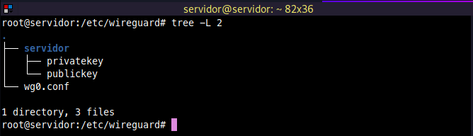
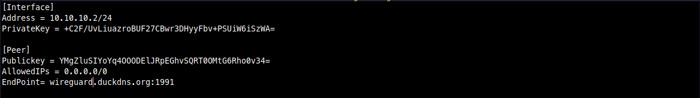
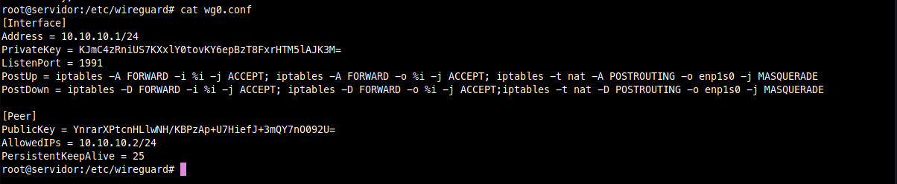
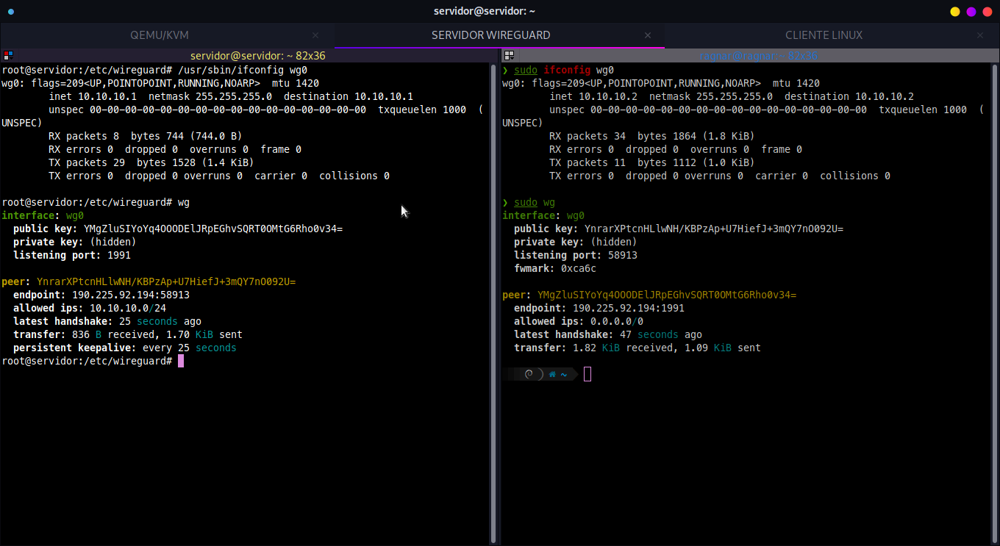

## Instalación 

Para instalar **WIREGUARD** solo se debe ejecutar el siguiente comando en Debian o derivadas:

```bash

apt install wireguard

```

Es necesario que la versión del kernel sea superior a la 5.4.

## Configuración

Las configuraciones se realizaran dentro del directorio _/etc/wireguard_. 

```bash
cd /etc/wireguard/

mkdir servidor

cd servidor

```


Generar Clave Publica y Privada.

```bash
wg genkey > privatekey

cat privatekey | wg pubkey > publickey

```

Generar archivo de configuración.

```bash
chmod 600 -R ../wireguard/

cd ..

touch wg0.conf

cat servidor/privatekey > wg0.conf

```

El archivo debe contener el siguiente contenido:

```bash
[Interface]
Address = direccion de red y mascara de red.
PrivateKey = clave privada.
ListenPort = puerto que usara wireguard.
PostUp = iptables -A FORWARD -i %i -j ACCEPT; iptables -A FORWARD -o %i -j ACCEPT;iptables -t nat -A POSTROUTING -o eth0 -j MASQUERADE
PostDown = iptables -D FORWARD -i %i -j ACCEPT; iptables -D FORWARD -o %i -j ACCEPT;iptables -t nat -D POSTROUTING -o eth0 -j MASQUERADE

```

Habilitar e iniciar el servicio de **WIREGUARD**.

```bash
systemctl enable wg-quick@wg0
systemctl start wg-quick@wg0
systemctl status wg-quick@wg0
```

Encender ip forward

```bash
sysctl -w net.ipv4.ip_forward=1
```

Contenido del directorio **WIREGUARD**.




## Cliente 

Dentro del cliente Linux se debe realizar los mismos pasos que en el servidor.

```bash                                                                         

 cd /etc/wireguard/                                                              
                                                                                 
 mkdir servidor                                                                  
                                                                                 
 cd servidor                                                                                                                                                  

```                                                                  

Generar Clave Publica y Privada.

```bash                                                                         

 wg genkey > privatekey                                                          
                                                                                 
 cat privatekey | wg pubkey > publickey                                          

```
                                                                                                                                                        
Generar archivo de configuración.

```bash
                                                                         
chmod 600 -R ../wireguard/                                                      
cd ..                                                                           
touch wg0.conf                                                                  
cat servidor/privatekey > wg0.conf                                              

```

El archivo debe contener el siguiente contenido:

```bash                                                                         
[Interface]
Address = dirección ip y mascara de red
PrivateKey = CLAVE PRIVADA CLIENTE LINUX
[Peer]
Publickey = CLAVE PÚBLICA DEL SERVIDOR
AllowedIPs = 0.0.0.0/0
EndPoint= IP PÚBLICA:PUERTO.
```

Mi archivo de configuración.




Contenido del directorio **WIREGUARD**


## Servidor

Dentro del archivo de configuración se debe agregar nuevo cliente.

```bash
nvim /etc/wireguard/wg0.conf
```

El contenido debe quedar de la siguiente manera:

```bash
[Interface]
Address = Dirección ip y mascara de red.
PrivateKey = clave privada
ListenPort = puerto
PostUp = iptables -A FORWARD -i %i -j ACCEPT; iptables -A FORWARD -o %i -j ACCEPT; iptables -t nat -A POSTROUTING -o eth0 -j MASQUERADE
PostDown = iptables -D FORWARD -i %i -j ACCEPT; iptables -D FORWARD -o %i -j ACCEPT;iptables -t nat -D POSTROUTING -o eth0 -j MASQUERAD

[Peer]
PublicKey = CLAVE PÚBLICA CLIENTE LINUX
AllowedIPs = dirección ip y mascarara de red
PersistentKeepAlive = 25
```

Mi archivo de configuración.



Una vez echo esto, solo queda reiniciar el servicio de **WIREGUARD** para que tome los cambios.

```bash
systemctl restart wg-quick@wg0
```

## Cliente

Para conectar al cliente al **VPN** se debe habilitar el servicio y luego activarlo.

```bash
systemctl enable wg-quick@wg0
systemctl start wg-quick@wg0
```


Como se puede observar en la imagen, la conexión se estableció correctamente.



## Cliente Windows


## Cliente Android


