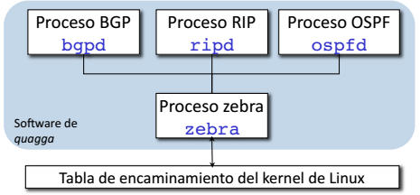

<p style="text-align:center;">
  
  

</p>

## ¿Que es Quagga? 

Quagga es un software formado por un conjunto de demonios que ejecutan distintos protocolos de routing y que convierten un PC con GNU/Linux en un router totalmente funcional. Unos de los software que incluye Quagga es Zebra, el cual modifica la tabla de enrutamiento del núcleo del sistema, con la informacion que le devuelve el protocolo utilizado (OSPF, RIP y/o BGP). 



## PREPARACION DEL AREA DE TRABAJO

Como de costumbre todas mis practicas las realizo en mi servidor de VIRTUALIZACIÓN QEMU/KVM. Para este ejemplo estaré creando: 

- Tres interfaces virtuales.
- Tres maquinas virtuales con **DEBIAN 11**.
- Paquete de herramientas QUAGGA.

### CREACIÓN DE INTERFACES VIRTUALES QEMU/KVM

Las configuraciones de las interfaces de red siempre las realizo mediante un **script** que ejecuto cada vez que se inicie el sistema mediante crontab.

En este script en bash se pueden observar todas las interfaces virtuales con las que cuento en el servior. Las que utilizare son intefaces route1, route2, route3.  

```bash

#! /bin/bash

echo "Creacion de las interfaces"

echo "CREACION DE RED DMZ"

ip link add link br0 name dmz type vlan id 100

ip addr add 192.168.100.1/24 brd 192.168.100.255 dev dmz

ip link set dmz up


echo "CREACION DE PRIVADA 1"

ip link add link br0 name lan1 type vlan id 101

ip addr add 192.168.101.1/24 brd 192.168.101.1 dev lan1

ip link set lan1 up


echo "CREACION DE RED PRIVADA 2"

ip link add link br0 name lan2 type vlan id 102

ip addr add 192.168.102.1/24 brd 192.168.102.255 dev lan2

ip link set lan2 up


echo "CREACION DE RED PRIVADA 3"

ip link add link br0 name route1 type vlan id 103

ip addr add 200.34.30.1/24 brd 200.34.30.255 dev route1

ip link set route1 up


echo "CREACION DE RED PRIVADA 4"

ip link add link br0 name route2 type vlan id 104

ip addr add 200.34.32.1/24 brd 200.34.32.255 dev route2

ip link set route2 up


echo "CREACION DE RED PRIVADA 5"

ip link add link br0 name route3 type vlan id 105

ip addr add 200.34.34.1/24 brd 200.34.34.255 dev route3

ip link set route3 up


echo "Fin de las interfaces"

```
Una vez que las interfaces virtuales ya están creadas, creare las maquinas virtuales con "**virt-manager**".


Cada maquina cuenta con una direccion IP estatica. 

* PC Router 1: 192.168.1.110
* PC Router 2: 192.168.1.111 
* PC Router 3: 192.168.1.112

## ROUTER - INSTALACIÓN Y CONFIGURACIÓN

La instalación de Quagga es muy sencilla, se puede instalar directamente desde los repositorios officales de debian.

Por alguna razon que desconozco y no investigue, Quagga ya no esta disponible en lo repositorios de Debian 11, pero si en los repositorios de Debian 10.

### REPOSITORIO DE DEBIAN 10 

Es necesario comentar los demás repositorios y agregar el repositorio de debian 10.

```bash

cp /etc/apt/sources.list /etc/apt/sources.list.bk

echo "deb http://ftp.de.debian.org/debian buster main" > /etc/apt/sources.list  

apt update

apt install quagga


```
Antes de comenzar con la configuración del router se debe habilitar el **ip forwarding** descomentando la siguiente linea **net.ipv4.ip_forward=1**


```bash
    
    vi /etc/sysctl.conf

```
### CONFIGURACIÓN DE INTERFACES DE RED

Para configurar la interfaz de la subred creare un script que se ejecutara en cada inicion del sistema.

```bash

#! /bin/bash

echo "Creacion de las interfaces"

ip link add link enp7s0 name route1 type vlan id 103

ip addr add 200.34.30.1/24 brd 200.34.30.255 dev route1

ip link set enp7s0 up

echo "nameserver 1.1.1.1" > /etc/resolv.conf

```

### CONFIGURACIÓN ZEBRA Y OSPF

En el archivo de configuración de Zebbra se debe configurar las interfaces de red, nombre del host, clave de VTY, etc.  Pero por gusto personal las configuraciones de red las realizo como se realizan en Linux, con el comando "#ip".

### ZEBRA

```bash

  vi /etc/quagga/zebra.conf


! NOMBRE DEL HOST
hostname router1.local


!CLAVE PARA ACCEDER VTY
password clave

!CLAVE DE ACCESO PARA CONFIGURAR VTY
enable password clave

```

### OSPF (Open Shortest Path First - Primer camino más corto abierto)

Este protocolo es el recomendado para utilizar en las subredes y, los routers que lo utilizan intercambian entre sí las subredes a las que están conectados. Para calcular el camino más corto para llegar al resto de las subredes se utiliza el algoritmo Dijkstra.


[OSPF](https://www.ticarte.com/sites/su/users/7/file/enrutamiento-ospf.pdf)


### ARCHIVO OSPFD

```bash

vi /etc/quagga/ospfd.conf


!NOMBRE DEL HOST
hostname router1.local


!CLAVE DE ACCESO PARA VTY
password clave


!CLAVE DE ACCESO PARA CONFIGURAR VTY
enable password clave


!INTERFACES
interface enp1s0
interface lo


! Identificador del router
! Redes anunciadas y área a la que pertenecen
router ospf

  ospf router-id 192.168.1.110

  network 192.168.1.0/24 area 0.0.0.0

  network 200.34.30.0/24 area 0.0.0.0


!Habilita el acceso por terminal VTY

line vty

```
En este mismo archivo se debe definir el nombre del Host, la clave de VTY, las interfaces que se utilizaran y lo mas importantes, las redes que se compartiran con los demas routers.

* Repetir el proceso de configuracion en cada uno de los routers.

## ¿QUE PUERTOS SE UTILIZAN?

En el fichero /etc/services se puede ver la asignación de puertos a cada uno de los procesos de Quagga:


## AGREGAR EQUIPOS A LAS SUBRED 

Configuracion de red:

```bash

#! /bin/bash

echo "Configurando interfaz de red"

ip link add link enp1s0 name route1 type vlan id 103

ip addr add 200.34.30.2/24 brd 200.34.30.255 dev route1

ip link set route1 up

ip route add default via 200.34.30.1

echo "nameserver 1.1.1.1" > /etc/resolv.conf

#esta linea la ejecuto porque el equipo que coloque en la red tenia una IP estatica

#ip addr del 192.168.1.8/24 dev enp1s0

echo "Configuración Finalizada"

```
* Este proceso se repite en cada maquina con la asignación de la IP correspondiente.


## PING 

Para comprobar que todo funcione correctamente realizare un ping de una maquinda dentro de la subred del "Router 1" a una maquina dentro de la subred del Router 3.


Con la herramienta Traceroute se puede ver el paso por los distintos router hasta llegar al equipo con el que se busca comunicar.


