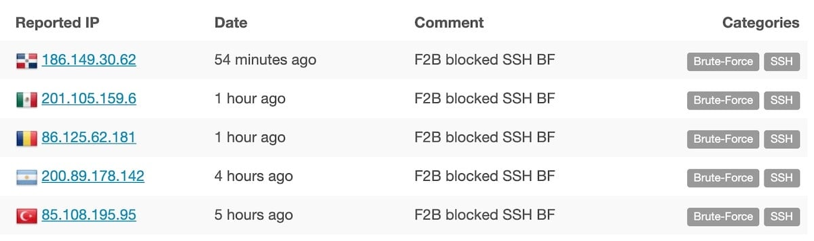
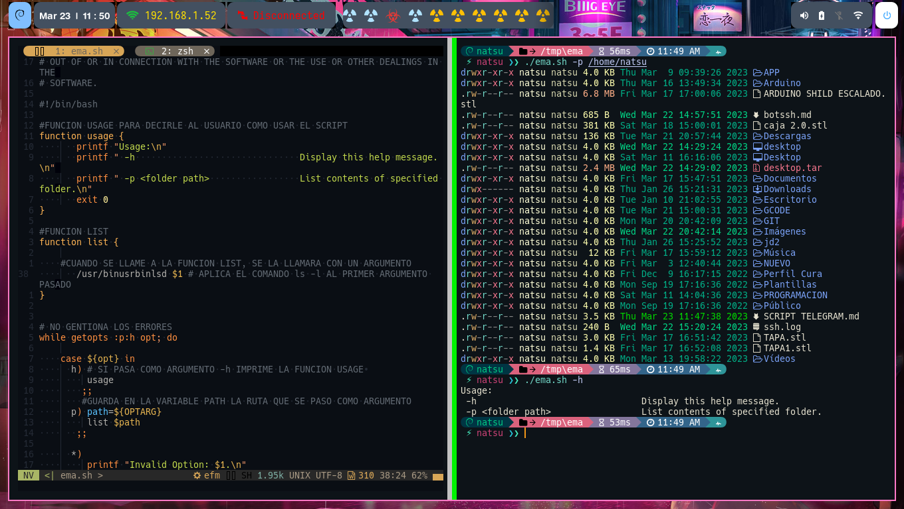

## Cómo proteger su servidor con Fail2Ban: La guía definitiva


[TOC]


*Descubra cómo mejorar la seguridad de su servidor con Fail2Ban, el potente software de prevención de intrusiones. Aprenda a instalarlo y configurarlo para asegurar su servidor contra intentos de acceso no autorizados.*


Tan pronto como inicias tu servidor, inmediatamente salta al océano de botnets que intentan iniciar sesión con credenciales comunes. Y si su servidor tiene algo útil, tarde o temprano puede convertirse en un objetivo para los script kiddies o incluso para gente más avanzada con potentes ordenadores y las últimas tecnologías, incluyendo la Inteligencia Artificial.

Puedes salvar tu servidor de las redes de bots y complicar un poco la vida a los hackers utilizando Fail2ban.

### Qué es Fail2ban (F2B)

Fail2Ban es un IPF (Intrusion Prevention Framework) que protege a los servidores de ataques externos. Fue creado por Cyril Jaquier (Suiza) en 2004 y desde entonces está en desarrollo activo por la creciente comunidad.

F2B opera monitoreando los archivos de registro, por ejemplo, auth.log, registros de acceso de apache o nginx, y tomando acciones en las IPs con demasiadas actividades no deseadas dentro de una cantidad de tiempo predefinida.

Las acciones posibles incluyen

* actualizar las reglas del cortafuegos,
* enviar notificaciones por correo electrónico,
* reportar las IPs malas a un servicio especial,
* cualquier otra acción que pueda realizarse con un script de Python.

La configuración estándar ya incluye filtros para varios servicios, por ejemplo, sshd, postfix, y muchos otros. Cada filtro está diseñado para identificar fallos para ese servicio específico mediante el uso de complejas expresiones regulares. Define estos patrones de expresiones regulares en una variable llamada **failregex**. La combinación de un filtro y acciones predefinidas se conoce como “cárcel”.

Hablando de las debilidades de F2B, tienes que saber que no funciona muy bien contra los ataques de fuerza bruta distribuidos. La razón es que los archivos de registro monitorizados se reescanean aproximadamente una vez por segundo. Esto debería estar bien en la mayoría de los casos, sin embargo, es posible obtener más fallos de inicio de sesión que los especificados en el parámetro “maxretry”.

Aquí tengo que mencionar un software opcional, pero recomendado - Gamin, el Monitor de Alteración de Archivos de Daniel Veillard. (Actualización de 2022: el enlace a una biblioteca estaba muerto, así que le proporciono el enlace a la página principal del autor y también puede intentar buscar este software usted mismo si lo necesita). Si Gamin está instalado y el backend en *jail.conf* está configurado como *auto* o *gamin*, ya no es necesario el sondeo activo de los archivos de registro. Las acciones se activarán tan pronto como se modifiquen los archivos de registro.

Los requisitos del sistema de F2B son bastante bajos. Cuando se configura sólo con las jaulas sshd y recidive, F2B necesita unos 500 Mb de memoria y carga 1 núcleo de CPU por menos del 0,2% de media.

Enlaces:


* [Página principal de F2B](https://www.fail2ban.org/wiki/index.php/Main_Page)
* [Repositorio GitHub de F2B](https://github.com/fail2ban/fail2ban)

Si quieres ayudar con el desarrollo de F2B y / o obtener una comprensión más profunda de los filtros, entonces usted es muy bienvenido a la:

* [Documentación para desarrolladores de F2B](https://fail2ban.readthedocs.io/en/latest/index.html)


### Dos maneras de instalar

En primer lugar, realizar la actualización estándar de los repos y paquetes con:

```bash

 sudo apt update && sudo apt upgrade -y

```

Entonces tienes dos formas de instalar el software.

### Easy with stable release

Si prefiere una forma más rápida, un paquete gestionado por el sistema y una versión estable, entonces sólo tiene que utilizar este comando:

```bash

sudo apt install fail2ban -y

```

### Techy con la última versión

Si prefieres la última y mejor, entonces instala desde GitHub. Ten en cuenta que esto requerirá un poco más de baile. Primero, asegúrate de que tienes Python o Python 3 instalado en tu sistema. Yo usaré Python 3, así que vamos a comprobar que tienes Python 3 instalado con

```bash

python3 --versión

```
Si como resultado de este comando obtienes el mensaje: “Comando ‘python3’ no encontrado, pero puede ser instalado con… “, entonces:

```bash

sudo apt install python3
sudo apt install python3-setuptools

```

Y, por si acaso:

```bash

sudo apt install git

```
A continuación, descarga la versión desde el repositorio oficial de F2B:

```bash

cd ~
git clone https://github.com/fail2ban/fail2ban.git
cd fail2ban
sudo python3 setup.py install

```

Esperemos que no tengas errores, pero si los tienes, por favor, busca la solución en Google ya que está fuera del alcance de este post.

El siguiente comando te permitirá trabajar más cómodamente y autocompletar los comandos relacionados con F2B, como **fail2ban-client**, **fail2ban-server**, **fail2ban-regex** pulsando el tabulador en la consola:

```bash

sudo cp files/bash-completion /etc/bash_completion.d/fail2ban

```
Si hay mucho movimiento en su servidor, entonces es buena idea configurar la rotación del registro. Una vez que el registro alcance cierto tamaño, se archivará y F2B comenzará a escribir en un archivo nuevo. Para configurar la rotación de los registros de F2B:

```bash

sudo wget -O /etc/logrotate.d/fail2ban https://raw.githubusercontent.com/fail2ban/fail2ban/debian/debian/fail2ban.logrotate
```

Ahora necesitas habilitar F2B como servicio.

```bash

sudo cp ~/fail2ban/build/fail2ban.service /lib/systemd/system/
cd /etc/systemd/system/
sudo ln /lib/systemd/system/fail2ban.service fail2ban.service
```

Obtendrá este mensaje como resultado:


*Created symlink /etc/systemd/system/multi-user.target.wants/fail2ban.service → /etc/systemd/system/fail2ban.service.*


Ahora vamos a iniciar F2B:

```bash

sudo systemctl start fail2ban
```

Y comprueba el estado del servicio:

```bash

sudo systemctl status fail2ban

```

Comprueba la versión:

```bash

sudo fail2ban-client version

```

A partir de noviembre de 2021, la versión más reciente y estable es la 0.11.2. Puede consultar la última versión aquí.

Habilitar el servicio fail2ban, para que se ejecute después de los reinicios:

```bash

sudo systemctl enable fail2ban.service

```

Reinicie también el servicio rsyslog:

```bash

sudo service rsyslog restart

```

Ya está hecho.

Configuración básica

Se configura Fail2Ban usando los archivos en /etc/fail2ban.

El archivo más importante es jail.conf, que no recomiendo editar directamente, ya que será reescrito después de cada actualización de F2B. La práctica común es hacer todas las personalizaciones en el archivo jail.local. Al iniciar, F2B lee primero los archivos *.conf y luego las versiones *.local si existen. Las configuraciones en este último toman el control.

En todos los comandos siguientes puedes sustituir vim por tu editor favorito, por ejemplo nano. Ahora, vamos a crear un nuevo archivo, **jail.local**:

```bash

sudo vim /etc/fail2ban/jail.local
```

En este nuevo archivo, para configurar los parámetros de todas las jaulas, los defines en la sección DEFAULT:

```bash

[DEFAULT]

bantime = 3h
findtime = 10m
maxretry = 5

```

Esta configuración prohibirá cualquier dirección IP durante tres horas **{bantime = 3h}**, si dentro del intervalo de 10 minutos **{findtime = 10m}**, se detectan 5 **{maxretry = 5}** intentos de conexión fallidos desde esta IP en particular.

Los mismos parámetros, configurados en cualquier jaula individual, tendrán prioridad sobre la configuración general, lo que le permite ajustar la configuración para cada jaula por separado.

Si te conectas a tu servidor desde las IPs estáticas todo el tiempo, es buena idea ponerlas en la lista blanca, para que nunca sean baneadas. Puedes poner en la lista blanca varias IPs separándolas con espacios en blanco. Localhost está en la lista blanca por defecto.

```bash

ignoreip = 127.0.0.1 x.x.x.x y.y.y.y

```

Ahora vamos a decirle a F2B que habilite sshd jail:

```bash

[sshd]
enabled = true

```

La versión completa de un archivo jail.local muy básico tiene ahora este aspecto:


### Archivo de configuración de Fail2Ban LOCAL.

```bash

[DEFAULT]

bantime = 3h
findtime = 10m
maxretry = 5

ignoreip = 127.0.0.1

# JAILS

[sshd]
enabled = true

```

Formatos de abreviatura de tiempo
Las entradas de tiempo en la configuración de F2B (como findtime o bantime) pueden proporcionarse como integros en segundos o como cadenas utilizando un formato especial de abreviatura, por ejemplo, 600 es lo mismo que 10m (10 minutos).

Los tokens de abreviatura aceptables son

```bash

years?, yea?, yy?
months?, mon?
weeks?, wee?, ww?
days?, da, dd?
hours?, hou?, hh?
minutes?, min?, mm?
seconds?, sec?, ss?
```


El signo de interrogación (?) sigue al carácter opcional, por lo que para establecer la hora en días se puede utilizar días o day, da, dd o d. Puede combinar varios tokens en formato separados con espacio resp. sin separador, p. ej: 1a 6m o 1d12h30m.

Tenga en cuenta que los tokens m así como mm significan minutos, para el mes utilice la abreviatura mo o mon.

Puede convertir el formato de la abreviatura de la hora a segundos utilizando **fail2ban-client** con la opción **--str2sec**:

```bash

 fail2ban-client --str2sec 1d12h
129600
```

También es posible configurar el servidor mediante comandos enviados a través de **fail2ban-client**. Los comandos disponibles se describen en la página de manual **fail2ban-client(1)**.

Tenga en cuenta que fail2ban-client set sólo actualiza los valores para un servidor F2B en ejecución, así que no olvide actualizar el fichero de configuración en consecuencia si tienen que ser persistentes.

Vea también las páginas de manual fail2ban(1) y jail.conf(5) para más referencias:

* [man1](https://manpages.ubuntu.com/manpages/bionic/man1/fail2ban.1.html)

* [man5](https://manpages.ubuntu.com/manpages/bionic/en/man5/jail.conf.5.html)

Configuración avanzada
Una forma muy sencilla de aumentar la seguridad es añadir una “jaula de recuperación”. La jaula estándar prohíbe y luego, después de una cantidad de tiempo predefinida, desprohíbe la IP para que nada impida que esta IP repita sus intentos de conexión de nuevo. Añadamos una jaula especial para estos reincidentes. Copia y pega esto en tu archivo **jail.local**:

```bash

[recidive]
enabled   = true
bantime   = 9w
findtime  = 3d
```

La diferencia es que la jaula [recidive] apunta al propio registro de F2B en /var/log/fail2ban.log. Si la misma IP aparece allí dentro de la cantidad de tiempo findtime (3 días aquí), entonces es baneada por el bantime especificado en esta jaula, 9 semanas en este caso.

Ahora vamos a configurar un sistema de baneo más sofisticado, que aumentará el tiempo de baneo con cada intento en una cantidad de tiempo aleatoria para complicar la vida a los botnets “inteligentes”. Añade esta información a tu jail.local:

```bash

[DEFAULT]

bantime.increment    = true
bantime.rndtime      = 30m
bantime.maxtime      = 60d
bantime.factor       = 2
bantime.formula      = ban.Time * math.exp(float(ban.Count+1)*banFactor)/math.exp(1*banFactor)
bantime.overalljails = true
```

Revisemos cada parámetro uno por uno.

* **bantime.increment** permite usar la base de datos para buscar IPs previamente baneadas para incrementar el tiempo de baneo por defecto usando una fórmula especial, que por defecto es banTime 1, 2, 4, 8, 16, 32…*.

* **bantime.rndtime** es el número máximo de segundos que se utiliza para mezclar con el tiempo aleatorio para evitar que los botnets “inteligentes” calculen el tiempo exacto después del cual una IP puede ser desbaneada de nuevo.
* **bantime.maxtime** es el número máximo de segundos que puede alcanzar el tiempo de baneo (no crece más)

* **bantime.factor** es un coeficiente para la fórmula de cálculo del crecimiento exponencial o multiplicador común. El valor por defecto es 1 y con él el tiempo de baneo crece en 1, 2, 4, 8, 16…

* **bantime.formula** se utiliza por defecto para calcular el siguiente valor del tiempo de baneo, por defecto se muestra abajo. El mismo incremento de tiempo de baneo será alcanzado por los multiplicadores 1, 2, 4, 8, 16, 32…

Ejemplo de la fórmula por defecto:

```bash

bantime.formula = ban.Time * (1<<(ban.Count if ban.Count<20 else 20)) * banFactor
```
Ejemplo más agresivo de la fórmula, tiene los mismos valores sólo con el factor “2,0 / 2,885385”:

```bash


bantime.formula = ban.Time * math.exp(float(ban.Count+1)*banFactor)/math.exp(1*banFactor)
```

Así que, teniendo en cuenta nuestras configuraciones anteriores más estas más avanzadas, F2B hará ahora lo siguiente

* Prohibir cualquier dirección IP durante 3 horas, si realiza 5 intentos de conexión fallidos en un intervalo de 10 minutos

* Guardar esta IP en su base de datos interna

* Desprohibirla después de 3 horas
* Si esta IP realiza otro intento de conexión fallido, F2B calculará el nuevo “tiempo de prohibición” mediante la fórmula

* Prohíbe esta IP durante este nuevo tiempo, incrementado y aleatorio.

* El bantime se incrementará de forma aleatoria y exponencial con cada nuevo intento, pero sin exceder los 60 días.
Si esta IP es bloqueada 5 veces dentro de los 3 días, entonces será baneada por 9 semanas (puesta en cárcel de recreo).

Hay mucho espacio para ajustar estas configuraciones de acuerdo a tu situación específica, lo que puede implicar revisiones y análisis de registros. Como se dice, la seguridad es un proceso, no un procedimiento único.

++Proteger otros servicios:++

Por defecto, todas las jaulas están desactivadas. Necesitas habilitar las jaulas relevantes para tu configuración en tu archivo **jail.local** añadiendo **enabled = true** bajo el nombre de una jaula. Por ejemplo, si tiene instalado el servidor web Apache, puede añadirlo a su jail.local:

```bash

[apache-auth]
# Prohibir los hosts con fallos de autenticación de contraseña
enabled  = true
port     = http,https
logpath  = %(apache_error_log)s

[apache-badbots]
# Prohibir que los robots de spam rastreen la web en busca de direcciones de correo electrónico
port     = http,https
logpath  = %(apache_access_log)s
bantime  = 172800
maxretry = 1

[apache-noscript]
# Prohibir que los anfitriones busquen scripts en el sitio web para ejecutarlos y explotarlos
enabled  = true
port     = http,https
logpath  = %(apache_error_log)s
maxretry = 6

[apache-overflows]
# Prohibir a los anfitriones que intenten solicitar URLs inusualmente largas y sospechosas
enabled  = true
port     = http,https
logpath  = %(apache_error_log)s
maxretry = 2

[apache-nohome]
# Si no proporciona acceso al contenido de la web dentro de los directorios personales de los usuarios
enabled  = true
port     = http,https
logpath  = %(apache_error_log)s
maxretry = 2
Para exim, añada


[exim]
enabled = true
y opcionalmente


[exim-spam]
enabled = true
Para postfix, añada


[postfix]
enabled = true
```

y así sucesivamente. La lista completa de todas las jaulas preconfiguradas se encuentra en el archivo /etc/fail2ban/jail.conf.

Para muchos otros servicios hay diferentes soluciones. Por ejemplo, WordPress tiene un plugin especial. Después de instalar este plugin desde el panel de administración, necesitas copiar el filtro

```bash

sudo cp /var/www/html/wp-content/plugins/wp-fail2ban/filters.d/wordpress-hard.conf /etc/fail2ban/filter.d/
```

Y habilitar esta cárcel en jail.local:

```bash

[wordpress-hard]
enabled  = true
port     = http,https
filter   = wordpress-hard
logpath  = /var/log/auth.log
bantime  = 1h
maxretry = 1
```

En general, si no tienes un filtro para tu aplicación/servicio, y no puedes encontrar uno en Internet, puedes escribir el tuyo propio, añadiendo una lista de regexes a /etc/fail2ban/filter.d/non-standard.conf. Entonces puedes habilitar tu jaula no estándar añadiendo a jail.local:


```bash

[non-standard]
enabled = true
port    = port your app/service uses
logpath = where its log file is located
```

Ahora, cuando conozcas los principios generales de F2B, podrás encontrar, configurar y ajustar cualquier opción para cualquier servicio.

Añadir expresiones regulares personalizadas
Como ya sabes, F2B vigila los registros que le indiques y busca allí las entradas utilizando expresiones regulares. Por ejemplo, las expresiones regulares en /etc/fail2ban/filter.d/postfix.conf para el registro de Postfix tienen este aspecto:

```bash

failregex = ^%(__prefix_line)sNOQUEUE: reject: RCPT from \S+\[<HOST>\]: 554 5\.7\.1 .*$
            ^%(__prefix_line)sNOQUEUE: reject: RCPT from \S+\[<HOST>\]: 450 4\.7\.1 : Helo command rejected: Host not found; from=<> to=<> proto=ESMTP helo= *$
            ^%(__prefix_line)sNOQUEUE: reject: VRFY from \S+\[<HOST>\]: 550 5\.1\.1 .*$
            ^%(__prefix_line)simproper command pipelining after \S+ from [^[]*\[<HOST>\]:?$
```


Sin embargo, sucede que los filtros estándar pueden perder algunas entradas en los registros, porque son inusuales. Así que es posible que desee comprobar esta situación de vez en cuando y añadir regexes personalizados para mejorar la seguridad. ¿Cómo hacerlo?

F2B tiene una utilidad especial para esto, llamada fail2ban-regex, que comprueba las expresiones regulares. El uso general es así:

```bash

fail2ban-regex [OPTIONS] LOG FILTER [IGNOREREGEX]

```

* [OPTIONS] - comprueba la lista completa de opciones del comando fail2ban-regex -h.
LOG es una cadena de entrada de registro o la ruta a un archivo de registro.
REGEX es una cadena (regex real) o la ruta a un archivo de filtro, es decir, una lista de regex.

* [IGNOREREGEX] es lo mismo, cadena o ruta a un archivo.
Primero, identifica qué log y qué servicio quieres probar, por ejemplo auth.log y sshd.conf. En otras palabras, quieres ver qué conjunto de filtros estándar en sshd.conf se pierde en auth.log. Entonces, introduce este comando en la consola:

```bash

fail2ban-regex /var/log/auth.log /etc/fail2ban/filter.d/sshd.conf --print-all-missed > /home/user_name/missed.txt
```

La clave aquí es utilizar la opción --print-all-missed. Por defecto, imprimirá todo en stdout, es decir, en la consola, pero es posible que desee redirigir la salida a un archivo de texto (por ejemplo, missed.txt) para su posterior exploración y procesamiento. Examinemos el resultado:

Captura de pantalla con regexes perdidosCaptura de pantalla con regexes perdidos
Esta es la salida real del comando anterior para auth.log procesado por el estándar sshd.conf Y conjunto personalizado de regexes en sshd.local (ligeramente editado para eliminar información sensible). Incluso en este caso, los filtros han omitido, como puede ver, algunas entradas en el archivo de registro. Echemos un vistazo a los puntos importantes, marcados con flechas rojas:

Hay 812 entradas en auth.log que coinciden con failregexes. El número entre corchetes al principio de cada regex muestra cuántas veces ha funcionado.
Hay 2959 entradas que coinciden con ignoreregex, es decir, entradas que le dije al sistema que ignorara.
Y finalmente, como puedes ver, 35 líneas fueron omitidas. Lo que significa que las IPs 146.52.214.41 y 37.135.222.203 no fueron procesadas por F2B.
¿Por qué? Bueno, las líneas omitidas aparecen debido a la ausencia de regex o a una regex mal escrita. Así que necesitas hacer / test tu regex personalizada que atrape las líneas perdidas y luego añadirlas a /etc/fail2ban/filter.d/sshd.local. Para más detalles recomiendo estudiar la sección correspondiente de la documentación de desarrolladores.

Esta es una versión truncada de mi archivo /etc/fail2ban/filter.d/sshd.local:

```bash

# Fail2Ban filter for openssh - local additions

[Definition]

cmnfailre = ^Bad protocol version identification .* from <HOST>%(__on_port_opt)s$
            ^Connection closed by ((authenticating|invalid)? user \S+ )?<HOST>%(__on_port_opt)s%(__suff)s$
            ^Connection reset by <HOST>%(__on_port_opt)s%(__suff)s$
            ^Did not receive identification string from <HOST>%(__on_port_opt)s$
            ^Disconnected from ((?:authenticating|invalid) user \S+ )?<HOST>%(__on_port_opt)s%(__suff)s$
            ^Invalid user \S* from <HOST>%(__on_port_opt)s$
            ^message repeated \d+ times: \[ Failed password for root from <HOST>%(__on_port_opt)s ssh2\]$
            ^pam_unix\(sshd:auth\):\s+authentication failure;\s*logname=\S*\s*uid=\d*\s*euid=\d*\s*tty=\S*\s*ruser=<F-USER>\S*</F-USER>\
            ^PAM \d more authentication failure(s)?; logname= uid=0 euid=0 tty=ssh ruser= rhost=<HOST>(  user=root)?$
            ^Received disconnect from <HOST>%(__on_port_opt)s:.*\s%(__suff)s$
            ^Unable to negotiate with <HOST>%(__on_port_opt)s:\s.*\s%(__suff)s$
            ^User \S+ from <HOST> not allowed because not listed in AllowUsers$
            ^Disconnecting invalid user \S* <HOST>%(__on_port_opt)s:
            ^(error: )?maximum authentication attempts exceeded for .* from <HOST>(?: port \d*)?(?: ssh\d*)? \[preauth\]$

ignoreregex = pam_unix\((cron|sshd|sudo|systemd-user):session\): session (open|clos)ed for user (root|USER_NAME)( by \(uid=0\))?$
              pam_unix\(sudo:session\): session opened for user root by USER_NAME\(uid=0\)$
              pam_unix\(sshd:auth\): check pass\; user unknown$
              New session \d+ of user USER_NAME\.$
              Removed session \d+\.$
              User child is on pid \d+$
              Timeout, client not responding\.$
              \s+USER_NAME \: TTY=pts\/\d \; PWD=\/home\/USER_NAME(\/.*)? \; USER=root \; COMMAND=.*$

              Disconnected from user USER_NAME <HOST>%(__on_port_opt)s$

```

Si quieres copiarlo en tu servidor, sustituye USER_NAME en el texto anterior por tu nombre de usuario real.

También he añadido el trabajo crontab, que se ejecuta todos los días a las 08:00 con:

```bash

/usr/local/bin/fail2ban-regex /var/log/auth.log /etc/fail2ban/filter.d/sshd.conf --print-all-missed > /home/USER_NAME/missed.txt
```

y luego simplemente cat missed.txt para comprobar si algo pendiente fue omitido por los filtros F2B sshd.

También puede comprobar otros registros y otros filtros de esta manera y añadir sus regexes.

Notificación con correo
Puedes habilitar las notificaciones por correo electrónico si deseas recibir un correo electrónico cada vez que se produzca un baneo. Para ello, primero tendrás que configurar un MTA (Agente de Transferencia de Correo) en tu servidor para que pueda enviar correos electrónicos. Para aprender a usar Postfix para esta tarea, sigue esta guía. Siéntase libre de utilizar cualquier otro MTA y cambiar la configuración de abajo en consecuencia.

Una vez que tengas tu MTA configurado, necesitas ajustar la configuración dentro de la sección DEFAULT del jail.local. Empieza por configurar la directiva mta. Si configuraste Postfix, como demuestra el tutorial anterior, establece este valor:

```bash

[DEFAULT]
mta = postfix
```

Ahora tienes que añadir los correos electrónicos y algunos otros campos:

correo electrónico: La dirección de correo electrónico donde desea recibir los correos electrónicos.
remitente: La dirección de correo electrónico desde la que F2B enviará los correos electrónicos (véase la guía anterior).
nombre del remitente: El texto del campo “Remitente” de los correos electrónicos de notificación.


```bash

[DEFAULT]
mta        = postfix
destemail  = youraccount@email.com
sender     = user@localhost.localdomain
sendername = Fail2BanAlert
```
### Acciones

Ahora tiene que ajustar la configuración de la acción. Como recordatorio rápido, en la jerga de F2B, una “acción” es el procedimiento que se sigue cuando un cliente falla demasiadas veces.

La opción por defecto %(action_)s sólo prohíbe un host.
%(action_mw)s banea y envía un correo electrónico con un informe WHOIS sobre la dirección IP infractora.
%(action_mwl)s prohibirá el acceso, enviará un correo electrónico con el informe WHOIS y todas las líneas relevantes del archivo de registro.
Selecciona el nivel de detalle que más te convenga y configúralo:

```bash

[DEFAULT]
action = %(action_mwl)s
```


Esto también se puede cambiar en función de la cárcel (bajo el nombre de la cárcel), de modo que se obtendrán diferentes detalles para diferentes cárceles.

Para concluir este capítulo, aquí hay una historia esclarecedora de Ken Tossel relacionada con las notificaciones por correo electrónico.


*“…hasta julio de 2011, el archivo de configuración por defecto de Fail2Ban especificaba la dirección From: fail2ban@mail.com y la dirección To: you@mail.com, ambas alojadas en el proveedor de correo gratuito Mail.com. Supongo que la persona que configuró esto asumió que mail.com no era válido. you@mail.com está reservado o lleno hasta el límite, así que cuando Fail2Ban detecta un ataque en un servidor mal configurado, su informe es devuelto al remitente, fail2ban@mail.com. Registré esa dirección en 2010…”*

En julio de 2014, Ken había analizado todos los 500.000 informes y realizó los gráficos que puedes ver en su sitio: https://ken.tossell.net/ftb/

### Informar sobre IPs malas

Si quieres apoyar a la comunidad reportando IPs ofensivas, para que otros puedan beneficiarse de esta información, hay varios servicios que te permiten hacerlo. Revisemos uno con más detalle y otros serán mencionados al final de esta sección.

[AbuseIPDB](https://www.abuseipdb.com/)


* Paso 1 - [Crear cuenta en AbuseIPDB](https://www.abuseipdb.com/register).

* Paso 2 - [Crear la clave API de AbuseIPDB](https://www.abuseipdb.com/register).

Para hacer que F2B informe de las IPs, añade los comandos siguientes a tu archivo jail.local. Añade estas acciones a tus jaulas individualmente para que puedas personalizar las categorías de informes de AbuseIPDB y hacer tus informes más específicos. Por ejemplo, para reportar IPs por fuerza bruta sshd, agrega esto bajo [sshd] jail:

```bash

[sshd]
action_abuseipdb = abuseipdb
action = %(action_)s
         %(action_abuseipdb)s[abuseipdb_apikey="YOUR.API.KEY", abuseipdb_category="18,22"
```

Categorías de informes de AbuseIPDB más populares:

|  Name             |    #  |
|-------------------|-------|
| FTP Brute-Force   |   5   |
|      Port Scan    |   14  |
|    Hacking        |   15  |
|   Brute-Force	    |    18 |
|   Bad Web Bot     |    19 |
|     SSH           |     22|
|     Web App Attack|    21 |


La lista completa de todas las categorías está aquí: https://www.abuseipdb.com/categories

Opcionalmente, puede personalizar el mensaje editando /etc/fail2ban/action.d/abuseipdb.conf:

```bash
actionban = curl --tlsv1.0 --fail 'https://api.abuseipdb.com/api/v2/report' \
    -H 'Accept: application/json' \
    -H 'Key: <abuseipdb_apikey>' \
    --data-urlencode 'ip=<ip>' \
    --data-urlencode 'comment=F2B blocked SSH BF' \
    --data 'categories=<abuseipdb_category>'

```

Entonces sus informes en el sitio AbuseIPDB se verán así: 



Puedes reemplazar el comentario F2B blocked SSH BF por el tuyo propio.

Más información y solución de problemas en el sitio oficial: https://www.abuseipdb.com/fail2ban.html

Otros servicios en línea para reportar IPs
* [Blocklist.de](https://www.blocklist.de/en/index.html)

* [BadIPs](https://www.badips.com/). Configurar F2B siguiendo su [documentación oficial](https://www.badips.com/documentation#32).

### Desbanear IPs baneadas manualmente
Este es un comando muy simple:

```bash
sudo fail2ban-client set JAIL_NAME unbanip IP_ADDRESS
```

Si IP_ADDRESS no está bloqueada por esta cárcel en particular, verás 0 como salida, de lo contrario 1.

Un par de veces me las arreglé para conseguir mi propia IP bloqueada :) trabajando desde varias ubicaciones geográficas. En este caso, simplemente reconéctate a tu servidor a través de cualquier proxy y desbloquea tu IP actual con el comando anterior.

### Restablecer los registros y la base de datos de F2B
Todas las direcciones IP prohibidas se guardan en este archivo: 

*/var/lib/fail2ban/fail2ban.sqlite3.*

Incluso si borras todos los registros, F2B recreará todas las IPs prohibidas de la base de datos después de cada reinicio del servicio hasta que el tiempo de prohibición de la IP se agote. Para borrar todo el registro de F2B y cada IP baneada de la base de datos haz los siguientes pasos. Es un buen método para reiniciar F2B al punto cero restableciendo cada IP baneada.

```bash
sudo fail2ban-client stop
sudo truncate -s 0 /var/log/fail2ban.log
sudo rm /var/lib/fail2ban/fail2ban.sqlite3
sudo fail2ban-client restart

```

No te preocupes - F2B recrea el archivo fail2ban.sqlite3 después de reiniciar el servicio

También puedes borrar manualmente la IP de la base de datos sin perder todas las demás IPs baneadas y si no quieres usar la lista blanca:

- Descargue el DB Browser para SQLite de http://sqlitebrowser.org/
- Instale el DB Browser en su ordenador local
- Descargue el archivo fail2ban.sqlite3 de /var/lib/fail2ban/fail2ban.sqlite3.
- Inicie el DB Browser y abra su archivo fail2ban.sqlite3
- Busque en la base de datos la IP prohibida
- Selecciónala y haz clic en “eliminar fila”
- Guardar el archivo fail2ban.sqlite3 y cerrar el programa
- Conéctese a su servidor con ssh y escriba service fail2ban stop.
- Escriba truncate -s 0 /var/log/fail2ban.log.
- Sube el fail2ban.sqlite3 editado a /var/lib/fail2ban/fail2ban.sqlite3.
- Vuelva a su conexión ssh y escriba service fail2ban restart.

Una opción más es editar esta base de datos directamente en el servidor con la utilidad de línea de comandos sqlite3. https://manpages.ubuntu.com/manpages/bionic/en/man1/sqlite3.1.html


### Cómo desinstalar Fail2ban
Para eliminar sólo el paquete F2B, detenga el servicio y elimine el paquete:

```bash
sudo fail2ban-client stop
sudo apt remove fail2ban
```

Para eliminar el paquete F2B y cualquier otro paquete dependiente:

```bash
sudo apt remove --auto-remove fail2ban

```
Si también desea eliminar los archivos de configuración y/o datos de F2B:

```bash
sudo apt purge fail2ban
```
Para eliminar los archivos de configuración y/o datos de F2B y sus dependencias:

```bash
sudo apt purge --auto-remove fail2ban
```

### Conclusión
Configurar F2B para proteger su servidor es bastante sencillo en los casos más simples. Sin embargo, F2B proporciona una gran flexibilidad para construir políticas que se adapten a sus necesidades específicas de seguridad. Usted puede encontrar muchas piezas para ajustar y cambiar como sus necesidades evolucionarán. Aprender los fundamentos de cómo proteger su servidor con F2B puede proporcionarle una gran seguridad con un mínimo esfuerzo.

Espero que esta información, basada en mis apuntes, cuidadosamente recogidos y probados en la práctica durante muchos años, le ayude a iniciar/configurar la protección de su servidor.

 - [ ] Siguiendo esta guia de buensas practivas puedo generar una jaula para ssh con la siguiente configuracion:

```bash
  
  [DEFAULT]
  
   bantime.increment    = true
   bantime.rndtime      = 30m
   bantime.maxtime      = 60d
   bantime.factor       = 2
   bantime.formula      = ban.Time * math.exp(float(ban.Count+1)*banFactor)/math.exp(1*banFactor)
   bantime.overalljails = true
   maxretry = 3
   
   [sshd]
   enabled = true
  
  
 ```

## CONFIGURAR BOT TELEGRAM PARA RECIBIR NOTIFICACIONES

### Esta es la lista completa de variables especiales para los script en BASH:

* **$1 , $2 , $3** , ... parámetros de posición que hacen referencia al primer, segundo, tercer, etc. parámetro pasado al script.

* **$_** , el último argumento pasado al último comando ejecutado (justo después de arrancar la shell, este valor guarda la ruta absoluta del comando que inicio la shell).

* **$#** , número total de argumentos pasados al script actual.

* **$* ** , la lista completa de argumentos pasados al script. Esta valor es una cadena de texto.

* **$@** , la lista completa de argumentos pasados al script. Esta valor es una lista.

* **$-** , la lista de opciones de la shell actual.

* **$$** , el PID de la shell actual.

* **$IFS** , el separador utilizado para delimitar los campos.

* **$?** , el código de salida del pipe más reciente (es decir, de la última vez que se encadenaron varios comandos mediante el carácter pipe que se escribe como |).

* **$!** , el PID del último comando ejecutado en segundo plano.

* **$0** , el nombre de la shell o del script de shell.

Además de estas, también están disponibles las variables de entorno definidas por la shell.

### Opciones de análisis con argumentos en Bash getopts

Las letras **"n"** y **"p"** tienen **":"** detras de ellas. Esto significa que esperamos que se proporcione un argumento siempre que se utilice la opción **"-n"** o **"-p"**. La variable **"opcion"**, contiene el valor de la opción actual que ha sido analizada por **getopts**.

```bash

#!/bin/bash

while getopts n:p: opcion
do
	case "${opcion}" in
		n) nombre=${OPTARG};;
		p) pais=${OPTARG}
	esac
done
echo "Mi nombre es $nombre";
echo  "y vivo en $pais";

```
### Opciones de análisis sin argumentos en Bash getopts

Nuevo script en bash simple que imprime la funcion **"usage"** cuando se pasa la opción **"-h"**, e imprime el contenido del directorio cuando se utiliza la opción **"-p"** con una ruta a la carpeta como argumento.

El primer **":"** significa que **getopts** no informará ningún error. En cambio, manejaremos los errores nosotros mismos. La letra **"p"** tiene un **":"** detras, mientras que la letra **"h"** no. Esto significa que siempre que se usa la opción **"-p"**, esperamos un argumento, pero la opción **"-h"** se puede usar sin un argumento.

Cuando se pasa la opción **"-h"**, invoca la función **usage**. La opción **"-p"** asigna el argumento pasado a la variable **path**, que luego se pasa a la función **list** como argumento. El **"*"** especifica la acción que se debe realizar siempre que se pase una opción que no sea **"-h"** o **"-p"**.


```bash 

#!/bin/bash

#funcion usage que se usara para la ayuda
function usage {
       printf "Usage:\n"
       printf " -h               Display this help message.\n"
       printf " -p <folder path> List contents of specified folder.\n"
       exit 0 # continua la ejecucion
}

#funcion que le aplicara el comando ls al primer argumento que se le pase
function list {
       ls -l $1
}

#getopts no gestionara errores
#: -> no gestiona errores
# p: -> recibe argumentos
# h -> no necesita argumentos

while getopts :p:h opt; 
do
    case ${opt} in
      h) # cuando ponga -h imprimira la ayuda "usage"
         usage
        ;;
      p) path=${OPTARG} #toma el argumento pasado a -p y lo guarda en "path"
         list $path #llama a la funcion list y le pasa como argumento "path"
       ;;
      *) # si se pasa cualquier opcion imprimira la opcion pasada como error y llama a la funcion "usage"
          printf "Invalid Option: $1.\n"
          usage
       ;;
     esac
done
```


[FUENTE ORIGINAL](https://www.delftstack.com/es/howto/linux/use-getopts-in-bash-script/)

### SCRIPT FINAL

- [ ] Crear directorio donde se alojara el script. Preferencia ** */etc/fail2ban/scripts* **

* Nombre del archivo: ** *send_telegram_notif.sh* **

```bash
#!/bin/bash


#TOKEN
TOKEN='5608271045:AAHJOM8H7R5c9MVQsjNq-xxxxxxxxxxxxxx' #TOKEN

# ID DEL CHAT O GRUPO
ID='-100xxxxxxxxxx' #ID DE MI GRUPO DE TELEGRAM
#para que el bot funcione en grupos debe tener permisos de administrador

function enviarMensajeAlBot() {
	
	#$0 -> REPRESENTA EL NOMBRE DEL ARCHIVO
	#$1 -> REPRESENTA EL PRIMER ARGUMENTO QUE SE PASA
	#$2 -> REPRESENTA EL SEGUNDO ARGUMENTO QUE SE PASA
	#${3,4,5,6,7,8,9} -> REPRESENTA ARGUMENTOS

	message=$1
	
	#ENVIA UN MENSAJE 
	curl -s -X POST https://api.telegram.org/bot${TOKEN}/sendMessage -d text="${message}" -d chat_id=${ID} > /dev/null 2>&1
}

#COMPARA LA CANDITDAD DE ARGUMENTOS PASADOS AL SCRIPT
# 0 -> no se paso ningun argumento
#imprime en pantalla los parametros que se deben pasar

if [ $# -eq 0 ]; then

	#-a -> start o stop
	#-b -> IP baneada
	#-u -> IP desbaneada
	#
	echo "Usage $0 -a ( start || stop ) || -b \$IP || -u \$IP"
	
	#FINALIZA EL SCRIPT
	exit 1;
fi


#PARAMETROS ACEPTADOS
#-a, -n , -b , -u

while getopts "a:n:b:u:" opcion; do

	case "$opcion" in
		a)
			accion=$OPTARG
		;;
		n)
			nombre_jaula=$OPTARG
		;;
		b)
			ban=y #se crea una variable con el caracter "y"
			ip_add_ban=$OPTARG #se guarda la IP dentro de esta variable
		;;
		u)
			unban=y # se crea una variable con el caracter "y"
			ip_add_unban=$OPTARG # la IP se guarda dentro de esta variable
		;;
		\?)  #cualquier otro parametro es invalido y termina el script
			echo "OPCION INVALIDA. -$OPTARG" 
			exit 1
		;;
	esac
done

# -z -> Verdadero si la longitud de la cadena es cero.
#si la variable string no esta vacia devuelve false y ! la niega y cambia a true.

if [[ ! -z ${accion} ]]; then

	case "${accion}" in

		start) #si la variable "accion" contine la cadena "start"

			enviarMensajeAlBot "FAIL2BAN START"
		;;
		
		stop) # si la variable "accion" contiene la cadena "stop"
		
			enviarMensajeAlBot "FAIL2BAN STOP"
		;;
		
		*) # si la variable "accion" contiene cualquier otra cadena
			
			echo "OPCION INCORRECTA"
			
			exit 1; #termina el script
		;;

	esac

elif [[ ${ban} == "y" ]]; then

	#se llama a la funcion con un solo argumento
	#[nobre de la jaula] IP y el mensaje
	enviarMensajeAlBot "[${nombre_jaula}] LA IP: ${ip_add_ban} FUE BANEADA"
	
	exit 0;

elif [[ ${unban} == "y" ]]; then

	#se llama a la funcion con un solo argumento que es nombre de la jaula, ip y mensaje
	enviarMensajeAlBot "[${nombre_jaula}] LA IP: ${ip_add_unban} FUE DESBANEADA"
	
	#finaliza el script correctamente
	exit 0;
else

	info
fi
```
- [ ] Crear archivo de accion dentro del directorio ** */etc/fail2ban/action.d* **

* Nombre del archivo: ** *telegram.conf* **


* La variable **<ip>** no se define explícitamente en los archivos de configuración de **Fail2Ban**, ya que es una variable de sustitución que se reemplaza automáticamente con la dirección **IP** específica que se bloqueó.
Hay otras variables de sustitución como **name**, **time** y **matches**.


```bash

[Definition]
actionstart = /etc/fail2ban/scripts/send_telegram_notif.sh -a start 
actionstop = /etc/fail2ban/scripts/send_telegram_notif.sh -a stop
actioncheck = 
actionban = /etc/fail2ban/scripts/send_telegram_notif.sh -b <ip>
actionunban = /etc/fail2ban/scripts/send_telegram_notif.sh -u <ip>
 
[Init]
init = 123
```

- [ ] Configuracion final de la jaula de **sshd**

* En **action** la palabra **telegram** debe estar tabulada

```bash
bantime.maxtime      = 60d
bantime.factor       = 2
bantime.formula      = ban.Time * math.exp(float(ban.Count+1)*banFactor)/math.exp(1*banFactor)
bantime.overalljails = true
maxretry = 3

[sshd]
enabled = true
action  = iptables[name=SSH, port=22, protocol=tcp]
		telegram
```


_ _ _

- [ ]  Finalizada la configuracion al momento de iniciar o detener el servicio de **Fail2ban** se recibira una notificacion, de igual manera al momento de banear o desbanear alguna IP se recibira una notificacion al chat de telegram definido en el ID.


## RESUMIENDO PARA COPY PASTE

### jaula para ssh 

```bash 
nvim /etc/fail2ban/jail.local

``` 

- Agregar las siguientes lineas al archivo _jail.local_

```bash 

[DEFAULT]

bantime.increment    = true
bantime.rndtime      = 30m
bantime.maxtime      = 60d
bantime.factor       = 2
bantime.formula      = ban.Time * math.exp(float(ban.Count+1)*banFactor)/math.exp(1*banFactor)
bantime.overalljails = true
maxretry = 3

[sshd]
enabled = true
action  = iptables[name=SSH, port=2222, protocol=tcp]
                telegram

``` 
## SCRIPT PARA NOTIFICACIÓN POR TELEGRAM

```bash

nvim send_telegram_notif.sh

```

- Contenido del archivo: 

```bash

#!/bin/bash


#TOKEN
TOKEN='xxxxxxxxx:AAH9_Hjw-4P7xxxxxxxxxxxLbEH0Ywx3pPUo' #TOKEN

# ID DEL CHAT O GRUPO
ID='-98xxxxxx' #ID DE MI GRUPO DE TELEGRAM O DEL CHAT
#para que el bot funcione en grupos debe tener permisos de administrador

function enviarMensajeAlBot() {
	
	#$0 -> REPRESENTA EL NOMBRE DEL ARCHIVO
	#$1 -> REPRESENTA EL PRIMER ARGUMENTO QUE SE PASA
	#$2 -> REPRESENTA EL SEGUNDO ARGUMENTO QUE SE PASA
	#${3,4,5,6,7,8,9} -> REPRESENTA ARGUMENTOS

	message=$1
	
	#ENVIA UN MENSAJE 
	curl -s -X POST https://api.telegram.org/bot${TOKEN}/sendMessage -d text="${message}" -d chat_id=${ID} > /dev/null 2>&1
}

#COMPARA LA CANDITDAD DE ARGUMENTOS PASADOS AL SCRIPT
# 0 -> no se paso ningun argumento
#imprime en pantalla los parametros que se deben pasar

if [ $# -eq 0 ]; then

	#-a -> start o stop
	#-b -> IP baneada
	#-u -> IP desbaneada
	#
	echo "Usage $0 -a ( start || stop ) || -b \$IP || -u \$IP"
	
	#FINALIZA EL SCRIPT
	exit 1;
fi


#PARAMETROS ACEPTADOS
#-a, -n , -b , -u

while getopts "a:n:b:u:" opcion; do

	case "$opcion" in
		a)
			accion=$OPTARG
		;;
		n)
			nombre_jaula=$OPTARG
		;;
		b)
			ban=y #se crea una variable con el caracter "y"
			ip_add_ban=$OPTARG #se guarda la IP dentro de esta variable
		;;
		u)
			unban=y # se crea una variable con el caracter "y"
			ip_add_unban=$OPTARG # la IP se guarda dentro de esta variable
		;;
		\?)  #cualquier otro parametro es invalido y termina el script
			echo "OPCION INVALIDA. -$OPTARG" 
			exit 1
		;;
	esac
done

# -z -> Verdadero si la longitud de la cadena es cero.
#si la variable string no esta vacia devuelve false y ! la niega y cambia a true.

if [[ ! -z ${accion} ]]; then

	case "${accion}" in

		start) #si la variable "accion" contine la cadena "start"

			enviarMensajeAlBot "FAIL2BAN START"
		;;
		
		stop) # si la variable "accion" contiene la cadena "stop"
		
			enviarMensajeAlBot "FAIL2BAN STOP"
		;;
		
		*) # si la variable "accion" contiene cualquier otra cadena
			
			echo "OPCION INCORRECTA"
			
			exit 1; #termina el script
		;;

	esac

elif [[ ${ban} == "y" ]]; then

	#se llama a la funcion con un solo argumento
	#[nobre de la jaula] IP y el mensaje
	enviarMensajeAlBot "[${nombre_jaula}] LA IP: ${ip_add_ban} FUE BANEADA"
	
	exit 0;

elif [[ ${unban} == "y" ]]; then

	#se llama a la funcion con un solo argumento que es nombre de la jaula, ip y mensaje
	enviarMensajeAlBot "[${nombre_jaula}] LA IP: ${ip_add_unban} FUE DESBANEADA"
	
	#finaliza el script correctamente
	exit 0;
else

	info
fi


```

## ACCIONES 

```bash
nvim /etc/fail2ban/action.d/telegram.conf

```
### CONTENIDO

```bash
[Definition]
actionstart = /etc/fail2ban/scripts/send_telegram_notif.sh -a start 
actionstop = /etc/fail2ban/scripts/send_telegram_notif.sh -a stop
actioncheck = 
actionban = /etc/fail2ban/scripts/send_telegram_notif.sh -b <ip>
actionunban = /etc/fail2ban/scripts/send_telegram_notif.sh -u <ip>

[Init]
init = 123

```

### NOTA:

¿Que es lo que hace la jaula de SSH?

Para ahorrar tiempo le dije a chatGPT que me haga un resumen de lo que hace la jaula y, aqui va el copy paste:


- "bantime.increment" está habilitado, lo que significa que el tiempo de bloqueo aumentará cada vez que la misma IP sea bloqueada por Fail2ban. Este es un enfoque efectivo para lidiar con los atacantes persistentes que intentan repetidamente acceder a tu sistema.

- "bantime.rndtime" está configurado en 30 minutos, lo que significa que el tiempo de bloqueo para cada IP será un valor aleatorio entre 0 y 30 minutos. Esto ayuda a evitar que los atacantes determinen el tiempo exacto que tardarán en ser desbloqueados.

- "bantime.maxtime" está configurado en 60 días, lo que significa que ninguna IP puede permanecer bloqueada por más de 60 días. Esto ayuda a evitar que las IPs sean bloqueadas permanentemente si algo sale mal con la configuración de Fail2ban.

- "maxretry" está configurado en 3, lo que significa que si una IP realiza 3 intentos fallidos de inicio de sesión en SSH, entonces será bloqueada por Fail2ban.

- "bantime.formula" utiliza la misma fórmula que la configuración anterior para calcular el tiempo de bloqueo de cada IP.

- El parámetro "overalljails" se establece en verdadero, lo que significa que la regla de tiempo de bloqueo se aplica a todas las prisiones de Fail2ban en tu sistema.

- La acción se establece en "iptables" para bloquear la IP y "telegram" para enviar una notificación a través de Telegram.
