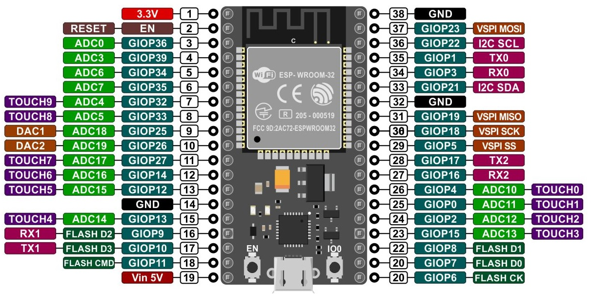

[toc]

## SENSORES MQ
### MQ-135: usado como monitor de calidad del aire.
- Sensible al: metano, propano, GLP, alcohol y humo.
- Aumenta el voltaje de salida conforme aumente la concentración de gases medidas. 
- Indicador de señal de medida.
- Alimentación: 2,5 - 5 V
- Dimensiones: 4 x 2,1 cm (aproximadamente)
- Tamaño agujeros de montaje: 2 mm (Aprox.)

### MQ-2: detector fuga de gas
- Sensible al: GLP, i-butano, metano, propano, alcohol, hidrógeno y humo.- 
- Detecta concentraciones desde 300 hasta 10000 ppm
- Alimentación: 5V
- Dimensiones: 4 x 2 cm (aproximadamente)
- Tamaño agujeros de montaje: 2 mm (Aprox.)

### MQ-3: detecta la concentración de alcohol en el aire.
- Sensible al Alcohol y etanol
- Alimentación: 2,5 - 5 V
- Temperatura ambiente: desde -10 ºC hasta 65 ºC
- Humedad: ≤ 95 % RH
- Aplicaciones: alcoholímetro
- Tamaño agujeros de montaje: 2 mm (Aprox.)

### MQ-4: Detector de gas metano (gas natural)
- Sensible al gas metano y al gas carbónico
- Concentración: 300 hasta 10000 ppm
- Alimentación: 2,5 - 5 V
- Temperatura ambiente: desde -10 ºC hasta 50 ºC
- Humedad: ≤ 95 % RH
- Consumo de potencia: menos de 900 mW
- Tamaño agujeros de montaje: 2 mm (Aprox.)

### MQ-5: Detector de fugas de gas
- Sensible a GLP y gas natural
- Consumo de potencia: 800 mW
- Dimensiones: 3 x 2 x 2.1 cm (aprox)
- Tamaño agujeros de montaje: 2 mm (Aprox.)

### MQ-6: Detector de gas licuado de petróleo
- Sensible al gas LP (propano, butano y gas natural)
- Concentración: 200 hasta 10000 ppm
- Alimentación: 2,5 - 5 V
- Temperatura: 20 ºC ± 2 ºC
- Humedad: ≤ 55 ± 5 % RH
- Consumo de potencia: menos de 950 mW
- Tamaño agujeros de montaje: 2 mm (Aprox.)

### MQ-7: Detector de monóxido de carbono.
- Sensible al monóxido de carbono (CO). Podemos detectar si el aire está limpio.
- Alimentación: 5v
- Concentración: 20 a 2000 ppm
- Concentración de oxigeno: 21 %
- Tamaño agujeros de montaje: 2 mm (aproximadamente)

La concentración inmediatamente peligrosa para la vida y la salud (IDLH) que recomienda NIOSH para el CO es de 1,200 ppm. IDLH es la concentración que podría provocar la muerte o efectos irreversibles sobre la salud, o que podría impedir que una persona se salga del ambiente contaminado en 30 minutos.


### MQ-8: Detector de gas hidrógeno.
- Alimentación: 5v
- Concentración: 100 a 10000 ppm
- Temperatura ambiente: desde -10 ºC hasta 50 ºC
- Consumo: menos de 900 mW
- Dimensiones: 3.2 x 2.2 x 2.7 cm (aprox)
- Tamaño agujeros montaje: 2 mm (Aprox)

### MQ-9: Detector de monóxido de Carbono y gas inflamable.
-  Sensible al monóxido de carbono, gases inflamables
-  Se parece al MQ-7 pero en versión mejorada
-  Temperatura ambiente: desde -10 ºC hasta 50 ºC
-  Concentración: 
	- Monóxido de carbono: 10 - 1000 ppm
	- Gas combustible: 100 - 10000 ppm
- Dimensiones: 4 x 2 mm (aproximadamente)
- Tamaño de agujeros: 2 mm (aprox)

++Gases inflamables:++ se encienden fácilmente y se queman rápidamente. Es el caso del Cloruro de Metilo, Gas Licuado de Petróleo, Acetileno e Hidrógeno. 

## PROYECTO ESP32

### INSTALAR LIBRERIAS DE ARDUINOS

#### CTBot


#### Arduino Json


### AGREGAR PLACA ESP32

* Agregar las librerías de ESP32 haciendo click en **Archivo -> Preferencias** y pegamos este link https://dl.espressif.com/dl/package_esp32_index.json

* 

* * 

* * 

* 

#### CODIGO DE EJEMPLO
https://github.com/shurillu/CTBot/blob/master/REFERENCE.md

* DATOS

```bash
const char * ssid = "RED WIFI";
const char * password = "XXXXXXX";
const String token = "XXXXXXXXXXXX";

```

* Este ejemplo reenvia el mensaje recibido en el ch1at del bot


```BASH
template<class T> inline Print &operator <<(Print &obj, T arg) {
  obj.print(arg);
  return obj;
}

#include "CTBot.h"
CTBot miBot;

#include "token.h"

void setup() {
  Serial.begin(115200);
  Serial.println("Iniciando Bot de Telegram");

  miBot.wifiConnect(ssid, password);

  miBot.setTelegramToken(token);

  if (miBot.testConnection()) {
    Serial.println("\n Conectado");
  }
  else {
    Serial.println("\n Problemas Auxilio");
  }
}

void loop() {
  TBMessage msg;

  if (CTBotMessageText == miBot.getNewMessage(msg)) {
    Serial << "Mensaje: " << msg.sender.firstName << " - " <<  msg.text << "\n";
    miBot.sendMessage(msg.sender.id, msg.text);
  }

  delay(500);
}

```

### ERROR AL COMPILAR

```python
"exec: "python": executable file not found in $PATH
Error compiling for board ESP32 Dev Module"
```

#### solucion

Para solucionar este problema se debe realizar la siguiente instalacion:

```bash
sudo apt install python-is-python3
```

[Solucion](https://espressif-docs.readthedocs-hosted.com/projects/arduino-esp32/en/latest/troubleshooting.html)

