[toc]

## PINES

### Entrada/Input

Los GPIO 34 al 39 en realidad son GPI (General Purpose Input)

Estos pines no tienen resistencias Pull-up o Pull down y no pueden ser usados como salida

* GPIO 34
* GPIO 35
* GPIO 36
* GPIO 37
* GPIO 38
* GPIO 39

### E/S
La conversión analógico-digital (ADC) y la inversa, digital a analógico (DAC) se encuentran asignados a una serie de pines que veremos a continuación. Por el contrario, el uso de UART, I2C, SPI, PWM, se puede asignar a través del código.

Antes de continuar, la información que resumimos en este artículo se ha extraído de la información técnica original de este componente disponible a través de https://docs.espressif.com/projects/esp-idf/en/latest/esp32/api-reference/index.html

Los GPIO 6 a 11 están expuestos en la mayoría de placas de desarrollo ESP32. Estos pines están conectados directamente al flash SPI integrado en el chip ESP-WROOM-32 y no es posible su uso para funciones más allá de las establecidas.


* PIO 6 (SCK/CLK)
* GPIO 7 (SDO/SD0)
* GPIO 8 (SDI/SD1)
* GPIO 9 (SHD/SD2)
* GPIO 10 (SWP/SD3)
* GPIO 11 (CSC/CMD)

### Touch Sensor
El ESP32 dispone de 10 sensores que se pueden utilizar de forma táctil como sensor capacitativo. Estos pines tienen la capacidad de detectar variaciones en la carga eléctrica, como por ejemplo la piel humana. Para que puedan detectar variaciones inducidas al tocar los GPIO con un dedo. Estas entradas se pueden integrar fácilmente en las almohadillas capacitivas y reemplazan los botones mecánicos. Las clavijas táctiles capacitivas también se pueden usar para activar el ESP32 cuando entra en modo Deep-Sleep.
Esos sensores táctiles internos están conectados a los siguientes GPIOs:

* T0 (GPIO 4)
* T1 (GPIO 0)
* T2 (GPIO 2)
* T3 (GPIO 15)
* T4 (GPIO 13)
* T5 (GPIO 12)
* T6 (GPIO 14)
* T7 (GPIO 27)
* T8 (GPIO 33)
* T9 (GPIO 32)

### Convertidor analógico a digital (ADC de Analog to Digital Converter)
Este microcontrolador dispone de canales de entrada ADC de 18 x 12 bits. Los siguientes GPIO que se pueden usar como ADC:

* ADC1_CH0 (GPIO 36)
* ADC1_CH1 (GPIO 37)
* ADC1_CH2 (GPIO 38)
* ADC1_CH3 (GPIO 39)
* ADC1_CH4 (GPIO 32)
* ADC1_CH5 (GPIO 33)
* ADC1_CH6 (GPIO 34)
* ADC1_CH7 (GPIO 35)
* ADC2_CH0 (GPIO 4)
* ADC2_CH1 (GPIO 0)
* ADC2_CH2 (GPIO 2)
* ADC2_CH3 (GPIO 15)
* ADC2_CH4 (GPIO 13)
* ADC2_CH5 (GPIO 12)
* ADC2_CH6 (GPIO 14)
* ADC2_CH7 (GPIO 27)
* ADC2_CH8 (GPIO 25)
* ADC2_CH9 (GPIO 26)

Estos pines tienen una resolución de 12 bits. Esto significa que puede obtener lecturas analógicas que van de 0 a 4095, en las que 0 corresponde a 0V y 4095 a 3.3V. También tiene la capacidad de establecer la resolución de sus canales en el código, así como el rango ADC.

Los pines ADC ESP32 no tienen un comportamiento lineal esto dificulta por ejemplo diferenciar entre 0 y 0.1V, o entre 3.2 y 3.3V. Esto se debe tener en cuenta al diseñar los proyectos ya que la conversión a 12bit conlleva que en ese rango, tal y como indicábamos en el párrafo anterior, la variación es de 4096 puntos.

### Convertidor digital a analógico (DAC de Digital Analog Converter)
El ESP32 dispone de 2 canales DAC de 8 bits, útiles para convertir señales digitales en salidas de señal de voltaje analógicas. Están disponibles a través d los siguientes GPIO:

* DAC1 (GPIO25)
* DAC2 (GPIO26)

### RTC GPIOs
ESP32 ofrece soporte de RTC GPIO que se encuentran enrutados al subsistema de baja potencia RTC y se pueden usar cuando el ESP32 está en modo Deep-Sleep. Estos RTC GPIO se pueden usar también para reactivar el ESP32 cuando está en uso el el coprocesador Ultra Low Power (ULP). Los siguientes GPIO se pueden usar como una fuente de activación externa RTC:

* RTC_GPIO0 (GPIO36)
* RTC_GPIO3 (GPIO39)
* RTC_GPIO4 (GPIO34)
* RTC_GPIO5 (GPIO35)
* RTC_GPIO6 (GPIO25)
* RTC_GPIO7 (GPIO26)
* RTC_GPIO8 (GPIO33)
* RTC_GPIO9 (GPIO32)
* RTC_GPIO10 (GPIO4)
* RTC_GPIO11 (GPIO0)
* RTC_GPIO12 (GPIO2)
* RTC_GPIO13 (GPIO15)
* RTC_GPIO14 (GPIO13)
* RTC_GPIO15 (GPIO12)
* RTC_GPIO16 (GPIO14)
* RTC_GPIO17 (GPIO27)

### PWM
El controlador ESP32 LED PWM cuenta con 16 canales independientes que pueden configurarse para generar señales PWM con diferentes propiedades. Todos los pines que pueden actuar como salidas se pueden usar como pines PWM (los GPIOs 34 a 39 no pueden generar PWM ya que como indicábamos al principio de este artículo no disponen de resistencia Pull-Up/Down.

Para producir una señal PWM,es necesario definir a través del código lo siguiente:

* frecuencia de la señal;
* Ciclo de trabajo;
* canal PWM;
* GPIO que emite la señal.


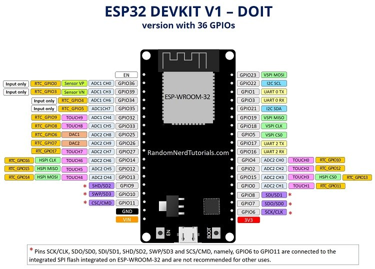

### I2C
El ESP32 también dispone de soporte I2C, para poder utilizar este protocolo de comunicación, habitual en algunos display, pantallas de tinta electrónico y algunos sensores, hay que utilizar los pines específicos del ESP32 I2C (soportados por la biblioteca de Wire):

* GPIO 21 (SDA)
* GPIO 22 (SCL)

### SPI
El Bus SPI (del inglés Serial Peripheral Interface) es un estándar de comunicaciones, usado principalmente para la transferencia de información entre circuitos integrados en equipos electrónicos. El bus de interfaz de periféricos serie o bus SPI es un estándar para controlar casi cualquier dispositivo electrónico digital que acepte un flujo de bits serie regulado por un reloj (comunicación sincrónica).

Por defecto, la asignación de pines para SPI es:

|SPI |MOSI	 |MISO	 |CLK    |CS	 |
|----|-------|-------|-------|-------|
|VSPI|GPIO 23|GPIO 19|GPIO 18|GPIO 5 |
|HSPI|GPIO 13|GPIO 12|GPIO 14|GPIO 15|

### Interrupciones
Una mejora más con respecto a las versiones anteriores como el ESP8266 es la posibilidad de utilizar todos los pines como interrupciones. De esta forma podemos generar a través del código una señal de interrupción para realizar una operación en cualquier momento, por ejemplo con un pulsador.

### Pines en estado HIGH durante el reinicio
Algunos GPIO cambien de estado HIGH o salida PPWM durante el reinicio de la placa. Esto puede generar problemas y resultados inesperados durante el arranque o incluso impedir el reinicio de la placa. Los pines que modifican así su estado son los siguientes:

* GPIO 1
* GPIO 3
* GPIO 5
* GPIO 6 to GPIO 11
* GPIO 14
* GPIO 15

### Pin EN (Enable)
Este pin es el de habilitación del regulador 3.3V. Para deshabilitar el regulador de 3.3V será suficiente conectar este pin a tierra. Esto implica que se puede usar este pin conectado a un botón para reiniciar el ESP32.

### Consumo de corriente de los GPIO
La corriente máxima absoluta consumida por GPIO es de 40 mA según la sección «Condiciones de funcionamiento recomendadas» en la hoja de datos de ESP32.

### Sensor Magnético Integrado (Hall Effect Sensor)
Entre las prestaciones, este integrado incluye un sensor magnético que permite detectar modificaciones en los campos magnéticos de su entorno. Se puede activar a través de código y puede resultar útil en algunas aplicaciones.

Para la lectura del valor de este sensor, se puede utilizar la función integrada hallRead();

### Sensor de Temperatura Integrado
Junto con el sensor de campos magnéticos, el ESP32 dispone de un sensor interno de temperatura. El valor de este sensor se puede obtener con la función temprature_sens_read();


[Copy Paste](https://tecnotizate.es/esp32-mapeo-de-pines-y-sensores-internos/) 

ESP32 DEVKIT V1: dispone de 18 pines que se pueden usar como entradas analogicas y el rango de voltaje que se puede leer va entre los 0 y los 3,3 voltios.

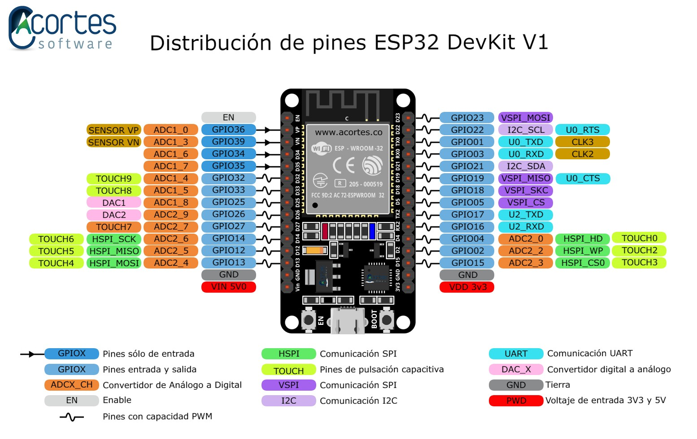

Los pines de color naranja denominados **ADC** son los que se pueden usar como pines analogicos y estan divididos en dos puertos diferentes, **ADC1** y **ADC2**, del cual solo se puede hacer uso cuando el controlador WIFI no haya sido iniciado.

La conversion por defecto que realiza **ADC** es de 12 bits, tomando valores que van del 0 al 4095. 

La conversion se puede configurar mediante codigo segun la preferencia, entre los 9 y 12 bits

* 12 bits -> 0, 4095
* 11 bits -> 0, 2048
* 10 bits -> 0 , 1024
* 9 bits -> 0, 512

### PIN DIGITALES

Contamos con 22 pines (GPIO) digitales que se pueden utilizar como pines de entrada y salida. 


* PIN 1 -> durante el arranque o reinicio de la placa su estado de entrada (input) sera alto **HIGH**.

* PIN 2 -> Este pin esta conectado al led integrado de la placa. Similar al led 13 de arduino.

* PIN 3 -> Durante el arranque o reinicio de la placa el estado de su salida (output) sera **HIGH**.

* PIN 12 -> No se debe poner en estado alto (HIGH) su entrada (input) desde el comienzo, porque durante el arranque o reinicio de la placa producira un error.

* PIN 14 y 15 -> durante el inicio de la placa emitiran una señales PWM.

* PIN 34,35,36 Y 39 -> solo se pueden usar como entradas, ya que no cuentan con ristencias pull-up y pull-down.

- [ ]  **pull-up** el estado del ping siempre es alto y cambia a un estado bajo cuando se produce una accion. 
- [ ]  **pull-down** el estado del ping siempre es bajo y cambia a un estado alto cuando se produce una accion. 

Para poner un pin en pull-down se puede realizar de la siguiente manera:

```bash
	pinMode(boton, INPUT_PULLDOWN);
```

_ _ _


*`Para estos ejemplos solo utilizare cualquiera de los pines GPIO, a excepción de los GPIO 34,35,36,37,38, 39 que no tienen resistencias Pull-up o Pull down.`*

_ _ _


## SENSORES MQ
### MQ-135: usado como monitor de calidad del aire.
- Sensible al: metano, propano, GLP, alcohol y humo.
- Aumenta el voltaje de salida conforme aumente la concentración de gases medidas. 
- Indicador de señal de medida.
- Alimentación: 2,5 - 5 V
- Dimensiones: 4 x 2,1 cm (aproximadamente)
- Tamaño agujeros de montaje: 2 mm (Aprox.)

### MQ-2: detector fuga de gas
- Sensible al: GLP, i-butano, metano, propano, alcohol, hidrógeno y humo.- 
- Detecta concentraciones desde 300 hasta 10000 ppm
- Alimentación: 5V
- Dimensiones: 4 x 2 cm (aproximadamente)
- Tamaño agujeros de montaje: 2 mm (Aprox.)


Se puede ver que este sensor es muy bueno para detectar Gas licuado del petróleo. 200 ppm como min.


### MQ-3: detecta la concentración de alcohol en el aire.
- Sensible al Alcohol y etanol
- Alimentación: 2,5 - 5 V
- Temperatura ambiente: desde -10 ºC hasta 65 ºC
- Humedad: ≤ 95 % RH
- Aplicaciones: alcoholímetro
- Tamaño agujeros de montaje: 2 mm (Aprox.)

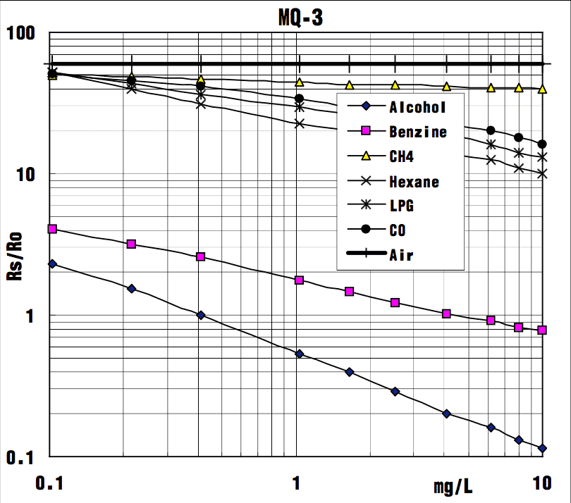


### MQ-4: Detector de gas metano (gas natural)
- Sensible al gas metano y al gas carbónico
- Concentración: 300 hasta 10000 ppm
- Alimentación: 2,5 - 5 V
- Temperatura ambiente: desde -10 ºC hasta 50 ºC
- Humedad: ≤ 95 % RH
- Consumo de potencia: menos de 900 mW
- Tamaño agujeros de montaje: 2 mm (Aprox.)
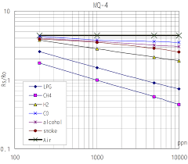


### MQ-5: Detector de fugas de gas
- Sensible a GLP y gas natural
- Consumo de potencia: 800 mW
- Dimensiones: 3 x 2 x 2.1 cm (aprox)
- Tamaño agujeros de montaje: 2 mm (Aprox.)

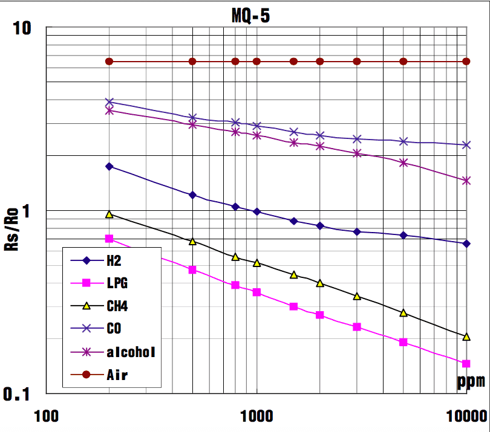


### MQ-6: Detector de gas licuado de petróleo
- Sensible al gas LP (propano, butano y gas natural)
- Concentración: 200 hasta 10000 ppm
- Alimentación: 2,5 - 5 V
- Temperatura: 20 ºC ± 2 ºC
- Humedad: ≤ 55 ± 5 % RH
- Consumo de potencia: menos de 950 mW
- Tamaño agujeros de montaje: 2 mm (Aprox.)

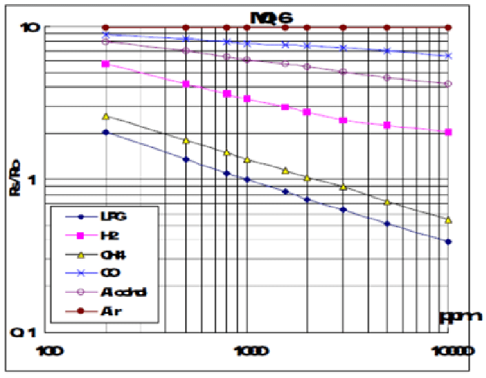

### MQ-7: Detector de monóxido de carbono.
- Sensible al monóxido de carbono (CO). Podemos detectar si el aire está limpio.
- Alimentación: 5v
- Concentración: 20 a 2000 ppm
- Concentración de oxigeno: 21 %
- Tamaño agujeros de montaje: 2 mm (aproximadamente)


La concentración inmediatamente peligrosa para la vida y la salud (IDLH) que recomienda NIOSH para el CO es de 1,200 ppm. IDLH es la concentración que podría provocar la muerte o efectos irreversibles sobre la salud, o que podría impedir que una persona se salga del ambiente contaminado en 30 minutos.


### MQ-8: Detector de gas hidrógeno.
- Alimentación: 5v
- Concentración: 100 a 10000 ppm
- Temperatura ambiente: desde -10 ºC hasta 50 ºC
- Consumo: menos de 900 mW
- Dimensiones: 3.2 x 2.2 x 2.7 cm (aprox)
- Tamaño agujeros montaje: 2 mm (Aprox)

### MQ-9: Detector de monóxido de Carbono y gas inflamable.
-  Sensible al monóxido de carbono, gases inflamables
-  Se parece al MQ-7 pero en versión mejorada
-  Temperatura ambiente: desde -10 ºC hasta 50 ºC
-  Concentración: 
	- Monóxido de carbono: 10 - 1000 ppm
	- Gas combustible: 100 - 10000 ppm
- Dimensiones: 4 x 2 mm (aproximadamente)
- Tamaño de agujeros: 2 mm (aprox)
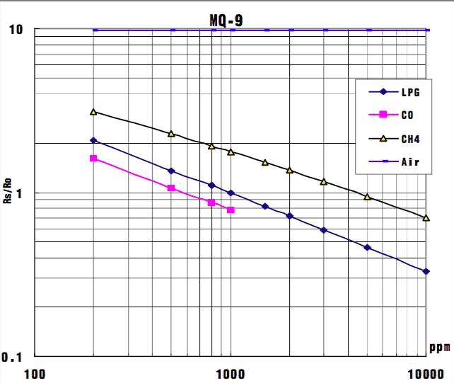

++Gases inflamables:++ se encienden fácilmente y se queman rápidamente. Es el caso del Cloruro de Metilo, Gas Licuado de Petróleo, Acetileno e Hidrógeno. 

[LEER BUTANO](http://www.ilo.org/dyn/icsc/showcard.display?p_card_id=0232&p_version=2&p_lang=es)
[LEER PPM](https://www.tgs.com.ar/files//files/tgs_16c247e4a94.pdf)
## PROYECTO ESP32

### INSTALAR LIBRERIAS DE ARDUINOS

#### CTBot


#### Arduino Json


### AGREGAR PLACA ESP32

* Agregar las librerías de ESP32 haciendo click en **Archivo -> Preferencias** y pegamos este link https://dl.espressif.com/dl/package_esp32_index.json


Placa ESP32:


ESP32:


### ERROR AL COMPILAR

```python
"exec: "python": executable file not found in $PATH
Error compiling for board ESP32 Dev Module"
```

### solucion

Para solucionar este problema se debe realizar la siguiente instalacion:

```bash
sudo apt install python-is-python3
```

[Solucion](https://espressif-docs.readthedocs-hosted.com/projects/arduino-esp32/en/latest/troubleshooting.html)


### CODIGO DE EJEMPLO


[Guia de referencia CTBot](https://github.com/shurillu/CTBot/blob/master/REFERENCE.md)

* Por cuestion de comodidad en un archivo separado colocare el **SSID, PASSWORD y TOKEN**.

```bash
const char * ssid = "RED WIFI";
const char * password = "XXXXXXX";
const String token = "XXXXXXXXXXXX";

```

* Este ejemplo reenvia el mensaje recibido en el ch1at del bot


```c++
template<class T> inline Print &operator <<(Print &obj, T arg) {
  obj.print(arg);
  return obj;
}

#include "token.h"
#include "CTBot.h"

CTBot emaBot;

void setup() {

  Serial.begin(115200);
  
  Serial.println("Iniciando ESP");
  
  emaBot.wifiConnect(ssid,password);
  
  emaBot.setTelegramToken(token);
  
  if(emaBot.testConnection()){

    Serial.println("Bot Conectado");
  }
  
  else{

    Serial.println("No conectado");
  }
  
}

void loop() {

  TBMessage mensaje;

  if( 1 == emaBot.getNewMessage(mensaje)){

    Serial << "El usuario: "<< mensaje.sender.id<<" envio el siguiente mensaje: "<<mensaje.text<<"\n";

    emaBot.sendMessage(mensaje.sender.id, mensaje.text);
  }


  delay(250);
}

```

### ENCENDER LED

```c++
template <class T> inline Print &operator<<(Print &obj, T arg){

  obj.print(arg);

  return obj;

}

#include "token.h"
#include "CTBot.h"

int led1 = 22;


CTBot emaBot;

void setup() {

  pinMode(22, OUTPUT);
  
  Serial.begin(115200);

  Serial.println("Iniciando ESP");
  
  emaBot.wifiConnect(ssid,password);
  
  emaBot.setTelegramToken(token);
  
  if(emaBot.testConnection()){

    Serial.println("Bot Conectado");
  }
  
  else{

    Serial.println("No conectado");
  }
  
}

void loop() {
  TBMessage msg;
  
  if (CTBotMessageText == emaBot.getNewMessage(msg)) {
    
    Serial << "Usuario: " << msg.sender.firstName << " - " << msg.sender.lastName<<"\n";
    Serial <<"ID: "<<msg.sender.id<<"\n";
    Serial <<"Mensaje: "<< msg.text << "\n";

    if (msg.text.equalsIgnoreCase("encender")) {
      Serial.println("Encender Led");
      digitalWrite(led1, HIGH);

      emaBot.sendMessage(msg.sender.id, "Led Encendido");
    }
    else if (msg.text.equalsIgnoreCase("apagar")) {
      Serial.println("Apagar Led");
      digitalWrite(led1, LOW);
      emaBot.sendMessage(msg.sender.id, "Led Apagado");
    }
    else {
     emaBot.sendMessage(msg.sender.id, "Bienvenido " + msg.sender.firstName + ",intenta usar: encender o apagar");
    }
  }

  delay(250);

}

```

### AGREGAR BOT A GRUPOS

Para que el bot funcione en un grupo es necesario darle permisos de administrador para que pueda leer los mensajes.

```c++
template <class T> inline Print &operator<<(Print &obj, T arg){

  obj.print(arg);

  return obj;

}

#include "token.h"
#include "CTBot.h"

int led1 = 22;


CTBot emaBot;

void setup() {

  pinMode(22, OUTPUT);
  
  Serial.begin(115200);

  Serial.println("Iniciando ESP");
  
  emaBot.wifiConnect(ssid,password);
  
  emaBot.setTelegramToken(token);
  
  if(emaBot.testConnection()){

    Serial.println("Bot Conectado");
  }
  
  else{

    Serial.println("No conectado");
  }
  
}

void loop() {
  TBMessage msg;
  
  if (CTBotMessageText == emaBot.getNewMessage(msg)) {
    
    Serial << "Usuario: " << msg.sender.firstName << " - " << msg.sender.lastName<<"\n";
    Serial <<"ID: "<<msg.sender.id<<"\n";
    
    if(msg.group.id < 0){
    
      Serial << "Grupo: " << msg.group.title<<"\nID: "<<msg.group.id<<"\n";
      Serial <<"Mensaje: "<< msg.text << "\n";

    }

    else{
    
      Serial <<"Mensaje: "<< msg.text << "\n";
    
    }
    
    if (msg.text.equalsIgnoreCase("encender")) {
      
      Serial.println("Encender Led");
      
      digitalWrite(led1, HIGH);

      if(msg.group.id < 0){
        
        emaBot.sendMessage(msg.group.id, "Led Encendido");
      }

      else{
        
        emaBot.sendMessage(msg.sender.id, "Led Encendido");
        
      }
      
    }
    
    else if (msg.text.equalsIgnoreCase("apagar")) {
    
      Serial.println("Apagar Led");
      
      digitalWrite(led1, LOW);
      
            if(msg.group.id < 0){
        
        emaBot.sendMessage(msg.group.id, "Led Apagado");
      }

      else{
        
        emaBot.sendMessage(msg.sender.id, "Led Apagado");
        
      }
      
    }
    else {
     emaBot.sendMessage(msg.sender.id, "Bienvenido " + msg.sender.firstName + ", intenta usar: encender o apagar");
    }
  }
  delay(250);

}

```

### BOTONES EN GRUPOS Y CHAT PRIVADOS

```bash 

template <class T> inline Print &operator <<(Print &obj, T arg){

  obj.print(arg);
  return obj;
}
#include "token.h"
#include "CTBot.h"

CTBotInlineKeyboard boton;
CTBot emaBot;
int led1 = 22;

void setup() {

//------------CONFIGURAR LED -------------------
  pinMode(led1, OUTPUT);
  
  digitalWrite(led1, LOW);
  
  Serial <<"ESP iniciado\n";

  //velocidad de comunicacion con el puerto serial
  Serial.begin(115200);

//--------- conexion wifi y telegram-------------
  emaBot.setMaxConnectionRetries(10);
  
  emaBot.wifiConnect(ssid,password);
  
  emaBot.setTelegramToken(token);

  if(emaBot.testConnection()){

    Serial << "Conexion con Telegram\n";
  
  }
  else{

    Serial << "Conexion con Telegram Fallida\n";
  
  }

//------------CREAR BOTONES -------------------------------------
  boton.addButton("ON","encendido",CTBotKeyboardButtonQuery);
  boton.addButton("OFF","apagado",CTBotKeyboardButtonQuery);
  boton.addRow();
  boton.addButton("BLOG","https://emablanco.github.io",CTBotKeyboardButtonURL);

}

void loop() {

//https://github.com/shurillu/CTBot/blob/master/REFERENCE.md#tbmessage
// estobjeto esta compuesto por otros objetos y string
  TBMessage mensaje;

  if(emaBot.getNewMessage(mensaje)){

//si se recibe un mensaje de texto
    if(mensaje.messageType == CTBotMessageText){

      Serial <<"Mensaje: "<<mensaje.text<<"\n";
      
      //grupos
      if(mensaje.group.id < 0){

        Serial <<"Grupo: "<<mensaje.group.title<<" - "<<mensaje.group.id<<"\n";
        if(mensaje.text.equalsIgnoreCase("/menu")){
        
      	  emaBot.sendMessage(mensaje.group.id, "MENU",boton);
      
        }
      
        else{
          
          emaBot.sendMessage(mensaje.group.id,"Para ver las opciones enviar /menu");
    
          }
        
      }

      //chat privado
      else{

        Serial << "Nombre: "<<mensaje.sender.firstName<<", "<<mensaje.sender.lastName<<"\n";
        Serial <<"ID: "<< mensaje.sender.id<<"\n";
                  
        if(mensaje.text.equalsIgnoreCase("/menu")){
        
          emaBot.sendMessage(mensaje.sender.id, "MENU",boton);
      
        }
             
        else{
                  
          emaBot.sendMessage(mensaje.sender.id,"Para ver las opciones enviar /menu");
           
          }
       }
    }

 //el mensaje recibido es Query. "BOTON"
    if(mensaje.messageType == CTBotMessageQuery){

//cuando se presiona un boton devuelve un mensaje.
      if(mensaje.callbackQueryData.equals("encendido")){

        Serial << "encendio el led\n";
        
        digitalWrite(led1,HIGH);
        
 //fializa una colsulta(Query) enviando lo que se especifique dentro de endQuery
        emaBot.endQuery(mensaje.callbackQueryID,"LED ENCENDIDO",false);
      }
      
      //callbackQueryData -> contiene el dato asociado al boton. -> 
      if(mensaje.callbackQueryData.equals("apagado")){
        
        Serial <<"apago led\n";
        
        digitalWrite(led1,LOW);

        emaBot.endQuery(mensaje.callbackQueryID,"LED APAGADO",false);
      }
  
    }
  
  }
  delay(250);
  
}

```
- [ ] A tener en cuenta: Se pueden poner varios bot, pero solo se configura la conexion WiFi en un solo bot. Para agregar otros bot solo hay que definir el Token.


## TONO ESP32

[FUENTE ORIGINAL](https://techtutorialsx.com/2017/07/01/esp32-arduino-controlling-a-buzzer-with-pwm/)

### ESP32 Arduino: control de un timbre con PWM

El objetivo de esta publicación es explicar cómo controlar un timbre con el ESP32, utilizando sus funcionalidades PWM. En particular, vamos a utilizar las funciones LED PWM de ESP32 ’.

### Introducción

El objetivo de esta publicación es explicar cómo controlar un timbre con el ESP32, utilizando sus funcionalidades PWM. En particular, vamos a utilizar las funciones LED PWM de ESP32 ’, cubiertas en detalle en esto publicación anterior.

Básicamente, utilizando el LED PWM del ESP32, podremos controlar tanto el ciclo de trabajo como la frecuencia de nuestra señal de salida. Sin embargo, tenga en cuenta que no necesitamos usar PWM para controlar un timbre, ya que solo necesitamos variar su frecuencia y podemos mantener un ciclo de trabajo constante.

Sin embargo, desde el tono la función aún no se implementa en las bibliotecas Arduino para el ESP32, el uso de las funcionalidades de control de frecuencia PWM es un posible trabajo.

Aunque, como se dijo anteriormente, no necesitamos cambiar el ciclo de trabajo para controlar un timbre y el mejor ciclo de trabajo es del 50% [ 1 ] [ 2 ], lo variaremos solo para verificar lo que sucede. El efecto esperado es que un cambio en el ciclo de trabajo afectará el volumen del timbre [ 1 ].

También vamos a variar la frecuencia, lo que afectará el tipo de sonido producido.

### Esquema electrónico

Para este tutorial voy a usar un módulo de timbre barato que ya tiene todo el hardware necesario para controlarlo directamente desde un microcontrolador GPIO ( más precisamente, un controlador de transistores ). De esta manera, no estamos extrayendo la corriente del pin ESP32 GPIO.

Verifique el resumen esquemático en la figura 1.

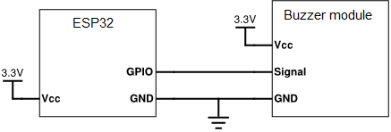

### El código

Comenzaremos declarando algunas variables globales necesarias para controlar la funcionalidad PWM del ESP32. Estableceremos la frecuencia inicial ( aunque la cambiaremos más adelante en el código ), el canal del PWM y la resolución de la especificación del ciclo de trabajo.

Utilizaremos el canal 0 y una resolución de 8 bits para el ciclo de trabajo. Para la frecuencia vamos a poner 2000 Hz solo para hacer la configuración inicial.

```bash
int freq = 2000;
int channel = 0;
int resolution = 8;

```
Ahora, en la función de configuración, vamos a configurar el PWM con el ledcSetup función, que recibe como entrada el canal PWM, la frecuencia y la resolución del ciclo de trabajo.

A continuación, adjuntaremos el canal PWM a un GPIO real del ESP32, llamando al ledcAttachPin función. Esto recibe como entrada el GPIO y el canal. Voy a usar GPIO 12 del ESP32. Tenga en cuenta que algunos pines ESP32 no se asignan directamente a los pines de las placas ESP32.

También abriremos una comunicación en serie, para que podamos verificar la salida de información sobre la ejecución. Verifique la función de configuración completa a continuación.

```bash
void setup() {
  
  Serial.begin(115200);
  ledcSetup(channel, freq, resolution);
  ledcAttachPin(12, channel);
  
}
```
Ahora vamos a pasar a la función de bucle principal, donde experimentaremos con nuestro timbre cambiando las configuraciones de frecuencia y ciclo de trabajo.

El primer valor que variaremos es el ciclo de trabajo. Entonces, al comienzo del ciclo, arreglaremos la frecuencia. Aunque lo configuramos en la función de configuración, queremos que se restablezca al valor original al comienzo de cada iteración del bucle principal.

Entonces, para establecer la frecuencia nuevamente, llamamos al ledcWriteTone función, pasando como entradas el canal PWM y la frecuencia a establecer. Lo configuraremos en 2000 Hz, como la configuración inicial.

```bash
ledcWriteTone(channel, 2000);

```
A continuación, haremos un bucle for comenzando con un PWM de cero y aumentando en 10 en cada iteración. Podemos variar el ciclo de trabajo entre 0 y 255, ya que especificamos una resolución de 8 bits.

Introduciremos un pequeño retraso de 1 segundo en cada iteración, para que podamos escuchar los efectos de cambiarlo. También imprimiremos el valor actual del ciclo de trabajo.

Para establecer el ciclo de trabajo, solo necesitamos llamar al ledcWrite función, pasando como entrada tanto el canal como el valor del ciclo de trabajo para establecer. Verifique el bucle completo a continuación.

```bash
for (int dutyCycle = 0; dutyCycle <= 255; dutyCycle=dutyCycle+10){
  
    Serial.println(dutyCycle);
  
    ledcWrite(channel, dutyCycle);
    delay(1000);
}

```

A continuación vamos a variar la frecuencia. Por lo tanto, comenzaremos fijando el ciclo de trabajo en 125 ( aproximadamente 50% ). A continuación, haremos un ciclo similar al anterior, pero esta vez comenzando con una frecuencia de 0 Hz y aumentando en 250 hasta 10000 Hz. También imprimiremos el valor actual nuevamente en el puerto serie.

Puede verificar a continuación el código fuente completo, que ya incluye este bucle mencionado anteriormente donde la frecuencia se incrementa llamando al ledcWriteTone función.


```bash

int freq = 2000;
int channel = 0;
int resolution = 8;
  
void setup() {
  
  Serial.begin(115200);
  ledcSetup(channel, freq, resolution);
  ledcAttachPin(12, channel);
  
}
  
void loop() {
  
  ledcWriteTone(channel, 2000);
  
  for (int dutyCycle = 0; dutyCycle <= 255; dutyCycle=dutyCycle+10){
  
    Serial.println(dutyCycle);
  
    ledcWrite(channel, dutyCycle);
    delay(1000);
  }
  
  ledcWrite(channel, 125);
  
  for (int freq = 255; freq < 10000; freq = freq + 250){
  
     Serial.println(freq);
  
     ledcWriteTone(channel, freq);
     delay(1000);
  }
  
}

```

### Probar el código
Para probar el código, simplemente cárguelo en el ESP32 usando el IDE de Arduino. Luego abra el puerto serie para verificar los valores de frecuencia y el cambio del ciclo de trabajo.

Con el ESP32 conectado al timbre, primero debe escuchar un cambio en el volumen producido por el timbre, causado por el cambio del ciclo de trabajo. Luego, al cambiar la frecuencia, notará que el sonido producido también cambiará.

Puede consultar en el video a continuación el resultado de ejecutar este código en una placa ESP32.

[FUENTE ORIGINAL](https://techtutorialsx.com/2017/07/01/esp32-arduino-controlling-a-buzzer-with-pwm/)


* * *

### SENSOR DE MOVIMIENTO CON BOTONES

```bash
template<class T> inline Print &operator <<(Print &obj, T arg) {
  obj.print(arg);
  return obj;
}

//TAMAÑO DE LA MEMORIA EEPROM -> MEMORIA INTERNA DEL ESP
#define EEPROM_SIZE 12

#include "CTBot.h"
#include <EEPROM.h>

CTBot miBot;
CTBotInlineKeyboard miTeclado;

#include "token.h"


//------------------- CONFIGURAR PING PARA BUZZER
int frecuencia = 200; //frecuencia
int channel = 0; //canal
int resolucion = 8;//bits
//--------------------------------------------------------


//----------------- DEFINIR PIN, BUZZER, SENSOR --------------
int Led1 = 22;
int Led2 = 2;
int buzzer = 21;
int Sensor = 4;
//---------------------------------------------------------


//---------------- TIEMPO ----------------------------------
float tiempo = 0;
float espera = 10;


//DIRECCION DE MEMORIA DONDE ESTARA EL VALOR
const int DireccionSonido = 0;
boolean Sonido = true;
//DIRECCION DE MEMORIA DONDE ESTARA EL VALOR
const int DireccionActivo = 1;
boolean Activo = true;

void setup() {
  
  Serial.begin(115200);
  
  Serial << "\nIniciando Bot de Telegram\n";


//----------------- BUZZER -------------------
  ledcSetup(channel, frecuencia, resolucion);
  ledcAttachPin(buzzer, channel);


//-------- CONFIGURAR EEPROM -------------------
// INICIO LA MEMORIA EEPROM CON EL TAMAÑO
  EEPROM.begin(EEPROM_SIZE);
  Serial << "EEPROM Configurada";
  Activo = EEPROM.read(DireccionActivo);


//------------- ESTADO DE ALARMA
  Serial.print("Alarma: ");
  Serial.println(Activo ? "Activo" : "Apagado");


//------------- ESTADO DE BUZZER ------------------
  Sonido = EEPROM.read(DireccionSonido);
  Serial.print("Sonido: ");
  Serial.println(Sonido ? "Activo" : "Apagado");


//--------- CONFIGURAR Led1 Y SENSOR --------------
  pinMode(Led1, OUTPUT);
  pinMode(Sensor, INPUT);
  pinMode(Led2, OUTPUT);


//------------ CONFIGURAR WIFI Y BOT -----------------
  miBot.wifiConnect(ssid, password);
  miBot.setTelegramToken(token);
  if (miBot.testConnection()) {
    Serial << "\n Conectado";
  }
  else {
    Serial << "\n Problemas Auxilio";
  }

//-------------------- BOTON -------------------------------------
  miTeclado.addButton("Alarma", "alarma", CTBotKeyboardButtonQuery);
  miTeclado.addButton("Sonido", "sonido", CTBotKeyboardButtonQuery);
  miTeclado.addButton("Estado", "estado", CTBotKeyboardButtonQuery);
  miTeclado.addRow();
  miTeclado.addButton("mira documentación", "https://emablanco.github.io", CTBotKeyboardButtonURL);

//--------------- AVISO DE ESTADO EN LINEA -----------------------
  miBot.sendMessage(IDchat, "En Linea, Sistema Vigilancia:");
  tiempo = -espera * 1000;
}

void loop() {
  //Serial << millis() << " - " << tiempo << " = " << (millis() - tiempo) << " - " << (espera * 1000) << "\n";
  usarAlarma();
  menuBot();
  digitalWrite(Led1, Activo);
}

void menuBot() {
  
  TBMessage mensaje;

  if (miBot.getNewMessage(mensaje)) {
    
    if (mensaje.sender.id == IDchat) {
      
      if (mensaje.messageType == CTBotMessageText) {
       
        if (mensaje.text.equalsIgnoreCase("menu")) {
     
          verEstado();
        }
      
        else {
      
          Serial<< "Enviar 'menu' a "<< mensaje.sender.id;
       
          miBot.sendMessage(mensaje.sender.id, "prueba 'menu'");
          
        }
        
      } 
      
      else if (mensaje.messageType == CTBotMessageQuery) {
        
        Serial << "Mensaje: " <<  mensaje.sender.firstName << "\n";
       
        if (mensaje.callbackQueryData.equals("alarma")) {
        
          Activo = !Activo;
         
          String estado_alarma  = "Alarma: ";
         
          estado_alarma += (Activo ? "Activo" : "Apagado");
         
          Serial.println(estado_alarma);
         
          miBot.endQuery(mensaje.callbackQueryID, estado_alarma);

         //GUARDAR EN ESTA DIRECCIO  EN VALOR DE ACTIVO
          EEPROM.put(DireccionActivo, Activo);
         //VALIDAR
          EEPROM.commit();
        } 
        
        else if (mensaje.callbackQueryData.equals("sonido")) {
         
          Sonido = !Sonido;
         
          String estado_alarma  = "Sonido: ";
         
          estado_alarma += (Activo ? "Activo" : "Apagado");
        
          Serial.println(estado_alarma);
        
          miBot.endQuery(mensaje.callbackQueryID, estado_alarma);
        
          EEPROM.put(DireccionSonido, Sonido);
        
          EEPROM.commit();
        }
        
        else if (mensaje.callbackQueryData.equals("estado")) {
         
          verEstado();
        }
        
      }
      
    } 
    
    else {
      
      Serial << "Intento de uso no autorizado: " << mensaje.sender.firstName << " - " <<  mensaje.sender.lastName << "\n";
      
      Serial << "Usuario: " << mensaje.sender.username << " ID: " << mensaje.sender.id << "\n";
      
      miBot.sendMessage(mensaje.sender.id, "No estas habilitado para usarme");
      
    }
  }
  
}

void verEstado() {
  
  Serial.println("Enviando 'opciones'");
  
  String estado_alarma  = "Estado Actual\n";
 
  estado_alarma += "Alarma: ";
 
  estado_alarma += (Activo ? "Activo" : "Apagado");
 
  estado_alarma += " - Sonido: ";
 
  estado_alarma += (Sonido ? "Activo" : "Apagado");
  
  Serial.println(estado_alarma);
 
  miBot.sendMessage(IDchat, estado_alarma);
 
  miBot.sendMessage(IDchat, "Cambiar", miTeclado);
}

void usarAlarma() {
  
  if (Activo) {
  
    int Valor = digitalRead(Sensor);
  
    if (Valor) {
   
        Serial.println("Enviando Alerta");
     
        digitalWrite(Led1, LOW);
        
        digitalWrite(Led2, HIGH);
    
        if (Sonido) {
    
            ledcWrite(channel, frecuencia);
     
            delay(1000);
     
            ledcWrite(channel, 0);
        }
      
        miBot.sendMessage(IDchat, "Alerta Camara: ");
     
        delay(1000);
        
        digitalWrite(Led2, LOW);
        
        digitalWrite(Led1, HIGH);
        
    }
  }
}

```
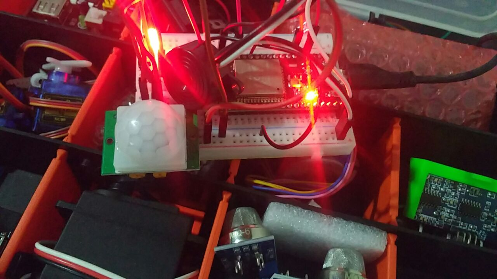
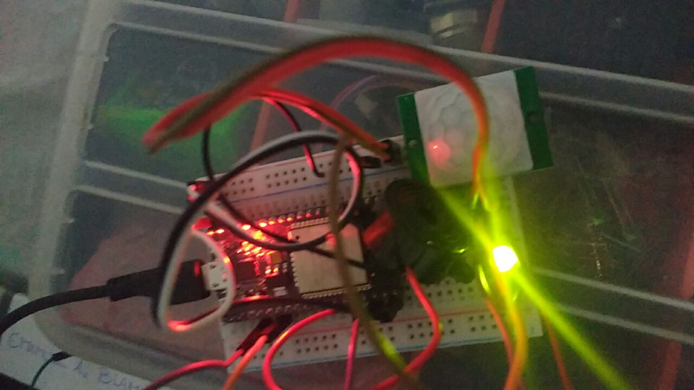


### MEMORIA EEPROM

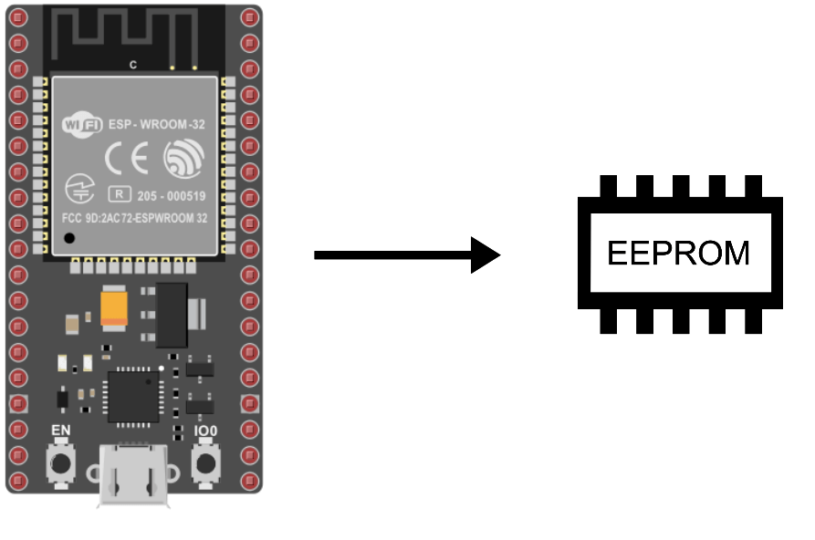

La EEPROM es una memoria interna del microcontrolador ESP32 que permite mantener los datos en la memoria después de reiniciar la placa. Cuando se trabaja con microcontroladores, es interesante mantener los datos en la memoria, especialmente cuando la placa se apaga, se quiera o no, como en el caso de una pérdida de energía eléctrica.

El microcontrolador ESP32 tiene una zona de memoria Flash con la que se puede interactuar como la EEPROM de un Arduino para mantener los datos en la memoria incluso después de apagar la placa. Una cosa importante a tener en cuenta es que la EEPROM tiene un tamaño y una vida útil limitados. Las celdas de memoria pueden leerse tantas veces como sea necesario, pero el número de ciclos de escritura está limitado a 100.000. Es aconsejable prestar atención al tamaño de los datos almacenados y a la frecuencia con la que se desea actualizarlos. La memoria EEPROM puede almacenar 512 valores de 0 a 255 o 128 direcciones IP o etiquetas RFID.

- [ ] Si quieres registrar los datos de una flota de sensores en tiempo real para trazarlos, lo mejor es optar por un módulo de tarjeta SD para almacenar los datos.

### Código con la biblioteca EEPROM
Para interactuar con la EEPROM del ESP32, podemos utilizar la librería EEPROM.h como para Arduino con dos diferencias. Antes de usar la función, debemos inicializar el tamaño de la memoria con begin() y la función update no existe pero la función write tiene la misma función que update. Es decir, un valor se modifica sólo si el valor es diferente al registrado.

* begin() para inicializar el tamaño de la memoria
* write(), que se adapta según el tipo de variable, para escribir
* read() para leer
* las funciones put() y get() pueden ser utilizadas de la misma manera

Otras funciones de la biblioteca pueden ser utilizadas dependiendo de su uso de la EEPROM.

```bash

//Libraries
#include <EEPROM.h>//https://github.com/espressif/arduino-esp32/tree/master/libraries/EEPROM
//Constants
#define EEPROM_SIZE 12
void setup() {
 	//Init Serial USB
 	Serial.begin(115200);
 	Serial.println(F("Initialize System"));
 	//Init EEPROM
 	EEPROM.begin(EEPROM_SIZE);
 	//Write data into eeprom
 	int address = 0;
 	int boardId = 18;
 	EEPROM.write(address, boardId);//EEPROM.put(address, boardId);
 	address += sizeof(boardId); //update address value
 	float param = 26.5;
 	EEPROM.writeFloat(address, param);//EEPROM.put(address, param);
 	EEPROM.commit();
 	//Read data from eeprom
 	address = 0;
 	int readId;
 	readId = EEPROM.read(address); //EEPROM.get(address,readId);
 	Serial.print("Read Id = ");
 	Serial.println(readId);
 	address += sizeof(readId); //update address value
 	float readParam;
 	EEPROM.get(address, readParam); //readParam=EEPROM.readFloat(address);
 	Serial.print("Read param = ");
 	Serial.println(readParam);
 	EEPROM.end();
}
void loop() {}

```
[FUENTE](https://www.aranacorp.com/es/uso-de-la-eeprom-con-el-esp32/#:~:text=La%20memoria%20EEPROM%20puede%20almacenar,direcciones%20IP%20o%20etiquetas%20RFID.)

### SENSOR DE GAS

Este codigo es similar al de la alarma, aun se puede mejorar un poco mas, talvez quitar varias lineas que puedne estar de mas. 

- [ ] Estos codigos son solo de practica y son guias para mi mismo.

#### ARCHIVO TOKEN.H

```
const char *ssid= "WiFi-Arnet-EMA_2,4";
const char *password = "1111111111";
const String token = "TOKEN TELEGRAM";
const long long IDchat =1111111111;
long long idGrupo = -111111111111111111;

```


#### ARCHIVO .INO
```

template<class T> inline Print &operator <<(Print &obj, T arg) {
  obj.print(arg);
  return obj;
}

//TAMAÑO DE LA MEMORIA EEPROM -> MEMORIA INTERNA DEL ESP
#define EEPROM_SIZE 12

#include "CTBot.h"
#include <EEPROM.h>

CTBot miBot;
CTBotInlineKeyboard miTeclado;

#include "token.h"


//------------------- CONFIGURAR PING PARA BUZZER
int frecuencia = 200; //frecuencia
int channel = 0; //canal
int resolucion = 8;//bits
//--------------------------------------------------------

//----------------- DEFINIR PIN, BUZZER, SENSOR --------------
int Led1 = 22;
int Led2 = 2;
int buzzer = 21;
int Sensor = 39;
//---------------------------------------------------------
//---------------- TIEMPO ----------------------------------
float tiempo = 0;
float espera = 10;


//DIRECCION DE MEMORIA DONDE ESTARA EL VALOR
const int DireccionSonido = 0;
boolean Sonido = true;
//DIRECCION DE MEMORIA DONDE ESTARA EL VALOR
const int DireccionActivo = 1;
boolean Activo = true;

void setup() {
  
  Serial.begin(115200);
  
  Serial << "\nIniciando Bot de Telegram\n";


//----------------- BUZZER -------------------
  ledcSetup(channel, frecuencia, resolucion);
  ledcAttachPin(buzzer, channel);


//-------- CONFIGURAR EEPROM -------------------
// INICIO LA MEMORIA EEPROM CON EL TAMAÑO
  EEPROM.begin(EEPROM_SIZE);
  Serial << "EEPROM Configurada";
  Activo = EEPROM.read(DireccionActivo);


//------------- ESTADO DE ALARMA
  Serial.print("Alarma: ");
  Serial.println(Activo ? "Activo" : "Apagado");


//------------- ESTADO DE BUZZER ------------------
  Sonido = EEPROM.read(DireccionSonido);
  Serial.print("Sonido: ");
  Serial.println(Sonido ? "Activo" : "Apagado");


//--------- CONFIGURAR Led1 Y SENSOR --------------
  pinMode(Led1, OUTPUT);
  pinMode(Sensor, INPUT);
  pinMode(Led2, OUTPUT);


//------------ CONFIGURAR WIFI Y BOT -----------------
  miBot.wifiConnect(ssid, password);
  miBot.setTelegramToken(token);
  if (miBot.testConnection()) {
    Serial << "\n Conectado";
  }
  else {
    Serial << "\n Problemas Auxilio";
  }

//-------------------- BOTON -------------------------------------
  miTeclado.addButton("Alarma", "alarma", CTBotKeyboardButtonQuery);
  miTeclado.addButton("Sonido", "sonido", CTBotKeyboardButtonQuery);
  miTeclado.addButton("Estado", "estado", CTBotKeyboardButtonQuery);
  miTeclado.addRow();
  miTeclado.addButton("mira documentación", "https://emablanco.github.io", CTBotKeyboardButtonURL);

//--------------- AVISO DE ESTADO EN LINEA -----------------------
  miBot.sendMessage(IDchat, "En Linea, Sistema Vigilancia:");
  tiempo = -espera * 1000;
}

void loop() {
  //Serial << millis() << " - " << tiempo << " = " << (millis() - tiempo) << " - " << (espera * 1000) << "\n";
  usarAlarma();
  menuBot();
  digitalWrite(Led1, Activo);
}

void menuBot() {
  
  TBMessage mensaje;

  if (miBot.getNewMessage(mensaje)) {
    
    if (mensaje.sender.id == IDchat) {
      
      if (mensaje.messageType == CTBotMessageText) {
       
        if (mensaje.text.equalsIgnoreCase("menu")) {
     
          verEstado();
        }
      
        else {
      
          Serial<< "Enviar 'menu' a "<< mensaje.sender.id;
       
          miBot.sendMessage(mensaje.sender.id, "prueba 'menu'");
          
        }
        
      } 
      
      else if (mensaje.messageType == CTBotMessageQuery) {
        
        Serial << "Mensaje: " <<  mensaje.sender.firstName << "\n";
       
        if (mensaje.callbackQueryData.equals("alarma")) {
        
          Activo = !Activo;
         
          String estado_alarma  = "Alarma: ";
         
          estado_alarma += (Activo ? "Activo" : "Apagado");
         
          Serial.println(estado_alarma);
         
          miBot.endQuery(mensaje.callbackQueryID, estado_alarma);

         //GUARDAR EN ESTA DIRECCIO  EN VALOR DE ACTIVO
          EEPROM.put(DireccionActivo, Activo);
         //VALIDAR
          EEPROM.commit();
        } 
        
        else if (mensaje.callbackQueryData.equals("sonido")) {
         
          Sonido = !Sonido;
         
          String estado_alarma  = "Sonido: ";
         
          estado_alarma += (Activo ? "Activo" : "Apagado");
        
          Serial.println(estado_alarma);
        
          miBot.endQuery(mensaje.callbackQueryID, estado_alarma);
        
          EEPROM.put(DireccionSonido, Sonido);
        
          EEPROM.commit();
        }
        
        else if (mensaje.callbackQueryData.equals("estado")) {
         
          verEstado();
        }
        
      }
      
    } 
    
    else {
      
      Serial << "Intento de uso no autorizado: " << mensaje.sender.firstName << " - " <<  mensaje.sender.lastName << "\n";
      
      Serial << "Usuario: " << mensaje.sender.username << " ID: " << mensaje.sender.id << "\n";
      
      miBot.sendMessage(mensaje.sender.id, "No estas habilitado para usarme");
      
    }
  }
  
}

void verEstado() {
  
  Serial.println("Enviando 'opciones'");
  
  String estado_alarma  = "Estado Actual\n";
 
  estado_alarma += "Alarma: ";
 
  estado_alarma += (Activo ? "Activo" : "Apagado");
 
  estado_alarma += " - Sonido: ";
 
  estado_alarma += (Sonido ? "Activo" : "Apagado");
  
  Serial.println(estado_alarma);
 
  miBot.sendMessage(IDchat, estado_alarma);
 
  miBot.sendMessage(IDchat, "Cambiar", miTeclado);
}

void usarAlarma() {
  
  if (Activo) {
    
    //analogReadResolution(10);
    int Valor = analogRead(Sensor);
    //Serial <<Valor<<"\n";
    if (Valor >= 2000) {
   
        Serial.println("Enviando Alerta ");
        Serial.println(Valor);
     
        digitalWrite(Led1, LOW);
        
        digitalWrite(Led2, HIGH);
    
        if (Sonido) {
    
            ledcWrite(channel, frecuencia);
     
            delay(2000);
     
            ledcWrite(channel, 0);
        }
      
        miBot.sendMessage(IDchat, "Alerta!!.. GAS DETECTADO!!: ");
     
        delay(1000);
        
        digitalWrite(Led2, LOW);
        
        digitalWrite(Led1, HIGH);
        
    }
  }
}
```