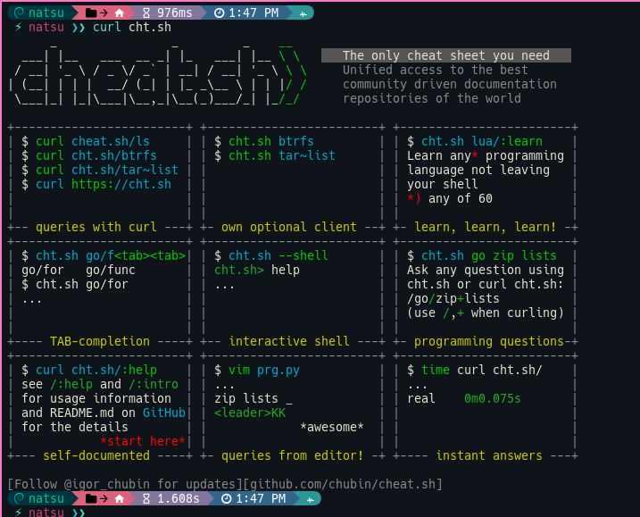

[---](---.md)
layout: single
title:  RANDOM
excerpt: "Herramientas y pag utiles"

date: 2023-03-22
classes: wide
header:
    teaser: /assets/images/comando/logo.png
    teaser_home_page: true
    icon: /assets/images/logofairy.png
categories:
    - Debian
tags:  
 - Programaciom
 - bash
---



## TEXTO DE AYUDA 

Escriba una línea de comando para ver el texto de ayuda que coincide con cada argumento. 

Esta pagina es para entender que es lo que hacen algunos scripts que se pueden encontrar en la red para resolver algunos problemas.

[Explain Shell](https://explainshell.com/)


## VER CLIMA DESDE TERMINAL 

[WTTR](http://wttr.in)

```bash

curl http://wttr.in

```


## LENGUAJE DE PROGRAMACION

Aveces suele pasar que se te olvidas como usar una función de un lenguaje de programación y debes acudir a Google. Con esta pag se puede obtener de forma fácil un ejemplo de su implementación.


```bash
#curl.sh/"lenguaje"/"funcion"

curl cht.sh/c++/while

```


### VER VERSION DE COMPILADOR 

```c++
#include<iostream>
using namespace std;
int main() {
    if (__cplusplus == 201703L)
        std::cout << "C++17" << endl;
    else if (__cplusplus == 201402L)
        std::cout << "C++14" << endl;
    else if (__cplusplus == 201103L)
        std::cout << "C++11" << endl;
    else if (__cplusplus == 199711L)
        std::cout << "C++98" << endl;
    else
        std::cout << "pre-standard C++" << endl;

    return 0;
}
```

### ENVIAR MENSAJES BOT DE TELEGRAM
```bash
#!/bin/bash

TOKEN="XXXXXXXXXXXXTOKENXXXXXXXXXXXXXXXXXXX"
ID="----ID-----"
MESSAGE=$1
URL="https://api.telegram.org/bot$TOKEN/sendMessage"

curl -s -X POST $URL -d chat_id=$ID -d text="$MESSAGE"


```

* Ejecutando el script junto con un mensaje, eso se enviara a telegram.

```bash

./bash.sh "Esto es una prueba";

```
