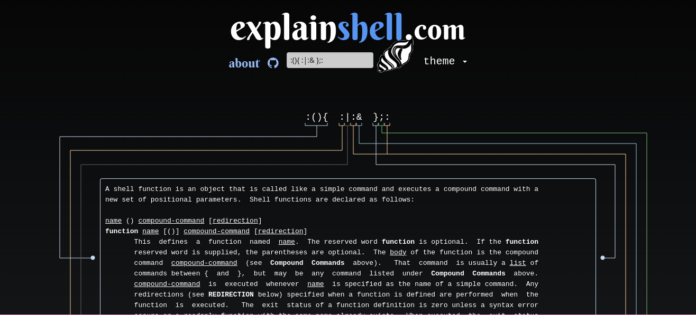
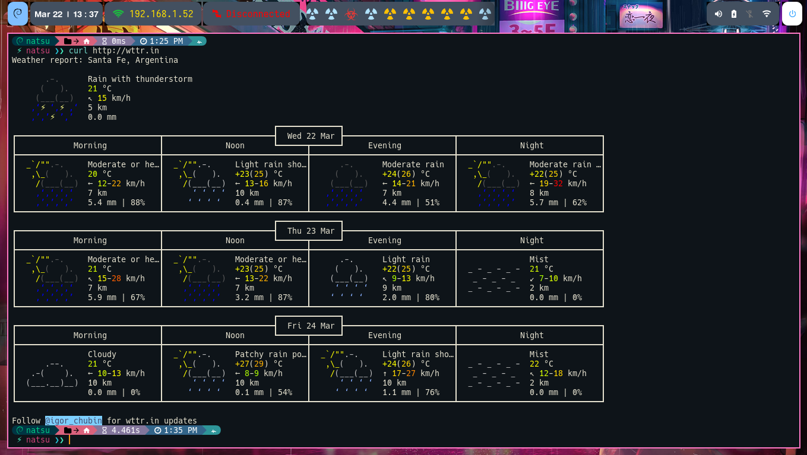
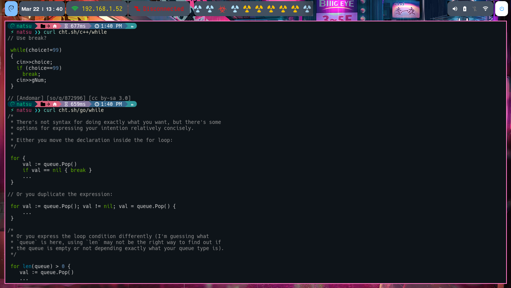
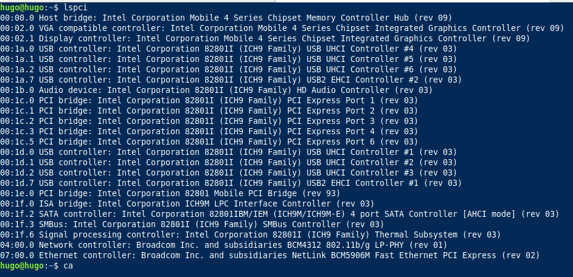

## TEXTO DE AYUDA 

Escriba una línea de comando para ver el texto de ayuda que coincide con cada argumento. 


[Explain Shell](https://explainshell.com/)



## VER CLIMA DESDE TERMINAL 

[WTTR](http://wttr.in)

```bash

curl http://wttr.in

```


## LENGUAJE DE PROGRAMACION

Aveces suele pasar que se te olvidas como usar una función de un lenguaje de programación y debes acudir a Google. Con esta pag se puede obtener de forma fácil un ejemplo de su implementación.


```bash
#curl.sh/"lenguaje"/"funcion"

curl cht.sh/c++/while

```


### VER VERSION DE COMPILADOR 

```c++
#include<iostream>
using namespace std;
int main() {
    if (__cplusplus == 201703L)
        std::cout << "C++17" << endl;
    else if (__cplusplus == 201402L)
        std::cout << "C++14" << endl;
    else if (__cplusplus == 201103L)
        std::cout << "C++11" << endl;
    else if (__cplusplus == 199711L)
        std::cout << "C++98" << endl;
    else
        std::cout << "pre-standard C++" << endl;

    return 0;
}
```

### ENVIAR MENSAJES BOT DE TELEGRAM
```bash
#!/bin/bash

TOKEN="XXXXXXXXXXXXTOKENXXXXXXXXXXXXXXXXXXX"
ID="----ID-----"
MESSAGE=$1
URL="https://api.telegram.org/bot$TOKEN/sendMessage"

curl -s -X POST $URL -d chat_id=$ID -d text="$MESSAGE"


```

* Ejecutando el script junto con un mensaje, eso se enviara a telegram.

```bash

./bash.sh "Esto es una prueba";

```

### DRIVER LINUX

Instalé Linux Mint en una netbook y me encontré con el problema de que el Wi-Fi no funcionaba. Para solucionar el problema, primero verifiqué que el hardware se detectara con:

```bash 
lspci

```



Como se puede ver en la imagen, la tarjeta inalámbrica es una Broadcom BCM4312. Para instalar el controlador correspondiente, se deben seguir los siguientes pasos.

- Paso 1: Conectar a una red cableada (Ethernet)

Antes de comenzar, es útil tener acceso a una conexión a Internet con cable (Ethernet) para descargar los controladores y las actualizaciones necesarias.

- Paso 2: Actualizar el sistema

Abre una terminal en Linux Mint y ejecuta los siguientes comandos uno por uno para actualizar el sistema y asegurarte de tener la última información sobre paquetes disponibles:

```bash
sudo apt update
sudo apt upgrade
```
- Paso 3: Instalar el controlador

Para instalar el controlador para el chip Broadcom BCM4312, puedes usar el paquete bcmwl-kernel-source, que es compatible con este tipo de hardware. Ejecuta el siguiente comando:


```bash
sudo apt install bcmwl-kernel-source

```
Cuando se te solicite, confirma la instalación. Este comando descargará e instalará el controlador necesario.

Paso 4: Cargar el controlador

Después de instalar el controlador, debes asegurarte de que esté cargado correctamente. Ejecuta el siguiente comando:

```bash
sudo modprobe wl

```
Este comando debe cargar el controlador en el kernel.

Paso 5: Reiniciar

Es posible que necesites reiniciar tu computadora para que los cambios surtan efecto. Después del reinicio, deberías poder conectarte a redes Wi-Fi utilizando el chip BCM4312.


### BUENA PRACTICA

Creo un servicio que va a ejecutar un script en todos los arranques del sistema.
```bash 

cat > /etc/systemd/system/servicio_ema.service << EOF

[Unit]

Description=Servicio de Ema 

[Service]
Type=oneshot
ExecStart=/bin/script.sh
RemainAfterExit=yes
[Install]
WantedBy=multi-user.target

EOF

systemctl enable servicio_ema 

cat > /bin/script.sh << EOF 

#! /bin/bash 

sed -i 's/^#net.ipv4.ip_forward=1/net.ipv4.ip_forward=1/' /etc/sysctl.conf

EOF

chmod +x /bin/script.sh

```


- **Type=oneshot:** El servicio solo se ejecuta una vez. 
- **ExecStart=/bin/script.sh:** Ejecuta un script .
- **RemainAfterExit=yes:** El servicio sigue activo aun cuando el script ya finalizo.
- **WantedBy=multi-user.target:** Se ejecuta cuando el sistema esta listo para ofrecer servicios


- sed -i 's/^#net.ipv4.ip_forward=1/net.ipv4.ip_forward=1/' /etc/sysctl.conf : edito el archivo **_/etc/sysctl.conf_** y busco la linea _#net.ipv4.ip_forward=1_, cuando la encuentro la reeplazo por net.ipv4.ip_forward=1 . 
- - ^: Se usa para buscar la linea que comience con _#net.ipv4.ip_forward=1_


