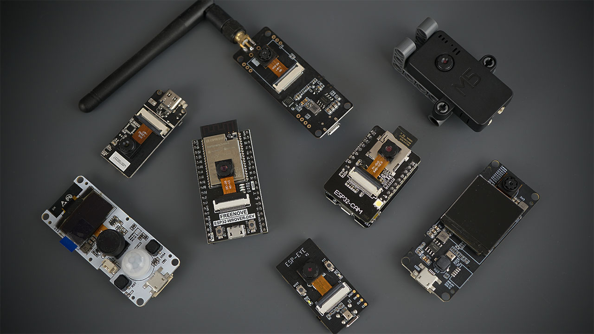
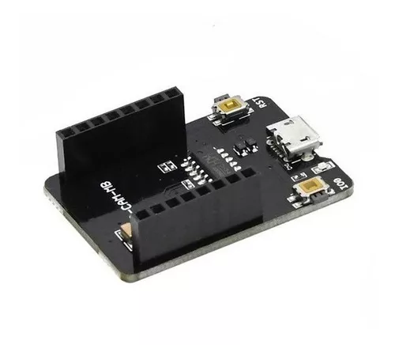
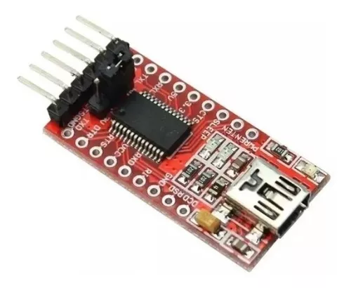
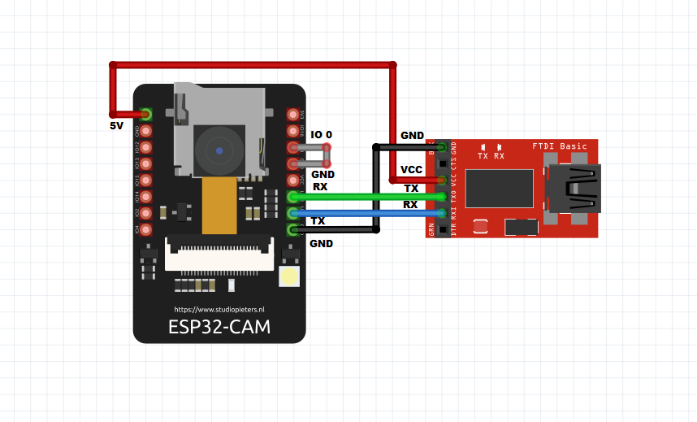

### CAMARA ESPIA

El proyecto consiste en armar un sistema de vigilancia utilizando el ESP32CAM que permita detectar el movimiento, tomar una foto y enviarla a un chat en Telegram.

Para lograr esto, el ESP32CAM es programado para detectar el movimiento utilizando un sensor de movimiento PIR (Infrarrojo Pasivo) y para tomar una foto utilizando la cámara OV2640 integrada. Cuando se detecta movimiento, el ESP32CAM captura una foto y la envía a un chat en Telegram utilizando la API de Telegram.

Para implementar este proyecto, es necesario programar el ESP32CAM utilizando un software de desarrollo como el IDE de Arduino. Además, se debe configurar una cuenta en Telegram y crear un bot de Telegram para recibir las fotos capturadas y enviarlas al chat.

Este tipo de proyecto puede ser muy útil para la vigilancia en el hogar o en la oficina, para la detección de intrusos, la monitorización de mascotas o la automatización del hogar, entre otros usos.

### Estos son los pasos para crear un bot de Telegram:

Abre la aplicación de Telegram en tu dispositivo o accede a la versión web.

Busca el bot "BotFather" en la barra de búsqueda. Una vez que lo encuentres, inicia una conversación con él.

Envía el comando "/newbot" al BotFather para crear un nuevo bot. Él te pedirá un nombre para el bot y un nombre de usuario (debe terminar en "bot"). Proporciona estos datos.

Si todo va bien, el BotFather te enviará un mensaje con un token. Este token es la clave para acceder a la API de Telegram y utilizar tu bot.

Ahora que tienes el token, puedes empezar a programar tu bot utilizando el lenguaje de programación que prefieras. Puedes utilizar una biblioteca como "python-telegram-bot" si estás programando en Python, o cualquier otra biblioteca disponible para tu lenguaje de programación.

Una vez que hayas programado el bot, debes añadirlo a un chat o grupo en Telegram para que pueda recibir y enviar mensajes. Para hacer esto, simplemente busca el nombre de usuario del bot en la barra de búsqueda de Telegram y envíale un mensaje.

¡Y eso es todo! Ahora tienes un bot de Telegram que puedes utilizar para enviar y recibir mensajes desde tus aplicaciones.

### PROGRAMAR ESP32CAM 

* **Placa Base Programador Esp32 Cam: ** Esta placa es la que utilizo para programarlo y alimentarolo.

[COMPRAR](https://articulo.mercadolibre.com.ar/MLA-1138363194-placa-base-programador-esp32-cam-ov2640-esp32-cam-mb-hobb-_JM#position=19&search_layout=grid&type=item&tracking_id=3b954265-e9a8-4448-bfca-bc7fdd37bb91)




* **Progrmador Ftdi Usb Ttl Ft232 Ft232rl Esp32cam Arduino: ** Tambien se puede utilizar este programador. 

[COMPRAR](https://articulo.mercadolibre.com.ar/MLA-880515783-progrmador-ftdi-usb-ttl-ft232-ft232rl-esp32cam-arduino-_JM#position=1&search_layout=stack&type=item&tracking_id=5e1230ab-6a97-4c40-8753-dbb1bca29c18)



El diagrama de conexion para este programador es el sig: 



#### CARGAR CODIGO

Espe codigo sirve para tomar fotos desde el chat de telegram y el mismo se puede obtener desde el repositorio de la libreria o los diferente tutoriales que se encuentran en la web.

```bash

#include <WiFi.h>
#include <WiFiClientSecure.h>
#include "soc/soc.h"
#include "soc/rtc_cntl_reg.h"
#include "esp_camera.h"
#include <UniversalTelegramBot.h>
#include <ArduinoJson.h>
#include <Wire.h>

//Reemplazar con los datos de tu red wifi
const char* ssid = "WiFi-Arnet-Ema_2,4";
const char* password = "11111111111";
//Se puede usar id de grupos, los cuales son negativos.
String CHAT_ID = "-1111111111111";//ID_Chat se obtiene de telegram
//Token de Telegram BOT se obtenienen desde Botfather en telegram
String BOTtoken = "xxxxxxxxxxxxxxxxxxxxxxxxxxxxxxxxxxxxxxxxxxxxxxxxxx";

WiFiClientSecure clientTCP;
UniversalTelegramBot bot(BOTtoken, clientTCP);

//PARA CÁMARA MODELO AI THINKER
#define PWDN_GPIO_NUM     32
#define RESET_GPIO_NUM    -1
#define XCLK_GPIO_NUM      0
#define SIOD_GPIO_NUM     26
#define SIOC_GPIO_NUM     27
#define Y9_GPIO_NUM       35
#define Y8_GPIO_NUM       34
#define Y7_GPIO_NUM       39
#define Y6_GPIO_NUM       36
#define Y5_GPIO_NUM       21
#define Y4_GPIO_NUM       19
#define Y3_GPIO_NUM       18
#define Y2_GPIO_NUM        5
#define VSYNC_GPIO_NUM    25
#define HREF_GPIO_NUM     23
#define PCLK_GPIO_NUM     22


bool sendPhoto = false;


//led
#define FLASH_LED_PIN 4

bool flashState = LOW;

//Timbre
bool timbre = false;
#define buzzer 2
int botRequestDelay = 1000;
unsigned long lastTimeBotRan;

void handleNewMessages(int nuevoMensajes);

String sendPhotoTelegram();
// Indica cuando se apretó el timbre

static void IRAM_ATTR pulsarTimbre(void * arg){
    Serial.println("Timbre precionado!");
    timbre = true;
}

void setup(){

    WRITE_PERI_REG(RTC_CNTL_BROWN_OUT_REG, 0); 
    Serial.begin(115200);
    pinMode(buzzer, OUTPUT);
    pinMode(FLASH_LED_PIN, OUTPUT);
    digitalWrite(FLASH_LED_PIN, flashState);
    
    WiFi.mode(WIFI_STA);
    Serial.println();
    Serial.print("Conectando a ");
    Serial.println(ssid);
    WiFi.begin(ssid, password);

    clientTCP.setCACert(TELEGRAM_CERTIFICATE_ROOT); // Agregar certificado raíz para api.telegram.org

    while (WiFi.status() != WL_CONNECTED) {
        Serial.print(".");
        delay(500);
        bot.sendMessage(CHAT_ID, "Sistema preparado, use '/start' para ver comandos!", "");//Enviamos un mensaje a telegram para informar que el sistema está listo
    }

    Serial.println();
    Serial.print("Dirección IP del modulo esp32cam: ");
    Serial.println(WiFi.localIP());
    
    camera_config_t config;

    config.ledc_channel = LEDC_CHANNEL_0;
    config.ledc_timer = LEDC_TIMER_0;
    config.pin_d0 = Y2_GPIO_NUM;
    config.pin_d1 = Y3_GPIO_NUM;
    config.pin_d2 = Y4_GPIO_NUM;
    config.pin_d3 = Y5_GPIO_NUM;
    config.pin_d4 = Y6_GPIO_NUM;
    config.pin_d5 = Y7_GPIO_NUM;
    config.pin_d6 = Y8_GPIO_NUM;
    config.pin_d7 = Y9_GPIO_NUM;
    config.pin_xclk = XCLK_GPIO_NUM;
    config.pin_pclk = PCLK_GPIO_NUM;
    config.pin_vsync = VSYNC_GPIO_NUM;
    config.pin_href = HREF_GPIO_NUM;
    config.pin_sscb_sda = SIOD_GPIO_NUM;
    config.pin_sscb_scl = SIOC_GPIO_NUM;
    config.pin_pwdn = PWDN_GPIO_NUM;
    config.pin_reset = RESET_GPIO_NUM;
    config.xclk_freq_hz = 20000000;
    config.pixel_format = PIXFORMAT_JPEG;
    
    if(psramFound()){
        config.frame_size = FRAMESIZE_UXGA;
        config.jpeg_quality = 1;  //0-63 menor número significa mayor calidad
        config.fb_count = 2;
    }
    
    else {
        config.frame_size = FRAMESIZE_SVGA;
        config.jpeg_quality = 2;  //0-63 menor número significa mayor calidad
        config.fb_count = 1;
    }
// inicio de la cámara

    esp_err_t err = esp_camera_init(&config);
    if (err != ESP_OK) {
        Serial.printf("El inicio de la cámara falló 0x%x", err);
        delay(1000);
        ESP.restart();
    }

// Tamaño de cuadro desplegable para una mayor velocidad de cuadro inicial

    sensor_t *s = esp_camera_sensor_get();
    s->set_framesize(s, FRAMESIZE_CIF);  // UXGA|SXGA|XGA|SVGA|VGA|CIF|QVGA|HQVGA|QQVGA
// En el pin 13 se coloca el pulsador 

    err = gpio_isr_handler_add(GPIO_NUM_13, &pulsarTimbre, (void *) 13);  
    
    if (err != ESP_OK){
        Serial.printf("hubo un error 0x%x \r\n", err); 
    }

    err = gpio_set_intr_type(GPIO_NUM_13, GPIO_INTR_POSEDGE);

    if (err != ESP_OK){
        Serial.printf("hubo un error 0x%x \r\n", err);
    }
}

//https://randomnerdtutorials.com/telegram-esp32-cam-photo-arduino/
//este codigo es el codigo de ejemplo que se encuentra en el git de las librerias
void loop(){

  if (sendPhoto) {
    Serial.println("Preparing photo");
    bot.sendMessage(CHAT_ID, "enviando foto", "");//Enviamos un mensaje a telegram para informar que el sistema está listo
    sendPhotoTelegram(); 
    sendPhoto = false;
    bot.sendMessage(CHAT_ID, "foto enviada", "");
  }
  if (millis() > lastTimeBotRan + botRequestDelay)  {
    int numNewMessages = bot.getUpdates(bot.last_message_received + 1);
    while (numNewMessages) {
      Serial.println("got response");
      handleNewMessages(numNewMessages);
      numNewMessages = bot.getUpdates(bot.last_message_received + 1);
    }
    lastTimeBotRan = millis();
  }
}


String sendPhotoTelegram() {
  const char* myDomain = "api.telegram.org";
  String getAll = "";
  String getBody = "";

  camera_fb_t * fb = NULL;
  fb = esp_camera_fb_get();  
  if(!fb) {
    Serial.println("Camera capture failed");
    delay(1000);
    ESP.restart();
    return "Camera capture failed";
  }  
  
  Serial.println("Connect to " + String(myDomain));


  if (clientTCP.connect(myDomain, 443)) {
    Serial.println("Connection successful");
    
    String head = "--RandomNerdTutorials\r\nContent-Disposition: form-data; name=\"chat_id\"; \r\n\r\n" + CHAT_ID + "\r\n--RandomNerdTutorials\r\nContent-Disposition: form-data; name=\"photo\"; filename=\"esp32-cam.jpg\"\r\nContent-Type: image/jpeg\r\n\r\n";
    String tail = "\r\n--RandomNerdTutorials--\r\n";

    uint16_t imageLen = fb->len;
    uint16_t extraLen = head.length() + tail.length();
    uint16_t totalLen = imageLen + extraLen;
  
    clientTCP.println("POST /bot"+BOTtoken+"/sendPhoto HTTP/1.1");
    clientTCP.println("Host: " + String(myDomain));
    clientTCP.println("Content-Length: " + String(totalLen));
    clientTCP.println("Content-Type: multipart/form-data; boundary=RandomNerdTutorials");
    clientTCP.println();
    clientTCP.print(head);
  
    uint8_t *fbBuf = fb->buf;
    size_t fbLen = fb->len;
    for (size_t n=0;n<fbLen;n=n+1024) {
      if (n+1024<fbLen) {
        clientTCP.write(fbBuf, 1024);
        fbBuf += 1024;
      }
      else if (fbLen%1024>0) {
        size_t remainder = fbLen%1024;
        clientTCP.write(fbBuf, remainder);
      }
    }  
    
    clientTCP.print(tail);
    
    esp_camera_fb_return(fb);
    
    int waitTime = 10000;   // timeout 10 seconds
    long startTimer = millis();
    boolean state = false;
    
    while ((startTimer + waitTime) > millis()){
      Serial.print(".");
      delay(100);      
      while (clientTCP.available()) {
        char c = clientTCP.read();
        if (state==true) getBody += String(c);        
        if (c == '\n') {
          if (getAll.length()==0) state=true; 
          getAll = "";
        } 
        else if (c != '\r')
          getAll += String(c);
        startTimer = millis();
      }
      if (getBody.length()>0) break;
    }
    clientTCP.stop();
    Serial.println(getBody);
  }
  else {
    getBody="Connected to api.telegram.org failed.";
    Serial.println("Connected to api.telegram.org failed.");
  }
  return getBody;
}


void handleNewMessages(int numNewMessages) {
  Serial.print("Handle New Messages: ");
  Serial.println(numNewMessages);

  for (int i = 0; i < numNewMessages; i++) {
    String chat_id = String(bot.messages[i].chat_id);
    if (chat_id != CHAT_ID){
      bot.sendMessage(chat_id, "Unauthorized user", "");
      continue;
    }
    
    // Print the received message
    String text = bot.messages[i].text;
    Serial.println(text);
    
    String from_name = bot.messages[i].from_name;
    if (text == "/start") {
      String welcome = "Welcome , " + from_name + "\n";
      welcome += "Use the following commands to interact with the ESP32-CAM \n";
      welcome += "/photo : takes a new photo\n";
      welcome += "/flash : toggles flash LED \n";
      bot.sendMessage(CHAT_ID, welcome, "");
    }
    if (text == "/flash") {
      flashState = !flashState;
      digitalWrite(FLASH_LED_PIN, flashState);
      Serial.println("Change flash LED state");
    }
    if (text == "/photo") {
      sendPhoto = true;
      Serial.println("New photo request");
    }
  }
}

```
[FUENTE](//https://randomnerdtutorials.com/telegram-esp32-cam-photo-arduino/)
