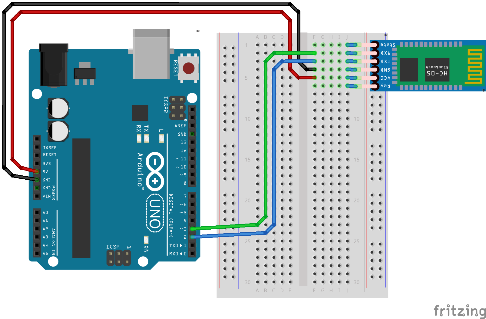
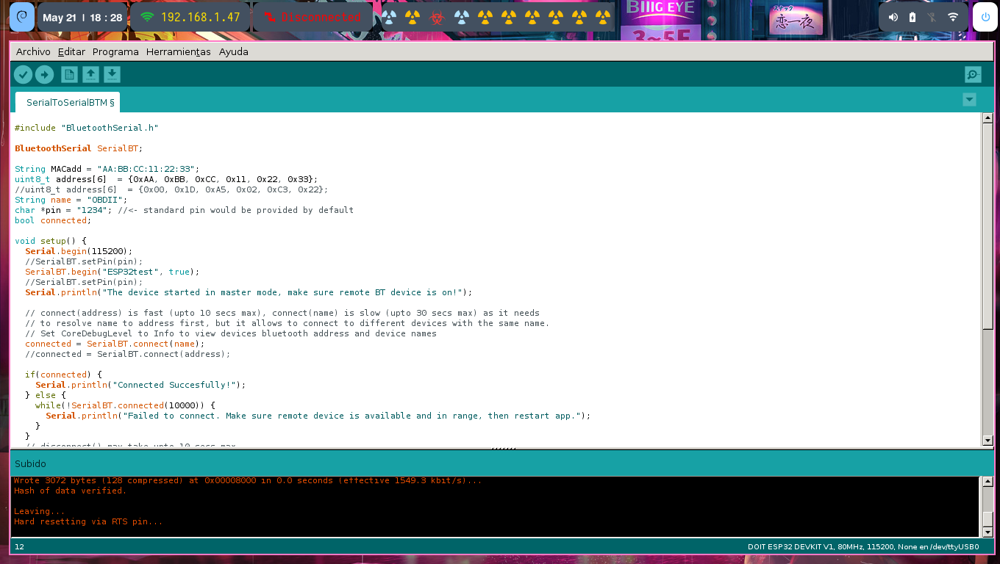

Para no usar el el pin 0 y 1 (Rx, TX) utilizare la libreria **SoftwareSerial**.

- TX: Transmite datos, generalmente desempeña el papel de transmisor, normalmente el pin TXD debe estar conectado al pin RXD de otros dispositivos. 
- RX: Receptor de datos, generalmente juega el papel de receptor, normalmente el pin RXD debe estar conectado al pin TXD de otros dispositivos.

### Los motivos de esta decisión son los siguientes: 

- Cada vez que quiera subir código al dispositivo tendré que remover el dispositivo.

- Se pierde la posibilidad de depurar el código por el puerto serial.

## SoftwareSerial Library

La biblioteca SoftwareSerial permite la comunicación en serie en otros pines digitales de una placa Arduino, utilizando software para replicar la funcionalidad (de ahí el nombre "SoftwareSerial"). Es posible tener múltiples puertos seriales de software con velocidades de hasta 115200 bps. Un parámetro habilita la señalización invertida para dispositivos que requieren ese protocolo.

La versión de SoftwareSerial incluida en 1.0 y posteriores se basa en la biblioteca NewSoftSerial de 'Mikal Hart'.

Para usar esta biblioteca:

[FUENTE](https://docs.arduino.cc/learn/built-in-libraries/software-serial)

```bash

#include <SoftwareSerial.h>

```

### Aplicacion "Arduino Bluetooth Controler"

[Aplicacion Bluetooth](https://play.google.com/store/apps/details?id=com.giumig.apps.bluetoothserialmonitor&hl=es_MX&pli=1)


### Ejemplo 1:

```bash

#include <SoftwareSerial.h>

//SoftwareSerial(rxPin, txPin, inverse_logic)
SoftwareSerial BTEma(2,3);

//el tx del bluetooth va en el rx
//el rx del bluetooth va en el tx
// 2 -> emulara el rx = recibe datos
// 3 -> emulara el tx = transmite datos

void setup() {
  Serial.begin(9600);//velocidad del puerto serial real
  BTEma.begin(9600); // velocidad del puerto serial emulado
}

void loop() {
  if(BTEma.available()){ // si se recibio datos
    Serial.write(BTEma.read()); //Escribimos en el puerto serial lo que se recibe por bluetooth
  }
  if(Serial.available()){// si en el puerto serial hay datos
    BTEma.write(Serial.read());
  }
}


```
Diagrama de conexion: 



- available(): Obtenga la cantidad de bytes (caracteres) disponibles para leer desde un puerto serie de software. Estos son datos que ya llegaron y se almacenaron en el búfer de recepción en serie.

- **Sintaxis**

```bash

mySerial.available()

```
- **Parámetros**: Ninguno.

- **Devoluciones** : El número de bytes disponibles para leer.

### Ejemplo2: Encender led por comandos

```bash

#include <SoftwareSerial.h>
SoftwareSerial BTEma(2, 3);
#include <Servo.h>
Servo servoMotor;

//led
int Led1 = 5;
int Led2 = 6;
int Nivel1 = 0;
int Nivel2 = 0;

//servo
int servo = 9;

int posicion;

void setup() {
  Serial.begin(9600);
  BTEma.begin(9600);
  pinMode(Led1, OUTPUT);
  pinMode(Led2, OUTPUT);
  servoMotor.attach(servo);
}

void loop() {
  if (BTEma.available()) {
    DecodificarSerial();
    analogWrite(Led1, Nivel1);
    analogWrite(Led2, Nivel2);
    servoMotor.write(posicion);
  }
}

void DecodificarSerial() {

  //https://www.arduino.cc/reference/en/language/functions/communication/stream/streamreadstringuntil/
  String Mensaje = BTEma.readStringUntil('\n'); //extrae toda la cadena leída de una secuencia, hasta el carácter terminador
  Serial.print("Mensaje : ");
  Serial.println(Mensaje);

  String Dato = Mensaje.substring(0, Mensaje.indexOf('/')); //indexOf busca subcadenas y devuelve donde comienza. sino esta return -1
  int Valor = Mensaje.substring(Mensaje.indexOf('/') + 1, Mensaje.length()).toInt(); //toInt convierte la cadena a entero.sino puede return 0

//https://www.arduino.cc/reference/en/language/variables/data-types/string/functions/equalsignorecase/
  if(Dato.equalsIgnoreCase("led1")) Nivel1 = Valor;
  if(Dato.equalsIgnoreCase("led2")) Nivel2 = Valor;
  if(Dato.equalsIgnoreCase("servo")){
      posicion = servoMotor.read() + Valor;
  }
  

  Depurar codigo
  Serial.print("Dato : ");
  Serial.print(Dato);
  Serial.print(" Valor//// : ");
  Serial.println(Valor);


}

```
### ESP32

Arduino cuenta con un ejemplo para poder utilizar el bluetooth el esp32 

```bash

#include "BluetoothSerial.h"

BluetoothSerial SerialBT;

String MACadd = "AA:BB:CC:11:22:33";
uint8_t address[6]  = {0xAA, 0xBB, 0xCC, 0x11, 0x22, 0x33};
//uint8_t address[6]  = {0x00, 0x1D, 0xA5, 0x02, 0xC3, 0x22};
String name = "OBDII";
char *pin = "1234"; //<- standard pin would be provided by default
bool connected;

void setup() {
  Serial.begin(115200);
  //SerialBT.setPin(pin);
  SerialBT.begin("ESP32test", true); 
  //SerialBT.setPin(pin);
  Serial.println("The device started in master mode, make sure remote BT device is on!");
  
  // connect(address) is fast (upto 10 secs max), connect(name) is slow (upto 30 secs max) as it needs
  // to resolve name to address first, but it allows to connect to different devices with the same name.
  // Set CoreDebugLevel to Info to view devices bluetooth address and device names
  connected = SerialBT.connect(name);
  //connected = SerialBT.connect(address);
  
  if(connected) {
    Serial.println("Connected Succesfully!");
  } else {
    while(!SerialBT.connected(10000)) {
      Serial.println("Failed to connect. Make sure remote device is available and in range, then restart app."); 
    }
  }
  // disconnect() may take upto 10 secs max
  if (SerialBT.disconnect()) {
    Serial.println("Disconnected Succesfully!");
  }
  // this would reconnect to the name(will use address, if resolved) or address used with connect(name/address).
  SerialBT.connect();
}

void loop() {
  if (Serial.available()) {
    SerialBT.write(Serial.read());
  }
  if (SerialBT.available()) {
    Serial.write(SerialBT.read());
  }
  delay(20);
}

```



```bash
#include "BluetoothSerial.h"

#if !defined(CONFIG_BT_ENABLED) || !defined(CONFIG_BLUEDROID_ENABLED)
#error Bluetooth is not enabled! Please run `make menuconfig` to and enable it
#endif

BluetoothSerial SerialBT;

int Led = 5;

void setup() {
  Serial.begin(9600);
  SerialBT.begin("ESP32test");
  pinMode(Led, OUTPUT);
}

void loop() {
  if (SerialBT.available()) {
    char Mensaje = SerialBT.read();
    if (Mensaje == 'A') {
      digitalWrite(Led, HIGH);
      Serial.println("Encender Led");
    }
    else if (Mensaje == 'B') {
      digitalWrite(Led, LOW);
      Serial.println("Apagar Led");
    }
  }
}

```
