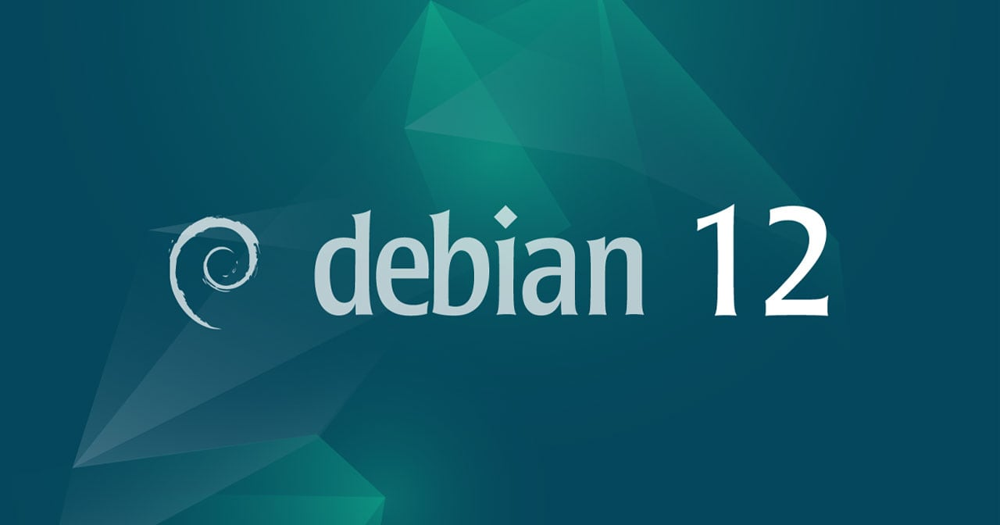

**¿Qué es un repositorio?**

Los repositorios permiten a los usuarios instalar y actualizar fácilmente software utilizando herramientas de gestión de paquetes como APT (Advanced Package Tool). A través de APT, los usuarios pueden buscar, descargar e instalar programas y bibliotecas con facilidad, lo que facilita la instalación y mantenimiento de software en sistemas Debian.

Debian tiene diferentes tipos de repositorios, como el repositorio principal (main), que contiene software completamente libre y de código abierto, y otros repositorios (como contrib y non-free) que pueden incluir software con licencias más restrictivas.

En general, los repositorios Debian son una parte fundamental del sistema, ya que proporcionan una forma segura y eficiente de administrar el software en una distribución Debian, asegurando que los programas se mantengan actualizados y sean compatibles con la distribución.


## REPOSITORIOS


```python

# Debian 12: sources.list Oficial
deb http://deb.debian.org/debian/ bookworm main
deb-src http://deb.debian.org/debian/ bookworm main
deb http://security.debian.org/debian-security bookworm-security main contrib
deb-src http://security.debian.org/debian-security bookworm-security main contrib
deb http://deb.debian.org/debian/ bookworm-updates main contrib
deb-src http://deb.debian.org/debian/ bookworm-updates main contrib

# Debian 12: Contrib & Non-Free
deb http://deb.debian.org/debian bookworm main contrib non-free
deb-src http://deb.debian.org/debian bookworm main contrib non-free
deb http://deb.debian.org/debian-security bookworm/updates main contrib non-free
deb-src http://deb.debian.org/debian-security bookworm/updates main contrib non-free
deb http://deb.debian.org/debian bookworm-updates main contrib non-free
deb-src http://deb.debian.org/debian bookworm-updates main contrib non-free

# Debian 12: Backports
deb http://deb.debian.org/debian bookworm-backports main contrib non-free
deb-src http://deb.debian.org/debian bookworm-backports main contrib non-free

```

## REPOSITORIO SIN SRC


```python
bookworm contrib main non-free non-free-firmware
# deb-src https://ftp.debian.org/debian/ bookworm contrib main non-free non-free-firmware

# Actualizaciones
deb https://ftp.debian.org/debian/ bookworm-updates contrib main non-free non-free-firmware
# deb-src https://ftp.debian.org/debian/ bookworm-updates contrib main non-free non-free-firmware

deb https://ftp.debian.org/debian/ bookworm-proposed-updates contrib main non-free non-free-firmware
# deb-src https://ftp.debian.org/debian/ bookworm-proposed-updates contrib main non-free non-free-firmware

# Seguridad
deb https://security.debian.org/debian-security/ bookworm-security contrib main non-free non-free-firmware
# deb-src https://security.debian.org/debian-security/ bookworm-security contrib main non-free non-free-firmware

# Repositorios Backports
deb https://ftp.debian.org/debian/ bookworm-backports contrib main non-free non-free-firmware
# deb-src https://ftp.debian.org/debian/ bookworm-backports contrib main non-free non-free-firmware

```

## bookworm-backports

 Para instalar un paquete de los repositorios backport es necesario especificar con -t

```python
sudo apt install -t bookworm-backports package-name

```
- [Repositorio](https://wiki.debian.org/es/SourcesList)

 
