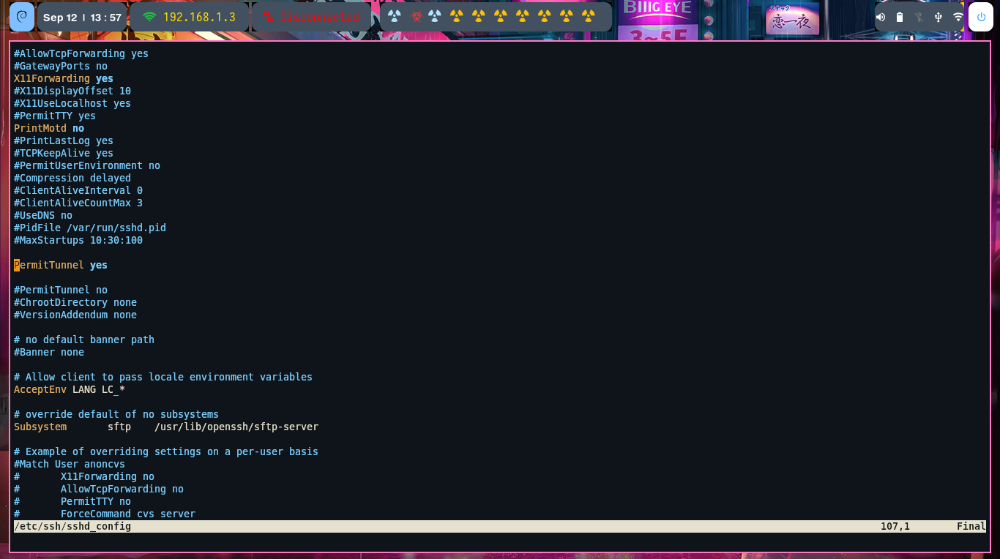
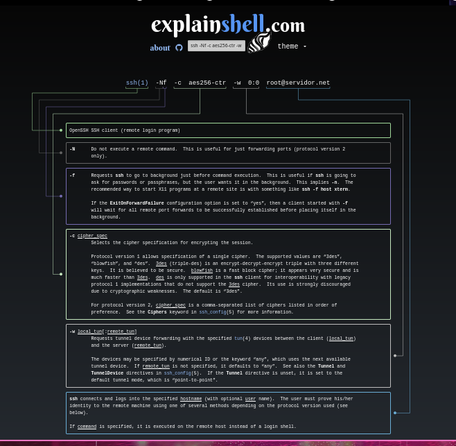

<p align="center">
  
</p>

## ¿Que es un Tunel SSH?

Un túnel SSH es una tecnología de seguridad que permite crear una conexión segura entre dos puntos en una red, a través de la cual se pueden enviar datos de manera cifrada. Estos túneles se utilizan comúnmente para proteger la transmisión de dato a través de redes no confiables (como internet), ya que los datos viajan de manera cifrada.


Algunos usos que se le suelen dar a los túneles SSH son:

1. **Acceso seguro a sistemas remotos:** Los túneles **SSH** permiten a los usuarios acceder de forma segura a sistemas remotos a través de una conexión cifrada. Esto es importante cuando se necesita administrar sistemas en entornos no confiables.

1. **Transferencia de archivos segura:** Los túneles **SSH** se pueden utilizar para transferir archivos de manera segura entre dos sistemas, utilizando el protocolo **SCP** o **SFTP**. Esto garantiza que los archivos transmitidos estén protegidos contra posibles ataques o interceptación.

1. **Redirección de puertos:** Mediante la redirección de puertos SSH, es posible enviar el tráfico de un puerto local a un puerto remoto a través de un túnel SSH. Esto se utiliza para acceder a servicios en una red remota de manera segura, como el acceso a una base de datos en un servidor remoto.

1. **Saltar restricciones de firewall:** Los túneles SSH pueden saltar restricciones de firewall al enrutar el tráfico a través de una conexión SSH segura. Esto puede ser útil para acceder a servicios bloqueados o restringidos en una red.


## ¿Que planeo hacer?

Hoy me he propuesto establecer un túnel SSH entre el firewall de mi hogar y el servidor QEMU/KVM del centro cultura "El Birri". El propósito es configurar una conexión que funcione como VPN. Para lograrlo, voy a crear interfaces **TUN/TAP** y aplicar el cifrado **AES** para asegurar la completa seguridad de las comunicaciones.

Estas interfaces **TUN/TAP** funcionarán como canales secretos que permiten la comunicación sin que haya posibilidad de intercepción por parte de algun **lammer**. El uso del cifrado **AES** añadirá una capa de seguridad a las comunicaciones, garantizando que nadie pueda espiarlas o comprometer la los datos transmitidos.


### CONFIGURAR SERVIDOR SSH


Antes de crear un túnel SSH, es necesario configurar el servicio **SSH** agregando la línea _PermitTunnel yes_. Esto garantiza que se pueda establecer el túnel de manera efectiva.




Es necesario reiniciar el servicio **sshd**.

```bash

systemctl restart sshd

```


### INTERFAZ VIRTUAL 


Cuando se deseas unir dos redes remotas a través de Internet utilizando **SSH** es necesario crear interfaces virtuales "TUN/TAP", estas interfaces virtuales en combinación con SSH proporcionan un canal seguro de comunicación que cifra y protege el tráfico y permite un enrutamiento eficiente y controlado. Esto garantiza la confidencialidad y la seguridad de la comunicación entre las redes remotas a través de una red pública o no confiable.

Entonces las interfaces virtuales permiten: 

- **Cifrado y Privacidad:** Una interfaz virtual TUN/TAP se utiliza para encapsular el tráfico de red y cifrarlo antes de enviarlo a través de Internet. Esto asegura que los datos transmitidos entre las dos redes estén protegidos.

- **Túnel VPN:** La interfaz virtual TUN/TAP actúa como un túnel VPN seguro a través del cual se enruta el tráfico entre las dos redes remotas. SSH se utiliza para establecer y gestionar este túnel VPN, lo que garantiza que la comunicación sea confidencial y segura.

- **Enrutamiento de Red:** Una vez que se crea el túnel VPN a través de la interfaz virtual, se puede configurar el enrutamiento para permitir que las redes remotas se comuniquen entre sí como si estuvieran en la misma red local. Esto permite que los dispositivos de una red remota se comuniquen con los dispositivos de la otra red de manera segura y eficiente.

- **Aislamiento y Control:** La interfaz virtual proporciona un nivel de aislamiento entre las dos redes, lo que significa que se puede controlar y gestionar la comunicación entre ellas de manera más precisa. Se puede aplicar políticas de seguridad específicas y segmentar el tráfico según sea crea necesario.

- **Flexibilidad y Escalabilidad:** Utilizar una interfaz virtual para crear una VPN SSH ofrece flexibilidad para conectar redes remotas y escalar la solución según sea necesario. Se Pueden agregar más redes remotas a la red VPN sin necesidad de modificar la infraestructura física.


### SERVIDOR SSH REMOTO 

Crear interfaz virtual:

```bash

ip tuntap add mode tun name tun0
ip addr add 200.10.10.2/24 dev tun0
ip link set tun0 up

```
Editar el archivo _/etc/sysctl.conf_.

```bash
net.ipv4.ip_forward=1

```

- **net.ipv4.ip_forward=1** habilita la funcionalidad de reenvío de paquetes IP en un sistema Linux, permitiendo que actúe como un intermediario para el tráfico de red y las diferentes redes o interfaces.


Recargar las configuraciones del Kernel:

```bash
sysctl -p

```

Configurar IPTABLES:

    - /usr/sbin/iptables -A INPUT -i tun0  -p tcp --dport 2222 -j ACCEPT # SSH
    - /usr/sbin/iptables -A FORWARD -i tun0 -o br0 -p tcp --dport 80 -j ACCEPT #HTTP
	- /usr/sbin/iptables -A FORWARD -i tun0 -o br0 -p tcp --dport 443 -j ACCEPT #HTTPS
	- /usr/sbin/iptables -A FORWARD -i tun0 -o br0 -p tcp --dport 53 -j ACCEPT #DNS
	- /usr/sbin/iptables -A FORWARD -i tun0 -o br0 -p udp --dport 53 -j ACCEPT #DNS
    - /usr/sbin/iptables -t nat -A POSTROUTING -s 200.10.10.0/24 -j MASQUERADE


### SERVIDOR RED LOCAL:

Crear interfaz virtual

```bash

ip tuntap add mode tun name tun0
ip addr add 200.10.10.1/24 dev tun0
ip link set tun0 up

```

Establecer el tunel ssh:

ssh -Nf -c aes256-ctr -w 0:0 root@emablanco.net

Desglose de los parametros:

- **-N:** Este parámetro le indica a SSH que no ejecute ningún comando remoto después de la autenticación. Es útil cuando solo se desea establecer el túnel y no ejecutar mas comandos.

- **-f:** Este parámetro hace que SSH se ejecute en segundo plano. Esto significa que la conexión SSH se establecerá y quedará en segundo plano sin bloquear la terminal actual.

- **-c aes256-ctr:**  Este parámetro especifica el cifrado a utilizar. En este caso, se utiliza **AES256-CTR**, que es un algoritmo de cifrado fuerte y seguro.

- **-w 0:0:** Este parámetro se utiliza para crear un túnel VPN. El 0:0 indica que se utiliza el primer par de interfaces TUN/TAP disponibles.




Con esto ya se logro unir las dos redes. 


### CONFIGURACIÓN FINAL DEL VPN

1. Finalizar el proceso del tunel VPN.


```bash
ip route delete default 
ip route add "SERVIDOR" via "GATEWAY"
ip rout add default via 200.10.10.2

```
- **ip route delete default:** Elimina la ruta de salida predeterminada actual. 

- **ip route add "SERVIDOR" via "GATEWAY":** Establece una nueva ruta de salida predeterminada que dirige todo el tráfico hacia "SERVIDOR" a través del "GATEWAY". Esto significa que todo el tráfico de salida se dirigirá primero al gateway de la red LAN y, desde allí, se enviará al servidor SSH remoto a través de su dirección IP pública.

- **ip route add default via 200.10.10.2:** Se configura otra ruta de salida predeterminada que dirige todo el tráfico no destinado a una red específica a través de la dirección IP "200.10.10.2". O sea, saldra a internet.

Crear tunel:


```bash 
ssh -Nf -c aes256-ctr -w 0:0 root@IP-SERVIDOR

```
Siguiendo estos pasos se puede configurar un servidor VPN utilizando solo SSH. 


## RESUMEN DE LOS COMANDOS COPY PASTE


### SERVIDOR REMOTO 

```bash

ip tuntap add mode tun name tun0
ip addr add 200.10.10.2/24 dev tun0
ip link set tun0 up

```
Editar el archivo _/etc/sysctl.conf_.

```bash
net.ipv4.ip_forward=1

```
Recargar configuración:

```bash
sysctl -p

```

IPTABLES: 

```bash

/usr/sbin/iptables -A INPUT -i tun0  -p tcp --dport 2222 -j ACCEPT # SSH
/usr/sbin/iptables -A FORWARD -i tun0 -o br0 -p tcp --dport 80 -j ACCEPT #HTTP
/usr/sbin/iptables -A FORWARD -i tun0 -o br0 -p tcp --dport 443 -j ACCEPT #HTTPS
/usr/sbin/iptables -A FORWARD -i tun0 -o br0 -p tcp --dport 53 -j ACCEPT #DNS
/usr/sbin/iptables -A FORWARD -i tun0 -o br0 -p udp --dport 53 -j ACCEPT #DNS
/usr/sbin/iptables -t nat -A POSTROUTING -s 200.10.10.0/24 -j MASQUERADE

```

### SERVIDOR LOCAL


Crear interfaz: 

```bash

ip tuntap add mode tun name tun0
ip addr add 200.10.10.1/24 dev tun0
ip link set tun0 up

```
Configurar red: 

```bash
ip route delete default 
ip route add "SERVIDOR" via "GATEWAY"
ip rout add default via 200.10.10.2

```

Crear Tunel: 

```bash 
ssh -Nf -c aes256-ctr -w 0:0 root@IP-SERVIDOR

```

## DUDAS. 

Mientras realizaba esta actividad, comencé a cuestionarme cuándo es recomendable utilizar un túnel o una VPN. A medida que leía más, mi confusión aumentaba, hasta que finalmente todo quedó claro.


### VPN Y TUNEL SSH 

Una forma de ver la diferencia clave entre una VPN y un túnel SSH, es que una VPN es adecuada para proteger y conectar dos o más redes completas, mientras que un túnel SSH es más apropiado cuando deseas proteger la comunicación entre dos puntos finales o servicios individuales.

- VPN: Una VPN se utiliza para proteger y conectar dos o más redes completas, permitiendo la comunicación segura entre todos los dispositivos en esas redes. Cada dispositivo en cualquiera de las redes puede comunicarse de manera segura con cualquier otro dispositivo en cualquiera de las redes. Esto es útil cuando se desea conectar redes completas y compartir recursos de manera segura entre ubicaciones geográficas separadas.

- Túnel SSH: Un túnel SSH, por otro lado, se utiliza para proteger y conectar dos puntos finales (generalmente dispositivos individuales o servicios específicos) de manera segura a través de una red no confiable. Establece una conexión segura entre estos dos puntos finales, lo que permite la comunicación segura solo entre esos dos puntos finales específicos. La protección se limita a las aplicaciones o servicios que se ejecutan a través del túnel SSH. Esto es útil cuando se desea proteger aplicaciones específicas o servicios sin necesidad de proteger toda una red.


### CERRANDO LA IDE 

```bash
ip route delete default 
ip route add "SERVIDOR" via "GATEWAY"
ip rout add default via 200.10.10.2

ssh -Nf -c aes256-ctr -w 0:0 root@IP-SERVIDOR

```
Cuando se configura un túnel SSH y se define el servidor remoto como la puerta de enlace predeterminada (ip route add default via 200.10.10.2), se esta redirigiendo todo el tráfico de una red a través del túnel SSH y hacia el servidor remoto. En este escenario, todo el tráfico de la red se enruta por el túnel SSH y sale a Internet a través de la otra red (SERVIDOR SSH).

Esto se logra redirigiendo el tráfico de la red local a través del túnel SSH, lo que efectivamente cambia la ruta de red predeterminada de los dispositivos en la red local. Como resultado, todo el tráfico de Internet generado por los dispositivos de la red local se envía a través del servidor remoto y, desde allí, se dirige a Internet.

Es importante tener en cuenta que esta configuración puede afectar significativamente el rendimiento de la conexión a Internet, especialmente si el servidor remoto no tiene un ancho de banda o una latencia adecuados. 


### ESTO SE PUEDE CONSIDERAR UN VPN?

Cuando se configura un túnel SSH para enrutar todo el tráfico de la red local a través del servidor remoto, se  esta creando una funcionalidad similar a un VPN. La principal diferencia es que este enfoque utiliza SSH como el método para enrutar y cifrar el tráfico, en lugar de un protocolo de VPN dedicado.

