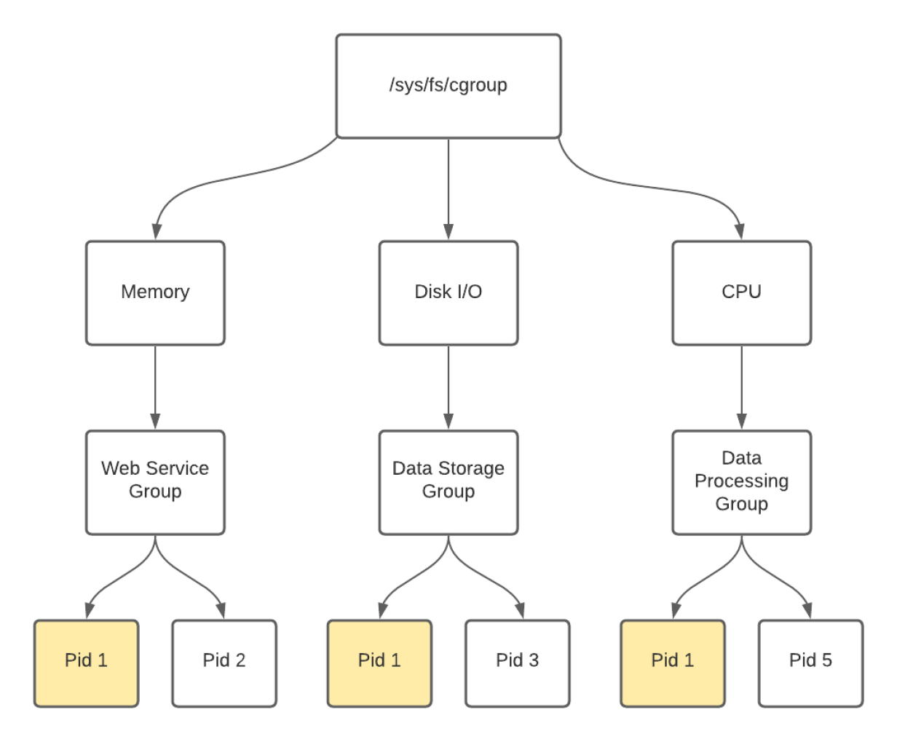

<p align="center">
  
</p>

## ¿Que es cgroup?

Cgroups es una característica de Linux que permite controlar y limitar el consumo de recursos como CPU, memoria, E/S, etc, garantizando un uso eficiente de los recursos del sistema entre múltiples usuarios o procesos. Esta medida busca mejorar el rendimiento y la estabilidad del sistema al evitar que un usuario acapare todos recursos, lo que a su vez beneficia a otros usuarios y aplicaciones en el mismo entorno compartido.


## Configuración

###  cgroup v2
A partir de Debian 11 Bullseye (2021), Debian utiliza jerarquía de grupos unificados (a.k.a. cgroups-v2). Entonces no es necesario instalar los paquetes cgroup-tools y libcgroup2, ya que las herramientas relacionadas con Cgroups v2 están preinstaladas y funcionando correctamente.

[fuente](https://www.debian.org/doc/manuals/debian-reference/ch04.es.html#_linux_security_features)

Pero si por alguna razon no se encuentran en el sistema se pueden instalar de la siguiente manera: 

```bash
apt update
apt install cgroup-tools libcgroup2

```

- **cgroup-tools:** Este paquete incluye las utilidades de línea de comandos que permiten interactuar con cgroups de manera directa y realizar tareas como la creación de cgroups, configuración de límites de recursos y la supervisión de procesos dentro de cgroups.  

   - cgcreate, cgset, cgexec, cgclassify, etc.

- **libcgroup2:** Este paquete contiene la biblioteca libcgroup, que proporciona una interfaz de programación para trabajar con cgroups desde aplicaciones y scripts. 


### D-bus 

Instalación de **dbus-user-session**.  Cuando se instala este paquete,se esta instalando el sistema **D-Bus** para la sesión del usuario en el sistema.

```bash

apt install -y dbus-user-session
systemctl --user start dbus

```

dbus-user-session o **D-Bus** es un sistema de comunicación entre procesos que permite que aplicaciones en un sistema Linux se comuniquen entre sí. El paquete **dbus-user-session** proporciona el sistema de **D-Bus** para sesiones de usuario, lo que significa que habilita la comunicación entre las aplicaciones que se ejecutan en la sesión de un usuario específico.

- **systemctl --user start dbus:** Una vez que se instalo **dbus-user-session**, se necesita iniciar el servicio **D-Bus** para que las aplicaciones en la sesión de usuario puedan utilizarlo para la comunicación entre procesos.


Habilitar D-bus para todos los usuarios del sistema: 

```bash
systemctl enable dbus
systemctl start dbus

```
### Cgroup v2 

De forma predeterminada, en muchos sistemas Linux, solo los controladores memory y pids se delegan a usuarios no root en cgroups. Esto significa que los usuarios no root pueden controlar y configurar límites de recursos relacionados con la memoria y el número de procesos que pueden crear, pero no se les permite controlar otros controladores, como los relacionados con la CPU o los dispositivos.

La razón de esta limitación es por seguridad. Los controladores de cgroups ofrecen un control detallado sobre los recursos del sistema, es por esta razon que no se deja en manos de cualquier usuarios el control completo sobre todos los controladores.


- A usuarios no root solo se le delegan memory y pids:

1. **Memory (Memoria):** Controlar la cantidad de memoria RAM que sus procesos pueden consumir. 

1. **Pids (Procesos):** Limitar la cantidad de procesos que se pueden iniciar.


- Para permitir la delegación de otros controladores, se debe cambiar la configuración de systemd de la siguiente manera:

```bash

 mkdir -p /etc/systemd/system/user@.service.d

 cat > /etc/systemd/system/user@.service.d/cgroup-defaul.conf << EOF

 [Service]

 Delegate=cpu cpuset io memory pids

 EOF

 systemctl daemon-reload

```

Esto permite que cada usuario que haga loggin en el sistema pueda hacer uso de los controladores **CPU, CPUSET, IO, MEMORY,PIDS**.

 - cpu: Permite controlar y limitar el uso del CPU .
 - cpuset: Permite controlar la asignacion de nucleos a procesos (podemos definir en que nucleo se ejecutara un proceso)
 - io: Permite administrar el acceso de E/S al disco.
 - memory: Permite controlar y limitar el uso de la memoria RAM
 - pips: Permite administrar el numero maximo de procesos que pueden ser creados.


### USER-SLICE 

El archivo que utiliza systemd para crear los user.slice se encuentra en la ruta _/usr/lib/systemd/user-.slicer.d/_ y no debe ser modificado.

Ver su contenido: 

```bash

cat /usr/lib/systemd/system/user-.slice.d/10-defaults.conf 

```
El archivo **10-defaults.conf** configura las opciones predeterminadas para todas las **Slices** de Usuario generadas automáticamente por systemd. Modificar este archivo podría afectar a todos los usuarios en el sistema y no se recomienda. En su lugar, se recomienda crear archivos de configuración personalizados en el directorio _/etc/systemd/system/user@.service.d/_ para realizar configuraciones específicas para usuarios individuales, las culaes se aplicarán solo a los servicios systemd de los usuarios seleccionados.

Cada usuario que se loguea tiene su propio servicio systemd **user@UID.service**, donde UID es el identificador único del usuario. Se Pueden crear archivos de configuración personalizados dentro de _/etc/systemd/system/user@.service.d/_ para ajustar la configuración de recursos y controladores de cgroups para usuarios específicos de manera más precisa sin afectar a otros usuarios del sistema.

- en _/etc/systemd/system/user@.service.d/_: Se colocan las configuraciones que se aplicarán de manera predeterminada a todos los usuarios que se logueen al sistema. Cualquier archivo de configuración que se coloque aquí afectará a todas las instancias de servicios de usuario generadas automáticamente por systemd.

- en _/etc/systemd/system/user-UID.service.d/_: Se puede crear un directorio con el UID del usuario que se pretende controlar, y dentro del directorio colocar las configuraciones específicas que se aplicarán solo a ese usuario. Los archivos de configuración que se coloquen aquí solo afectarán a la instancia de servicio del usuario con UID definido (user-UID.service).

Al organizar las configuraciones de esta manera, se pueden personalizar las opciones para usuarios individuales sin afectar a otros usuarios en el sistema. Esto permite una gran flexibilidad en la administración de recursos y la configuración de servicios para usuarios específicos.


Se pueden almacenar varios archivos de configuración personalizados dentro del directorio _/etc/systemd/system/user-UID.service.d/. No hay un límite específico en la cantidad de archivos que se pueden tener en ese directorio. Cada archivo de configuración personalizado puede contener configuraciones específicas que afectarán a la instancia del servicio systemd del usuario con UID definido.

Cuando se tengan múltiples archivos de configuración personalizados en el directorio _/etc/systemd/system/user-UID.service.d/_, systemd los aplicará en el orden alfabético, por lo se que puede ajustar el orden para garantizar que las configuraciones se apliquen de la manera deseada.

- Ejemplo de una posible configuracion: 


## RESUMEN DE LA CONFIGURACION

Dentro del directorio _/systemd/system/user@.service.d/_  crear archivo .conf: Ej "delegate.conf"

```bash

[Unit]

Description=Mi servicio Ema

[Service]
Delegate= cpu cpuset io memory pids

```


### Binario

```bash
#include <cstdlib>
 int main() {
   system("id -u > /opt/dato/dato");
   return 0;
 }

```
### Grupo y permisos

```bash 

 g++ main.cpp -o uid-ema

 mv uid-ema /usr/sbin 
 addgroup ema 
 chmod o-rwx /usr/sbin/uid-ema 
 chown root:ema /usr/sbin/uid-ema
 usermod -aG ema user1
 echo "/usr/sbin/uid-ema" >> /home/user1/.bashrc 
```

### crear directorio 

```bash
#! /bin/bash

mkdir -p /tmp/dato
touch /tmp/dato/dato
sleep 2
chmod -R g+wr /tmp/dato
sleep 2
chmod -R o-wrx /tmp/dato
sleep 2
chown -R root:ema /tmp/dato

```

### Scripts 


- Este scripts los guardare dentro del directorio _/etc/scripts/_
```bash 
#! /bin/bash

archivo=/tmp/dato/dato

if [ ! -f "$archivo" ] || [ ! -r "$archivo" ]; then
    echo "El archivo $archivo no existe o no es legible."
    exit 1
fi

# Lee el archivo línea por línea
while IFS= read -r linea; do
    # Extrae el UID de la línea utilizando una expresión regular
    uid=$(echo "$linea" | grep -oE '[0-9]+')

    # Verifica si se pudo extraer un UID válido
    if [ -z "$uid" ]; then
        echo "No se encontró un UID"
    else
        # Establece los límites de los recursos para el usuario en función del UID
        echo "Estableciendo límite de memoria para el usuario con UID $uid a 1G"
        echo "1G" > "/sys/fs/cgroup/user.slice/user-$uid.slice/memory.max"

        echo "Estableciendo límite de CPU para el usuario con UID $uid a 50000"
        echo "50000" > "/sys/fs/cgroup/user.slice/user-$uid.slice/cpu.max"
    fi
done < "$archivo"

echo "Script ejecucion completa."

```

### Crontab 

```bash
@reboot /etc/script/configuracion.sh
* * * * * /etc/script/cgroup.sh
```
1. Creación de un archivo de configuración:

1. En primer lugar, se crea un archivo de configuración dentro del directorio /etc/systemd/system/user@.service.d/delegate.conf. Este archivo se utilizará para especificar los controladores que se cargarán para cada usuario.

1. Desarrollo de un binario para obtener el UID: Se desarrolla un programa binario que tiene la capacidad de obtener el UID (identificador de usuario) cuando un usuario inicia sesión en el sistema.

1. Creación de directorios y ajuste de permisos y grupos: Se crean los directorios necesarios en el sistema y se ajustan los permisos y los grupos de manera adecuada para garantizar que el programa binario y otros archivos relacionados tengan los permisos necesarios para funcionar correctamente.

1. Implementación de un script de monitoreo: Se crea un script que se ejecutará periódicamente (por ejemplo, cada minuto) como un proceso en segundo plano. Este script tiene la tarea de buscar nuevos UID dentro de un archivo llamado datos, que se encuentra en el directorio /tmp/datos.

1. Configuración de controladores para los usuarios: El script busca nuevos UID en el archivo datos y utiliza esa información para configurar los controladores necesarios para los usuarios correspondientes. Esto asegura que los controladores se carguen de manera dinámica según los usuarios que inician sesión en el sistema.


