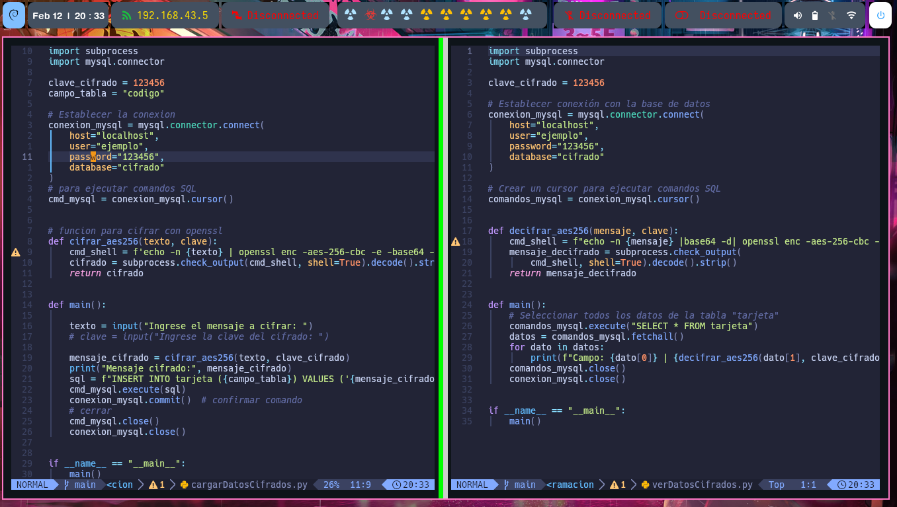

## ¿Que es OPENSSL? 

OpenSSL es una biblioteca de software de código abierto que proporciona implementaciones de los protocolos SSL y TLS así como de criptografía general y funciones de utilidad relacionadas. SSL y TLS son protocolos de seguridad diseñados para proporcionar comunicaciones seguras a través de una red, como Internet.


## ¿Que pretendo hacer? 

En este ejemplo, el objetivo es almacenar datos cifrados dentro de una base de datos utilizando OpenSSL y un script en Python.

## PREPARACION DEL AREA DE TRABAJO 

Para continuar con la actividad, es necesario tener instalados MariaDB, Python y OpenSSL.

### EJEMPLOS

Esta linea de comando en bash cifra el texto "Hola Ema" en __aes-256-cbc__ con la clave **123456** y luego lo convierte a **base64** para que sea legible desde la terminal.


```bash

#bash

echo -n Hola Ema | openssl enc -aes-256-cbc -e -base64 -pdkdf2 -k 123456
```


Decifrar mensaje:


```bash

echo -n "U2FsdGVkX1/XchgkTl+AICbGT/KFMw+X8JABIYHymA0=" | base64 -d| openssl enc -aes-256-cbc -d -pbkdf2 -k 123456


```


## TEXTO CIFRADO - MySql 

### GUARDAR DATOS 


```python 

import subprocess
import mysql.connector


clave_cifrado = 123456
campo_tabla = "codigo"

# Establecer la conexion
conexion_mysql = mysql.connector.connect(
    host="localhost",
    user="ejemplo",
    password="123456",
    database="cifrado"
)

# para ejecutar comandos SQL
cmd_mysql = conexion_mysql.cursor()


# funcion para cifrar con openssl
def cifrar_aes256(texto, clave):
    cmd_shell = f'echo -n {texto} | openssl enc -aes-256-cbc -e -base64 -pbkdf2 -k {clave}'
    cifrado = subprocess.check_output(cmd_shell, shell=True).decode().strip()
    return cifrado


def main():

    texto = input("Ingrese el mensaje a cifrar: ")
    # clave = input("Ingrese la clave del cifrado: ")

    mensaje_cifrado = cifrar_aes256(texto, clave_cifrado)
    print("Mensaje cifrado:", mensaje_cifrado)
    sql = f"INSERT INTO tarjeta ({campo_tabla}) VALUES ('{mensaje_cifrado}')"
    cmd_mysql.execute(sql)
    conexion_mysql.commit()  # confirmar comando
    # cerrar
    cmd_mysql.close()
    conexion_mysql.close()


if __name__ == "__main__":
    main()


```
### VER DATOS DECIFRADO 

```python


import subprocess
import mysql.connector

clave_cifrado = 123456

# Establecer conexion
conexion_mysql = mysql.connector.connect(
    host="localhost",
    user="ejemplo",
    password="123456",
    database="cifrado"
)

# ejecutar comandos SQL
comandos_mysql = conexion_mysql.cursor()


def decifrar_aes256(mensaje, clave):
    cmd_shell = f"echo -n {mensaje} |base64 -d| openssl enc -aes-256-cbc -d -pbkdf2 -k {clave}"
    mensaje_decifrado = subprocess.check_output(
        cmd_shell, shell=True).decode().strip()
    return mensaje_decifrado


def main():
    # Seleccionar todos los datos de la tabla "tarjeta"
    comandos_mysql.execute("SELECT * FROM tarjeta")
    datos = comandos_mysql.fetchall()
    for dato in datos:
        print(f"Campo: {dato[0]} | {decifrar_aes256(dato[1], clave_cifrado)}")
    comandos_mysql.close()
    conexion_mysql.close()


if __name__ == "__main__":
    main()

```
## CREAR BASE DE DATOS 


## TESTEANDO CODIGO 

Guardando los primeros datos cifrados dentro de la base de datos.


## SCREESHOT DEL SCRIPT EN PYTHON 





