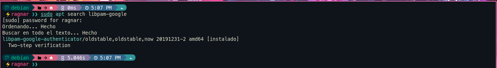
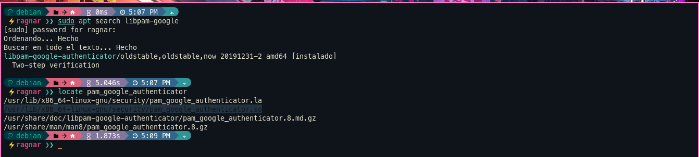
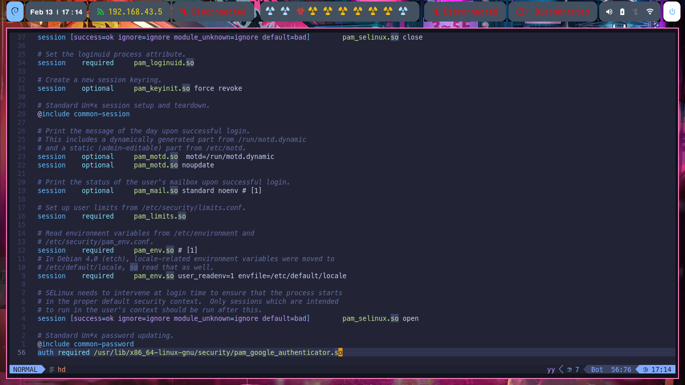
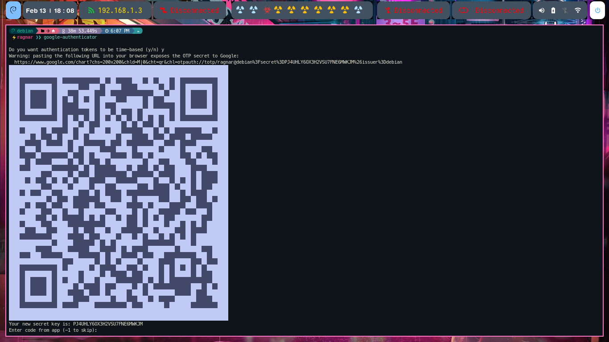
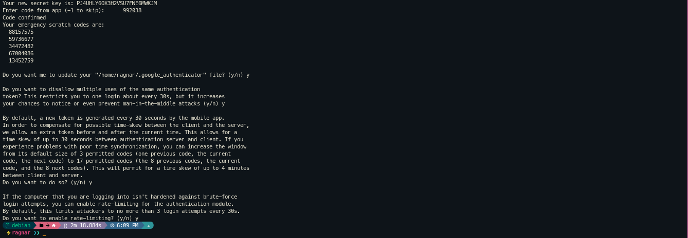
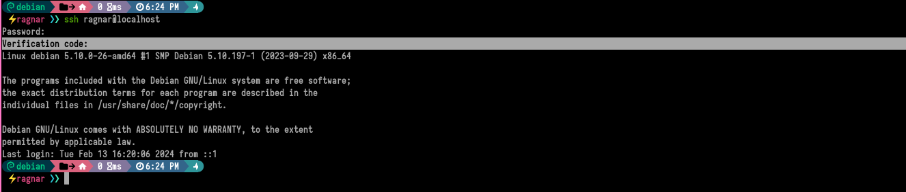

## ACTIVIDAD

En este caso, lo que pretendo es configurar SSH con un segundo factor de autenticación. Para lograr esto, es necesario configurar PAM, que se utiliza para la autenticación de usuarios durante el inicio del sistema, así como para gestionar la sesión de diversas aplicaciones una vez que el usuario ha iniciado sesión.

Dado que PAM es modular, instalaré **libpam-google-authenticator**, que es un módulo PAM que proporciona autenticación de dos factores para agregar una capa adicional de seguridad. Este módulo se integra con la aplicación **Google Authenticator**, la cual se puede instalar desde la **Play Store**. **Google Authenticator** genera códigos de tiempo (OTP), los cuales cambian cada pocos segundos.


### CONFIGURACION

1- Instalación de __libpam-google-authenticator__ 

```bash
sudo apt install libpam-google-authenticator

```



Finalizada la instalacion es necesario saber donde se encuentra el modulo:




1- Confguración __/etc/pam.d/sshd__

```bash

auth required /usr/lib/x86_64-linux-gnu/security/pam_google_authenticator.so

```




1- configuración __/etc/ssh/sshd_config__ 


```bash
ChallengeResponseAuthentication yes

```

Reiniciar el servicio ssh: 

```bash
systemctl restart sshd

```

1- Configuración **google-authenticator**

```bash
google-authenticator

```

Escanear el QR con la aplicacion **Google-authenticator**: 


 

Una vez que se ingrese el código generado por Google Authenticator, se proporcionarán los códigos de respaldo que se pueden utilizar en caso de que sea necesario acceder por SSH sin poder utilizar el método de autenticación principal (el celular).




- Cada 30 segundos se actualizara el token.
- Se podran usar token anteriores para compenzar problemas de sincronizacion de hora.
- 3 intentos maximos de sesion cada 30 segundos.

## PRIMER LOGIN 

Se solicita el password ssh y luego el codigo de autenticacion generado por **Google Authenticator**.


