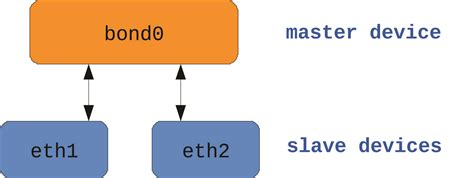
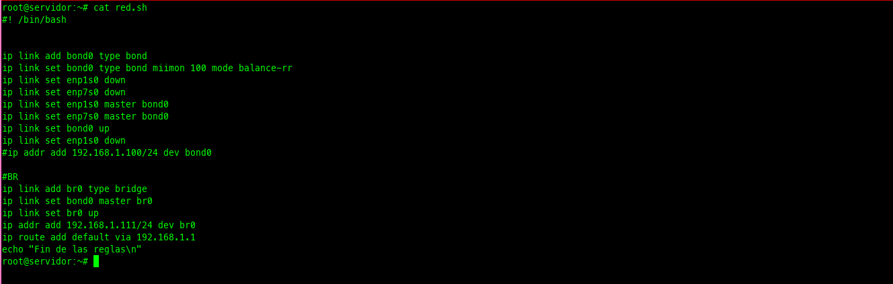
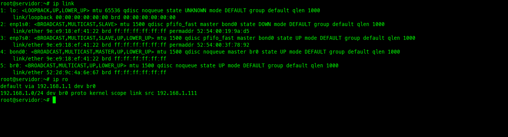

## PRACTICA

En este ejemplo, utilizaré una máquina virtual (Debian) con dos interfaces de red: "enp1s0" y "enp7s0". Las combinaré en una interfaz virtual bond0 con balanceo de carga (balance-rr), que distribuye la carga de manera equitativa entre las interfaces que forman parte de bond0.

El balanceo de carga Round Robin (balance-rr) ofrece tolerancia a fallos, ya que si una interfaz física deja de funcionar, automáticamente se continúan enviando los paquetes por las interfaces restantes.


### CONFIGURACION DE LA INTERFAZ BOND0 

En mi caso, guardaría este script en Bash dentro de la carpeta /bin/ y lo ejecutaría automáticamente al inicio del sistema mediante crontab.

```bash

#! /bin/bash


echo "Creacion de interfaz bond0"
ip link add bond0 type bond
ip link set bond0 type bond miimon 100 mode balance-rr
ip link set enp1s0 down
ip link set enp7s0 down
ip link set enp1s0 master bond0
ip link set enp7s0 master bond0
ip link set bond0 up
ip link set enp1s0 down
ip addr add 192.168.1.100/24 dev bond0

```
Este script es suficiente para configurar una interfaz bonding. 


### CONFIGURACION SERVIDOR DE VIRTUALIZACION

Para que estas configuraciones funciones en mi servidor de virtualización debería también configurar un puente de red virtual (bridge). Por lo tanto, agregaré otras lineas dentro de este script.


```bash

#! /bin/bash


echo "Creacion de interfaz virtual bond0"
ip link add bond0 type bond
ip link set bond0 type bond miimon 100 mode balance-rr
ip link set enp1s0 down
ip link set enp7s0 down
ip link set enp1s0 master bond0
ip link set enp7s0 master bond0
ip link set bond0 up
ip link set enp1s0 down
#ip addr add 192.168.1.100/24 dev bond0

echo "Creacion de interfaz virtual br0"
#BR
ip link add br0 type bridge
ip link set bond0 master br0
ip link set br0 up
ip addr add 192.168.1.111/24 dev br0
ip route add default via 192.168.1.1
echo "configuraci'on de las interfaces bond0 y br0 finalizadas.\n"

```


El nombre de las interfacesde red y las direcciones ip son solo de ejemplos.


## NOTA:

Este script es un complemento para mi servidor de virtualización, esta destinado a mejorar el rendimiento de la red. Dado que ultimanente tengo alojadas numerosas máquinas virtuales, la capacidad de la interfaz se divide entre todas ellas. Por lo tanto, me resulta fundamental contar con múltiples interfaces de red y realizar la agregación de enlaces para optimizar tanto el rendimiento como la capacidad.


