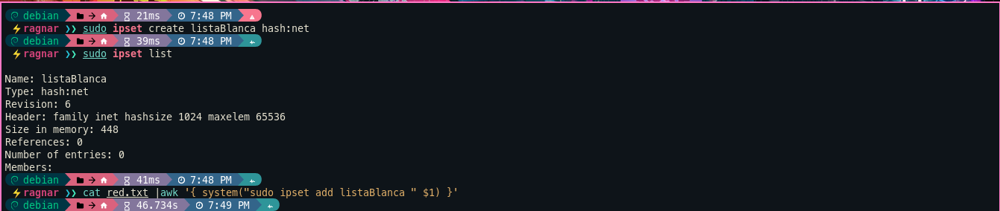

## ACTIVIDAD

En este caso, mi intención es configurar un firewall para permitir únicamente el tráfico proveniente de direcciones IP argentinas. Esto se realiza con el propósito de evitar que personas de otros países, que no tienen ninguna relación con el sitio web, puedan acceder al servidor.


### CONFIGURACION

Para iniciar la configuración, es necesario obtener la lista de direcciones IP o segmentos de red asignados a Argentina. Para ello, utilizaré el sitio web de [ipdeny](https://www.ipdeny.com/ipblocks/), que proporciona una lista de direcciones IP individuales y segmentos de red asignados a un país específico.


Descargar la lista de segmentos de red asignados a la Argentina y la lista con los nuevos egmentos de red.

```bash

wget https://www.ipdeny.com/ipblocks/data/countries/ar.zone -O segmentosRed1.txt
wget https://www.ipdeny.com/ipblocks/data/aggregated/ar-aggregated.zone -O segmentosRed2.txt 

```


En mi caso, asumí que la lista contenía tanto segmentos de red como direcciones IP individuales. Por lo tanto, decidí separarlas en dos listas diferentes: una para los segmentos de red y otra para las direcciones IP individuales, con el fin de crear los hash de ipset correspondientes.

### CODIGO C++
```bash 

#include <fstream>
#include <iostream>
#include <string>

int main() {
  std::ifstream archivoRed("aux.txt"); //<- colocar el nombre del archivo 
  std::ofstream archivoSegmento("1.txt");
  std::ofstream archivoIP("2.txt");

  if (!archivoRed) {
    std::cout << "No se pudo abrir el archivo de entrada.\n";
    return 1;
  }

  if (!archivoIP || !archivoSegmento) {
    std::cout << "No se pudieron crear los archivos de de IP y Segmento.\n";
    return 1;
  }

  std::string linea;
  while (
      std::getline(archivoRed, linea)) {
    if (linea.find('/') !=
        std::string::npos) {            
      archivoSegmento << linea <<"\n"; 
    } else {
      archivoIP << linea <<"\n";
    }
  }

  std::cout << "Finalizada la tarea.\n";

  
  archivoRed.close();
  archivoIP.close();
  archivoSegmento.close();

  return 0;
}

```
Pero al correr el programa me di cuenta que no habia direcciones IP individuales, solo segmentos de red.


### IPSET 

```bash 
#crear contenedor de los segmentos de red "listaBlanca"
ipset create listaBlanca hash:net 

#ver si se creo 
ipset list

#agregar cada segmento de red a "listaBlanca"
cat red.txt |awk '{ system("sudo ipset add listaBlanca " $1) }'

#contar cuantos segmentos de red se agregaron
ipset list listaBlanca | grep -c '^[^#]'

#guardar la lista 
ipset save > /etc/ipset.conf

```



### IPTABLES 

Reglas de IPTABLES:


```bash
############################################################## 

#!/bin/bash

ipset restore -f /etc/ipset.conf


#POLITICAS POR DEFECTO
/usr/sbin/iptables -P INPUT DROP
/usr/sbin/iptables -P FORWARD DROP
/usr/sbin/iptables -P OUTPUT DROP

# lo que llegue de los segmento de red se redirige al servidor web 
/usr/sbin/iptables -t nat -A PREROUTING -i br0 -p tcp --dport 80 -m set --match-set listaBlanca src -j DNAT --to 192.168.100.2:80

#RESPUESTA A LAS COMUNICACIONES YA ESTABLECIDAS 
/usr/sbin/iptables -A INPUT -m state --state RELATED,ESTABLISHED -j ACCEPT
/usr/sbin/iptables -A OUTPUT -m state --state RELATED,ESTABLISHED -j ACCEPT
/usr/sbin/iptables -A FORWARD -m state --state RELATED,ESTABLISHED -j ACCEPT #necesaria para ver la pag web 

#LOS PAQUETES QUE LLEGEN DESDE INTERNET PUEDEN IR A LA DMZ
/usr/sbin/iptables -A FORWARD -i br0 -o dmz -p tcp --dport 80 -j ACCEPT

```

Con esta configuracion solo se esta permitiendo el acceso al servidor web desde Argentina. 


### SCRIPT 

En caso de que los segmentos de red sean pocos:

```bash 

#! /bin/bash
cat > firewall.sh << EOE
#!/bin/bash

ipset restore -f /etc/ipset.conf


#POLITICAS POR DEFECTO
/usr/sbin/iptables -P INPUT DROP
/usr/sbin/iptables -P FORWARD DROP
/usr/sbin/iptables -P OUTPUT DROP

EOE

cat red.txt | awk '{print "/usr/sbin/iptables -t nat -A PREROUTING -i br0 -p tcp --dport 80 -s " $1 " -j DNAT --to 192.168.100.2:80"}' >> firewall.sh 

echo "#RESPUESTA A LAS COMUNICACIONES YA ESTABLECIDAS ">> firewall.sh  
echo "/usr/sbin/iptables -A INPUT -m state --state RELATED,ESTABLISHED -j ACCEPT ">> firewall.sh  
echo "/usr/sbin/iptables -A OUTPUT -m state --state RELATED,ESTABLISHED -j ACCEPT ">> firewall.sh  
echo "/usr/sbin/iptables -A FORWARD -m state --state RELATED,ESTABLISHED -j ACCEPT ">> firewall.sh 

echo "#LOS PAQUETES QUE LLEGEN DESDE INTERNET PUEDEN IR A LA DMZ " >> firewall.sh
echo "/usr/sbin/iptables -A FORWARD -i br0 -o dmz -p tcp --dport 80 -j ACCEPT" >> firewall.sh

```
[Fuente IPSET](https://www.ipfire.org/docs/configuration/firewall/ipset)

