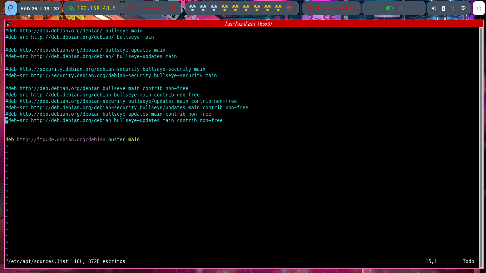
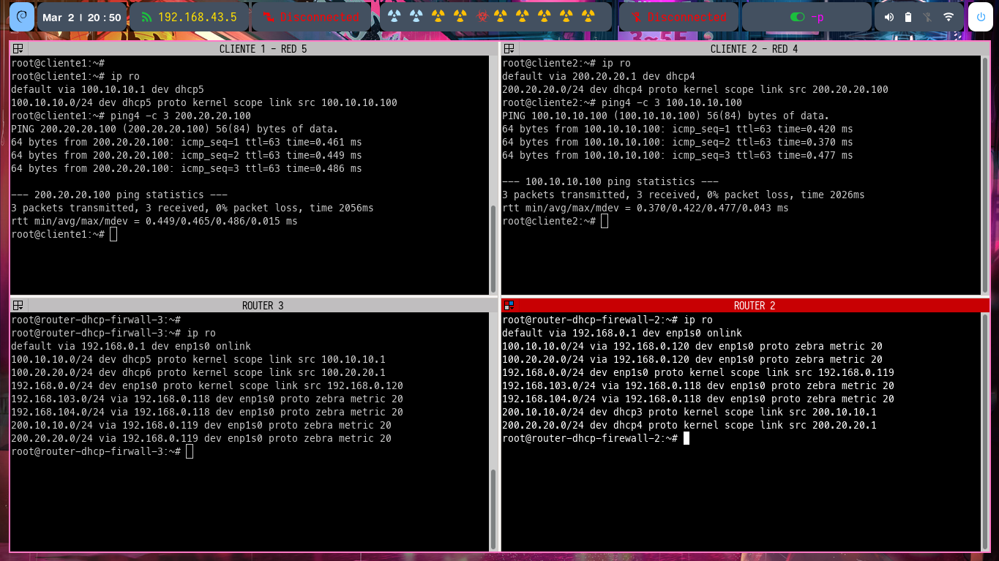
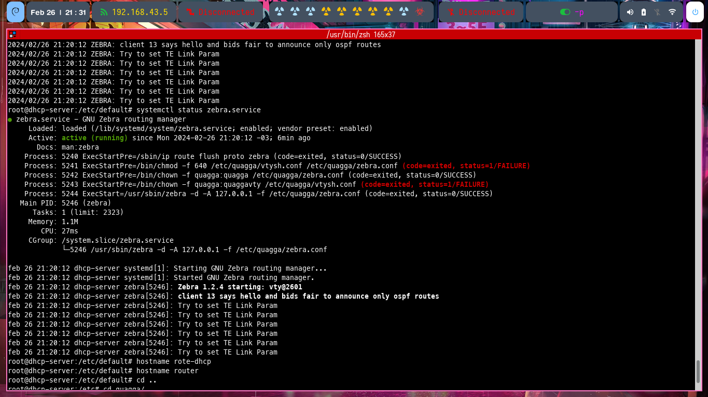

## ACTIVIDAD

En esta actividad pretendo crear un enrutador con Quagga como complemento al servidor DHCP para unir varias subredes.

- Zebra: actúa como un gestor de rutas.
- OSPF: protocolo de enrutamiento (calcular las rutas más cortas dentro de una red).


## CONFIGURACION - QUAGGA

1. Repositorio: 

```bash

deb http://ftp.de.debian.org/debian buster main 

```



2. Instalar Quagga:


```bash 

/usr/bin/apt install quagga
#Crear directorios para guardar los log
/usr/bin/mkdir -p /var/log/quagga/
/usr/bin/chown  -R quagga:quagga /var/log/quagga
/usr/bin/chmod go-rwx /var/log/quagga/

```

3. Configurar **zebra** __/etc/quagga/zebra.conf__

```bash

log file /var/log/quagga/zebra.log
log syslog

! NOMBRE DEL HOST
hostname router1.local

!CLAVE PARA ACCEDER VTY
password clave

!CLAVE DE ACCESO PARA CONFIGURAR VTY
enable password clave

```

- Configuraciones adicionasles de **log** 

* **log file /var/log/quagga/zebra.log** -> El log de zebra se almacenan dentro de __/var/log/quagga/__
* **log monitor** -> Los log se envian a pantalla.
* **log stdout** -> Si el servicio se ejecuta en segundo plano los log se mandan a pantalla.
* **log syslog** -> Los log ademas de ir a __/var/log/quagga/__ tambien se envian a __syslog__.


4. Configurar **OSPF**

```bash

log file /var/log/quagga/ospfd.log
log syslog 

!NOMBRE DEL HOST
hostname router1.local


!CLAVE DE ACCESO PARA VTY
password clave


!CLAVE DE ACCESO PARA CONFIGURAR VTY
enable password clave


!INTERFACES QUE SE DEBEN ANUNCIAR Y MONITOREAR
interface enp1s0
interface dhcp1
interface dhcp2
interface lo


! Identificador de 32 bit para el router (es normal usar la ip) pero puede ser Ej: 1.1.1.1
! Redes anunciadas y área a la que pertenecen
router ospf

  ospf router-id 192.168.1.118

  network 192.168.1.0/24 area 0.0.0.0
  network 192.168.103.0/24 area 0.0.0.0
  network 192.168.104.0/24 area 0.0.0.0

```
En este archivo se deben configuran las interfaces y los segmentos de red.

### LOGROTATE

Administrar **log** de **quagga**.


- __/etc/logrotate.d/quagga__

```bash
/var/log/quagga/*.log {
    daily
    rotate 7
    missingok
    notifempty
    compress
    delaycompress
    create 0644 quagga quagga
    postrotate
        systemctl reload quagga

}
```

5. Iniciar el servicio de Zebra y ospf.

```bash
systemctl enable zebra.service 
systemctl enable ospfd.service 

systemctl start zebra.service 
systemctl start zebra.service 

```


### Comunicacion de dos equipos en redes diferentes




### ERROR ZEBRA vtysh.conf.
Cuando ejecuto **systemctl status zebra.service** me muestra unos errores relacionadoscon __vtysh.conf__. 

El archivo vtysh.conf es utilizado por el programa vtysh, para administar por comandos los demonios de enrutamiento (Zebra y OSPF). Este archivo no estar presente en mi sistema, porque no utilizo vtysh.

Dado que el archivo no existe, no hay nada que corregir. Se deben ignorar los mensajes de error relacionados con la configuración de permisos de __/etc/quagga/vtysh.conf__.




[Fuente Repositorio](https://packages.debian.org/buster/amd64/quagga/download)

[Configuraciones QUAGGA](https://wiki.ubuntu.com/JonathanFerguson/Quagga)

[Configuracion OSPFD](https://wiki.ubuntu.com/JonathanFerguson/Quagga?action=AttachFile&do=get&target=ospfd.conf)
