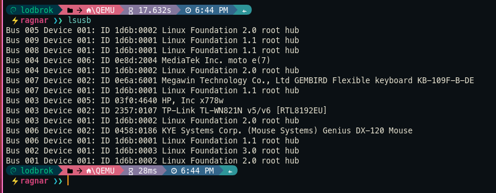
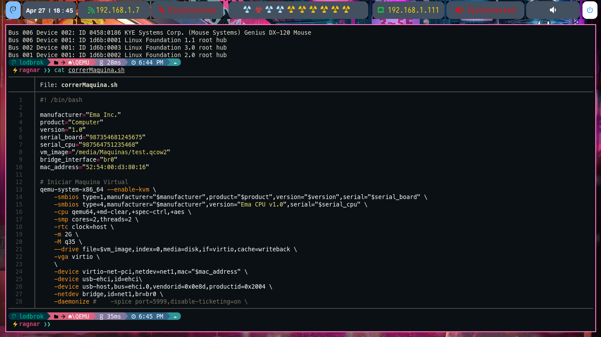
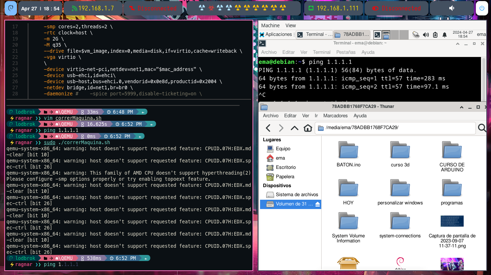

## Introducción

Crear Mquinas virtuales con QEMU


Crear directorios: 

```bash

mkdir -p /mnt/Maquinas
mkdir -p /mnt/ISOS


```
Crear disco: 

```bash
qemu-img create -f qcow2 disco1.qcow2 20G

```
El espacio se va asignando conforme se vaya necesitando, no se ocupan los 20G de entrana


Crear Maquina virtual:


```bash 

#! /bin/bash
manufacturer="Ema Inc."
product="Computer"
version="1.0"
serial_board="987354681245675"
serial_cpu="987564751235468"
iso_path="/media/ISOS/Debian12.iso"
vm_image="/media/Maquinas/test.qcow2"
bridge_interface="br0"
mac_address="52:54:00:d3:80:16" 

#Comprobar ISO
if [ ! -f "$iso_path" ]; then
	echo "Error: El archivo ISO '$iso_path' no existe."
	exit 1
fi

# Crear Maquina 
qemu-system-x86_64 --enable-kvm \
	-smbios type=1,manufacturer="$manufacturer",product="$product",version="$version",serial="$serial_board" \
	-smbios type=4,manufacturer="$manufacturer",version="Ema CPU v1.0",serial="$serial_cpu" \
	-cpu qemu64,+md-clear,+spec-ctrl,+aes \
	-smp cores=2,threads=2 \
	-rtc clock=host \
	-m 2G \
	-M q35 \
	--drive file=$vm_image,index=0,media=disk,if=virtio,cache=writeback \
	-vga virtio \
	-device virtio-net-pci,netdev=nagnar,mac="$mac_address" \
	-netdev bridge,id=nagnar,br=br0 \
	-cdrom $iso_path \
	-boot d

```


Iniciar Maquina virtual:


```bash 

#! /bin/bash

manufacturer="Ema Inc."
product="Computer"
version="1.0"
serial_board="987354681245675"
serial_cpu="987564751235468"
vm_image="/media/Maquinas/test.qcow2"
bridge_interface="br0"
mac_address="52:54:00:d3:80:16"

# Iniciar Maquina Virtual
qemu-system-x86_64 --enable-kvm \
	-smbios type=1,manufacturer="$manufacturer",product="$product",version="$version",serial="$serial_board" \
	-smbios type=4,manufacturer="$manufacturer",version="Ema CPU v1.0",serial="$serial_cpu" \
	-cpu qemu64,+md-clear,+spec-ctrl,+aes \
	-smp cores=2,threads=2 \
	-rtc clock=host \
	-m 2G \
	-M q35 \
	--drive file=$vm_image,index=0,media=disk,if=virtio,cache=writeback \
	-vga qxl \
	-spice port=5999,disable-ticketing=on \
	-device virtio-net-pci,netdev=net1,mac="$mac_address" \
	-netdev bridge,id=net1,br=br0 \

```

---

Permitir Bridge:

```bash

mkdir -p /etc/qemu 
touch /etc/qemu/bridge.conf

echo "allow br0" > /etc/qemu/bridge.conf

```
Las dos opciones funcionan:


[Configurar bridge](https://wiki.archlinux.org/title/QEMU_(Espa%C3%B1ol))
[CONFIGURAR BRIDGE](https://blog.christophersmart.com/2016/08/31/configuring-qemu-bridge-helper-after-access-denied-by-acl-file-error/)


Compartir internet a la maquina virtual desde CELULAR USB 





```bash
-device usb-ehci,id=ehci \
-device usb-host,bus=ehci.0,vendorid=0x0e8d,productid=0x2004 \

```

El prefijo 0x indica que los números siguientes están en formato hexadecimal. En este caso, los códigos de vendor_id y product_id generalmente se proporcionan en formato hexadecimal.

[FUENTE](https://wiki.archlinux.org/title/QEMU_(Espa%C3%B1ol))

[FUENTE](https://wiki.archlinux.org/title/QEMU_(Espa%C3%B1ol)#Dispositivo_USB_del_host_de_paso)



Montar dos USB (usb motorola, pendrive)


```bash
-device usb-ehci,id=ehci \
-device usb-host,bus=ehci.0,vendorid=0x0e8d,productid=0x2004 \
-device usb-host,bus=ehci.0,vendorid=0x03f0,productid=0x4640 \

```



Se puede ver el ping a internet y el contenido del pendrive

